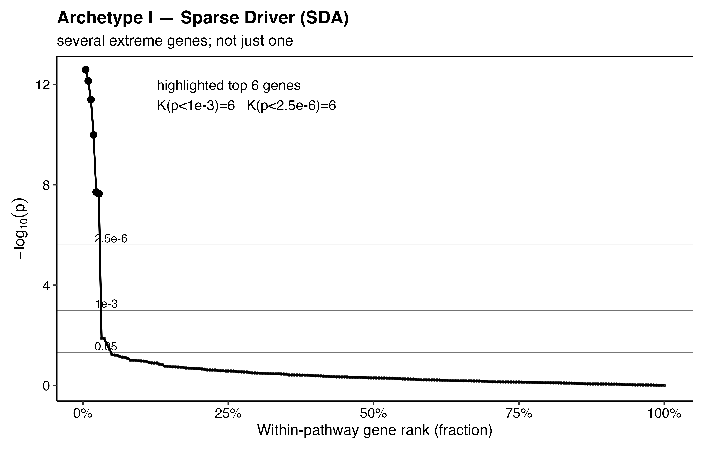
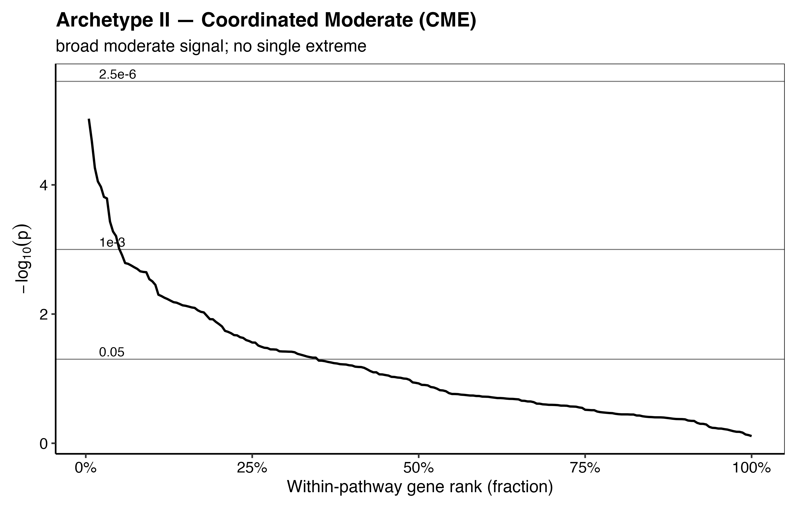
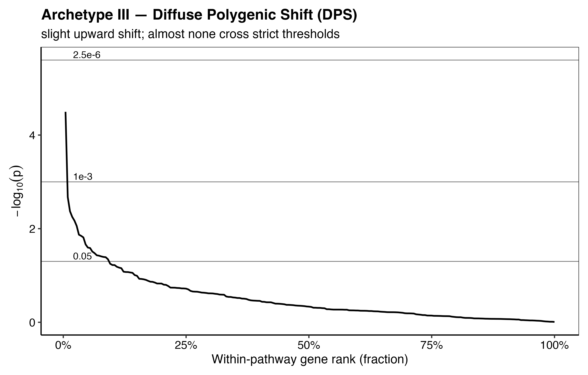
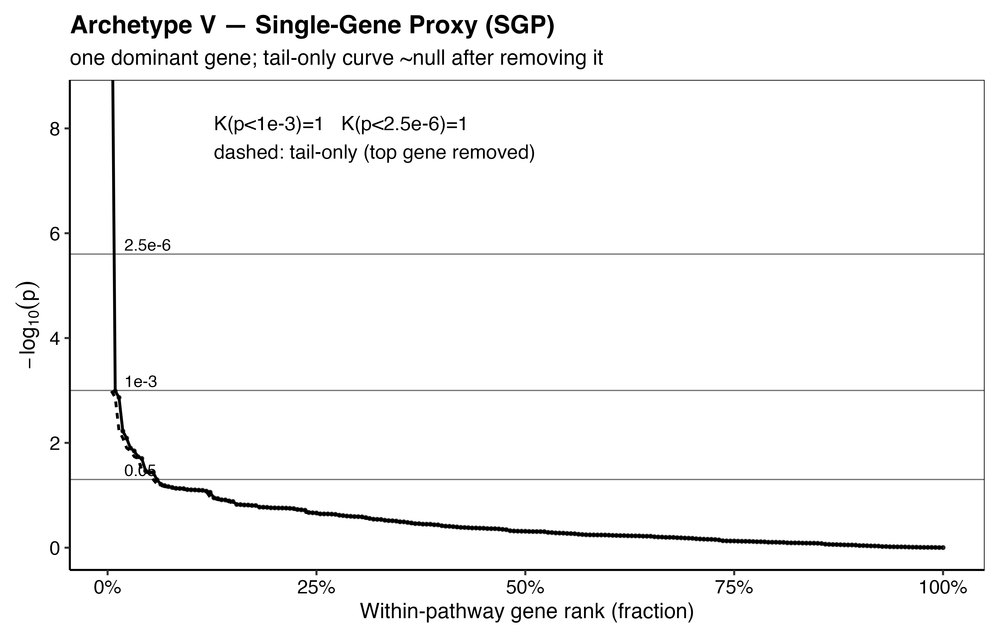
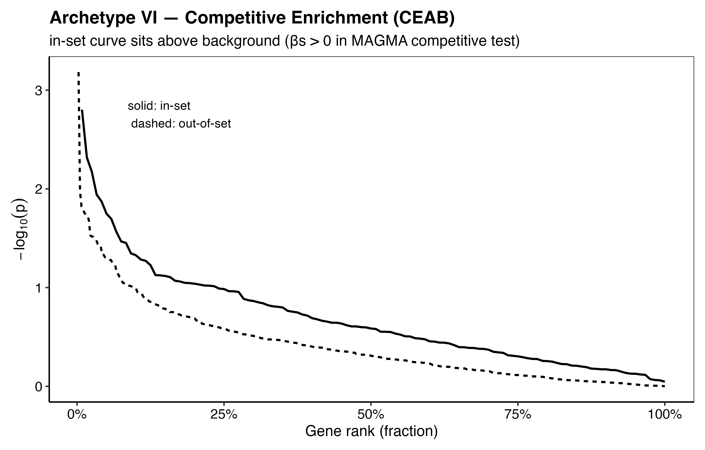
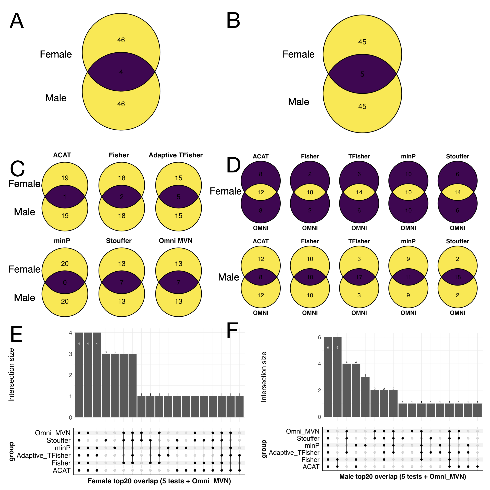
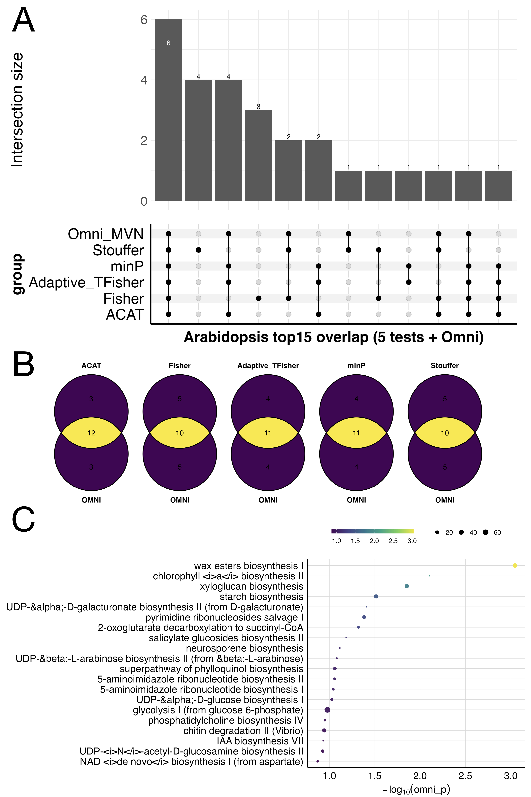

# CATFISH : GWAS pathway analysis pipeline

This Markdown is structured into:

- [**INTRODUCTION**](#introduction) — what the pipeline is and why multiple tests are needed  
- [**METHODS**](#methods) — paper‑ready subsections with explicit equations and assumptions  
- [**USAGE**](#usage) — installation + reproducible example commands and R snippets
- [**RESULTS**](#results) — Examples of (i) *Drosophila* starvation resistance GWAS, and (ii) *Arabidopsis* coldest day of the coldest month GWAS

---

## INTRODUCTION

**CATFISH** (Combining <ins>**C**</ins>auchy combination (ACAT), <ins>**A**</ins>daptive TFisher (soft) test, <ins>**F**</ins>isher's test, m<ins>**I**</ins>n-P, and <ins>**S**</ins>touffer's method for <ins>**H**</ins>olistic pathway analysis) is a multi-test pathway framework built on LD-aware MAGMA gene-level GWAS statistics adjusted for gene length and SNP density that combines ACAT, soft TFisher, Fisher, Stouffer and minP. It then uses an omnibus test based on permutation-calibrated minP or ACAT to collapse these multiple pathway tests into a single, correlation-robust enrichment p-value that is sensitive to both sparse and polygenic pathway patterns. In short, CATFISH casts a wide net across complementary tests and reels in a single pathway p-value.

CATFISH uses:

1. **MAGMA** for LD-aware **SNP → gene** inference (gene-level p-values).
2. **Multiple gene → pathway combination tests** (ACAT, Fisher, soft TFisher, Stouffer, minP).
3. A **correlation-robust LD-aware omnibus test** (permutation-calibrated second minP and ACAT test) that aggregates these tests into a single pathway-level p-value.

### Why multiple tests are needed

Pathways can be significant for statistically different reasons:

- one driver gene dominates,
- many genes show coordinated moderate enrichment,
- diffuse polygenic shift, and
- hybrids of these patterns.

No single gene-set statistic is uniformly most powerful across these various possibilities. Instead of relying on a single test, CATFISH runs several complementary pathway tests and combines them into one pathway-level omnibus p-value. We define these patterns using a set of **pathway signal archetypes** (sparse driver, coordinated moderate enrichment, diffuse polygenic shift, hybrid driver–support, single-gene proxy), which describe different ways a pathway can appear significant.

# Pathway signal archetypes

We divide the pathway signals into a set of archetypes that describe different ways a pathway can be enriched in a biological sense explained in detail below. We then use a combination of statistical tests chosen to be representative to each of these behaviors and a provide a biological example for each archetype.

## Archetype I — Sparse Driver Architecture (SDA)


*Archetype I: Sparse Driver Architecture (SDA).*

**Signature:** A small number of genes are extremely significant; most genes look null.

**Gene-level p-value pattern:**

- There exists a small $K \ll G$ such that the top $K$ gene p-values are extremely small, $p_{(1)}, \dots, p_{(K)} \ll \alpha$ (e.g. $p_{(1)} \sim 10^{-7}$ or smaller),
- The remaining genes are approximately null, $p_{(K+1)}, \dots, p_{(G)} \sim \mathrm{Uniform}(0,1)$.
- This produces a sharp “elbow” in the ranked p-values (a few tiny hits followed by a long flat tail).

**Interpretation:**  
An SDA pathway is significant because **a small set of driver genes dominates the signal**, rather than broad involvement of most pathway members. This can occur when the trait-relevant biology passes through a **bottleneck** (committed step, rate-limiting enzyme, key regulator, or essential transporter) so that genetic variation concentrates its effect at a few control points. In contrast, pathway annotations typically include many additional enzymes, modifiers, and general “support” genes that may be necessary for pathway operation but do not carry strong association for the trait. Under SDA, association is therefore concentrated in the top $K$ genes, yielding very small ordered p-values $p_{(1)}, \ldots, p_{(K)}$ followed by a long tail $p_{(K+1)}, \ldots, p_{(G)}$ that is close to uniform.

**Biological example:**  
**Aspartokinase in the aspartate-derived amino acid pathway**

The aspartate-derived amino-acid biosynthesis pathway converts **aspartate** into essential amino acids, such as **lysine**, **threonine**, **methionine**, and **isoleucine**. In plants and bacteria, the first step is catalyzed by **aspartokinase (AK)**, which phosphorylates aspartate to **aspartyl-phosphate** that feeds multiple branched network to produces several end-products. Due to its position at the starting point of the pathway, AK acts as a **flux-controlling bottleneck**. Variations in AK activity alter carbon and nitrogen flow through the whole network. Downstream enzymes, including tailoring steps, dehydrogenases, and transaminases, typically exhibit dispersed or buffered roles. Thus, the gene-level pattern aligns with SDA. A single AK gene or a few genes downstream may exhibit very low $p$ values (e.g. $10^{-8}\text{-}10^{-10}$), while the majority are dispersed across the interval $(0,1)$.

**Best detectors in CATFISH:**
- **ACAT** — sensitive to a few extremely small p-values (RECOMMENDED).  
- **minP / Tippett** — targets the minimum p-value; optimal when one gene dominates.


---

## Archetype II — Coordinated Moderate Enrichment (CME)


*Archetype II — Coordinated Moderate Enrichment (CME)*


**Signature:** many genes show moderate association; no single gene is extremely low.

**Gene-level p-value pattern:**
- A non-trivial fraction of genes have moderately small p-values, e.g.
  $$p_i \in [10^{-3}\,0.05]\quad\text{for many} i.$$
- The top signal is not orders-of-magnitude beyond the rest (no single-gene spike), e.g.
  $$p_{(1)} \not\ll p_{(k)}\quad\text{for small }k\ (\text{e.g., }k=5,10,20).$$
- The ranked p-values show a **broad shoulder** (many good genes) but not a sharp elbow.

**Interpretation:**  
CME signifies **collective functional engagement**. The pathway behaves like a coordinated module wherein numerous components exert small-to-moderate effects. This is expected when phenotypes emerge from distributed regulation, redundancy, and buffering/feedback as dramatic single-gene effects are rare. Statistically, enrichment arises from numerous mildly informative genes rather than single driver.

**Biological example:**  
**Cytokine / immune signaling cascades**

In numerous immunological pathways, the output is regulated not by a singular "master gene," but through distributed modulation across various tiers of a signaling circuit. A clear example is TNFα / IL-1β → NF-κB, where the activation of upstream receptors ultimately activates IKK complexes, which phosphorylate IκB inhibitors, facilitating the nuclear translocation of NF-κB family members. The temporal dynamics of NF-κB activation (rapid/transient versus slower/sustained) are significantly influenced by the stimulus class and receptor context  (Zhao et al., 2018). The significance of these dynamics lies in the variability of transcriptional outputs influenced by stimulus, NF-κB family composition, and cell type. Core feedback and marker targets encompass genes such as **NFKBIA (IκBα)** and **TNFAIP3 (A20)**, underscoring the notion that pathway behavior is governed by numerous regulatory nodes rather than a singular switch (Zhao et al., 2018).

This “many-knobs” architecture is also apparent one layer upstream in TNFRSF signaling. TNFRSF receptors bind trimeric TNFSF ligands, however, increasing evidence suggests that a single trimeric ligand–receptor complex fails to elicit complete signaling output. Rather, for certain TNFRSF pathways (notably the classical NF-κB pathway), successful activation may necessitate secondary interactions or clustering of multiple trimeric receptor complexes (Medler et al., 2019). Mechanistically, this indicates that pathway output relies on the coordinated effects of receptor assembly/avidity, adaptor recruitment, kinase activation thresholds, and the strength of negative feedback, precisely the type of system where typical genetic variation is anticipated to produce numerous modest perturbations rather than a singularly significant driver.

In CATFISH terminology, this yields a CME pattern. Within a cytokine/immune circuit, gene-level p-values may exhibit a surplus of moderate signals (e.g., numerous genes around 10⁻³–10⁻²) without a singular extreme outliers. The ordered gene-level p-values ($$p_{(1)}, p_{(2)}, \ldots$$) contains many values in the range of $$10^{-3} to 10^{-2},$$ without an extreme such as 10^{-12}. Consequently, CME pathways are optimally represented by evidence-accumulating tests (e.g., Fisher, Stouffer/mean-Z, and mild-truncation/soft-TFisher), whose efficacy is enhanced when numerous route members exhibit moderate associations, rather than depending on a singular peak.

**Best detectors in CATFISH:**
- **Fisher’s method** (aggregates evidence across many moderately small p-values) (RECOMMENDED).
- **Stouffer / mean-Z** (gains power when many genes shift together).
- Optionally **wFisher / weighted Z** if you later add biologically informed weights.


---

## Archetype III — Diffuse Polygenic Shift (DPS)


*Archetype III — Diffuse Polygenic Shift (DPS)*


**Signature:** the pathway’s genes are, on average, slightly more associated than the genome-wide background, but almost none cross a conventional significance threshold.

**Gene-level p-value / Z pattern:**
- Most gene p-values satisfy:
  $$p_i > 0.05\quad\text{for most } i.$$
Yet the pathway shows a small but consistent shift in adjusted gene-level Z-scores:

$$
\overline{Z}_{S,\mathrm{adj}} \;=\; \frac{1}{G}\sum_{i\in S} Z_{i,\mathrm{adj}} \;\neq\; 0,
$$

often with a coherent sign (bias in one direction).
- $$\{p_i: i\in S\}\ \text{is subtly enriched toward smaller values relative to Uniform}(0,1),$$
  but without extreme outliers.
- No sharp elbow, instead, the ranked p-values show a gentle, global downward bend relative to null.

**Interpretation:**  
DPS indicates a global pathway bias aligned with polygenicity. Numerous genes individually exert minimal impacts in a uniform direction, resulting in pathway enrichment due to the collective subtle shift of the entire module rather than the influence of a singular "star" gene. This is the regime characterized by numerous little issues and the absence of significant challenges. Spike-hunting tests, such as minP/Tippett or highly aggressive truncation, are generally underpowered in this context due to the absence of a singular extreme p-value to leverage. Conversely, mean-/distribution-sensitive tests (Stouffer/mean-Z, Fisher, and competitive regression) are specifically formulated to identify this subtle, pervasive divergence from the null hypothesis.

**Biological example:**  

**Biological example – human height as a diffuse polygenic shift**

The height of adult humans exemplifies a highly polygenic characteristic. Initial GIANT meta-analyses involving over 180,000 individuals identified 180 loci and "hundreds of variants" associated with height. Nevertheless, they accounted for merely 10% of the phenotypic variance, despite height exhibiting approximately 80% heritability. Subsequent meta-analyses involving about 700,000 Europeans identified thousands of linked SNPs and hundreds of locations, validating the perspective that height is regulated by several common variants of minimal effect rather than a limited number of high-impact genes. A recent investigation of a "saturated map" identified over 12,000 genome-wide significant SNPs across more than 7,000 genomic segments, encompassing around 21% of the genome, thereby reaffirming Fisher’s original polygenic hypothesis for height proposed in 1918.

These variants are classified into several growth-related processes, such as chondrocyte proliferation and hypertrophy in the growth plate, extracellular matrix and cartilage organization, growth hormone and IGF-1 signaling, and morphogen pathways including TGF-β and Hedgehog, as well as overarching developmental and endocrine regulators. Analyses of height GWAS loci through pathway and gene-set evaluations have demonstrated enrichment for signaling pathways such as TGF-β and Hedgehog, as well as for genes associated with skeletal growth, growth plate regulation, and pertinent Mendelian growth disorders. Lango Allen et al. (2010) discovered that genes adjacent to height-associated variants congregate in biologically coherent pathways, including TGF-β signaling, Hedgehog signaling, and histone and growth/development gene sets. Furthermore, several SNPs near these pathway genes "narrowly miss" genome-wide significance, suggesting numerous additional sub-threshold contributors within the same modules. Guo et al. (2018) demonstrate that genes adjacent to height GWAS loci are enriched in processes and tissues pertinent to growth, including growth plate cartilage.

When examined at the level of an individual pathway (e.g., TGF-β signaling, Hedgehog signaling, or growth-plate extracellular matrix genes), this structure inherently produces a DPS pattern. Throughout the gene set, numerous genes possess one or more prevalent variations that have minor impacts on height. Certain genes attain definitive genome-wide relevance, while many others exhibit relatively mild or nominal associations. The outcome indicates that, in contrast to random gene sets, the distribution of gene-level test statistics within these pathways exhibits a shift towards more robust evidence overall characterized by an increased number of genes with small or moderate p-values and a decreased number of genes appearing entirely null, despite the fact that most individual genes would not, on their own, substantiate a strong association claim. This scenario exemplifies the optimal application of CATFISH’s DPS-oriented detectors (Stouffer/mean-Z on adjusted gene-level Z-scores, and optionally MAGMA-style competitive regression tests). They assess whether the **average** association signal across a biologically coherent pathway is subtly yet consistently heightened in comparison to the genome-wide background.

**Best detectors in CATFISH:**
- **Stouffer / mean-Z on** `Z_adj` (unweighted; permutation-calibrated) (RECOMMENDED).
- Optionally **competitive regression-style gene-set models** (e.g., **MAGMA competitive**) if included as a component test (NOT INCLUDED IN CATFISH)


---

## Archetype IV — Hybrid Driver–Support (HDS)


*Archetype IV — Hybrid Driver–Support (HDS)*


**Signature:** a few very strong genes plus a some moderately associated genes.

**Gene-level p-value pattern:**
- One or a few top genes are extremely significant, e.g.
  $$p_{(1)},\,p_{(2)} \ll 10^{-4}\quad(\text{often much smaller}).$$
- Beyond the top hits, several additional genes show moderate evidence:
  $$p_{(k)} \in [10^{-3},\,0.05]\quad\text{for multiple }k \text{ (support genes).}$$
- The remaining genes are near-null:
  $$p_{(j)} \sim \mathrm{Uniform}(0,1)\quad\text{for most other }j.$$
- A small “spike” at the top (drivers) plus a clear “shoulder” of moderately small p-values (support), then a flat tail.

**Interpretation:**  
Hybrid Driver–Support (HDS) exhibits a hierarchical pathway structure. A small number of “driver” genes exert the most significant effects, whilst a group of genes provides modest yet persistent associations. This is prevalent in pathways where flow or signal is regulated by a limited number of control points, whereas effective route output also relies on the synchronized activity of various downstream components. This architecture is statistically positioned between SDS and CME. A distinct driver signal exists, although the significance of the pathway is augmented by supplementary moderate signals.

**Biological example** – **LDL cholesterol as a hybrid driver–support pathway**

The regulation of LDL-cholesterol (LDL-C) exemplifies a scenario in which a limited number of genes serve as primary "drivers" within a more extensive polygenic framework. Extensive GWAS and sequencing investigations consistently identify *LDLR*, *APOB*, and *PCSK9* as fundamental genes associated with Mendelian hypercholesterolemia. Infrequent coding or splice-altering variants in these genes can alter LDL-C by approximately half a standard deviation or more and are responsible for classical familial hypercholesterolemia, significantly elevating the risk of coronary artery disease. Recent whole-genome sequencing investigations involving over 60,000 individuals reveal that even infrequent *non-coding* variations next to *LDLR* and *PCSK9* can exert effects comparable to clinically recognized exonic FH variants, hence supporting their significance as primary regulators of LDL-C homeostasis.

A supporting network of lipoprotein and cholesterol metabolism genes surrounds these drivers. GWAS of traditional lipids and nuclear magnetic resonance (NMR)-based lipoprotein characteristics have revealed numerous new loci affecting LDL particle size, concentration, and composition, including apolipoprotein clusters (*APOE/APOC*, *APOA1/A5*), hepatic lipase (*LIPC*), and transporters such as *ABCG5/ABCG8*. Individually, prevalent variants at these loci typically elucidate only a minor proportion of LDL-C variance, however, collectively, they constitute a significant segment of the genome-wide polygenic signal. Recent extensive multi-ancestry meta-analyses now identify hundreds of lipid-associated loci distributed throughout this extensive lipoprotein network.

Translating this biology into gene-level association statistics for an LDL-related trait reveals that the route is neither exclusively "sparse driver" nor entirely "coordinated moderate". Typically, one observes several robust gene-level signals at *LDLR*, *APOB*, *PCSK9*, and a few linked loci, supported by a wider array of modestly correlated genes implicated in lipoprotein assembly, remodeling, and cholesterol transport. The HDS pattern is characterized by a pathway whose enhancement is indicative of both a limited number of predominant, high-impact genes and a strong, albeit subtler, influence from the broader metabolic framework. In CATFISH terminology, this refers to the regime when **soft TFisher** (which prioritizes the lower tail while still considering moderate p-values), along with **Fisher** and the **omnibus combination**, aligns effectively with the underlying biology.

**Best detectors in CATFISH:**
- **Soft TFisher** (tail-focused; gains power from a few strong hits *plus* additional modest hits)
- **Fisher** (accumulates evidence across the moderate support set)
- **Omnibus combination** (e.g., ACAT across ACAT/Fisher/soft-TFisher/Stouffer; or permutation-calibrated minP across methods)

---

## Archetype V — Single-Gene Proxy Pathway (SGP)


*Archetype V — Single-Gene Proxy Pathway (SGP)*


**Signature:** the pathway looks significant only because it contains one very strong gene; the remaining members look essentially null.

**Gene-level pattern:**
- The top gene has an extremely small p-value (e.g. $10^{-7}\text{--}10^{-12}$).
- The rest of the genes have p-values that look noisy / $\mathrm{Uniform}(0,1)$, with no clear excess of small p’s.
- If you ignore the top gene, there is no obvious enrichment left in the pathway.

**Interpretation:**  
The pathway effectively serves as a proxy for a singular gene-level relationship. This frequently occurs when:
- an annotation term is very small (one gene plus a couple of weakly related neighbors), or
- numerous pathway definitions redundantly incorporate the same driver gene, resulting in several "distinct" pathways activating while all reference the same underlying gene.

Biologically, the driver gene remains significant (and may also align with the SDA), although the pathway-level assertion provides no additional information beyond indicating that "this gene is strongly associated to the pathway." In CATFISH, we consequently designate SGP patterns with a cautionary note, "view these as gene-centric findings with associated pathway designations, rather than as proof that the entire pathway is collectively activated."

**Biological example:**  
**PAH in phenylalanine metabolism**

In humans, phenylalanine metabolism is primarily regulated by a singular bottleneck enzyme, phenylalanine hydroxylase (PAH), a hepatic monooxygenase that catalyzes the conversion of phenylalanine to tyrosine in a process dependent on tetrahydrobiopterin (BH₄) (Scriver, 2007; Elhawary et al., 2022). Classical phenylketonuria (PKU) and associated forms of hyperphenylalaninemia (HPA) occur when phenylalanine hydroxylase (PAH) activity is significantly diminished, resulting in elevated blood phenylalanine levels, relatively decreased tyrosine levels, and the accumulation of neurotoxic metabolites. This culminates in the distinctive untreated PKU phenotype characterized by extremely high phenylalanine, low tyrosine, and progressive neurological impairment (Elhawary et al., 2022). Extensive clinical and molecular studies indicate that the predominant cause of HPA/PKU cases is pathogenic variants in PAH, whereas a minority results from deficiencies in BH₄ synthesis, recycling, or the PAH co-chaperone DNAJC12 (Blau et al., 2014; Himmelreich et al., 2021; Elhawary et al., 2022). In summary, within the overarching phenylalanine metabolism pathway, PAH represents the pivotal flux-controlling step. Both common and rare variations at PAH significantly influence systemic phenylalanine levels, while the majority of other pathway components (transporters, minor side-enzymes, cofactor recycling genes) have considerably weaker or less frequent effects at the population level.

**Best detectors in CATFISH:**
- **minP / Tippett** 
- **ACAT** 

---

## Archetype VI — Competitive Enrichment Above Background (CEAB) (OPTIONAL - Not used for CATFISH, just a check)


*Archetype VI — Competitive Enrichment Above Background (CEAB)*


**Signature:** the pathway is not merely “associated”, it is enriched above the genome-wide polygenic background. It passes a MAGMA competitive test ($\beta_s > 0$), indicating that genes inside the set exhibit, on average, greater associated than those outside the set.

**Gene-level pattern:**

Let $Z_g$ be the gene-level $Z$ used by MAGMA, derived from gene p-values via a probit transform (higher $Z$ = stronger association).  
In a CEAB pathway $s$:

- The distribution of $\{Z_g : g \in s\}$ is elevated in comparison to $\{Z_g : g \notin s\}$. Equivalently, $\mathrm{mean}(Z_{\mathrm{in\_set}}) > \mathrm{mean}(Z_{\mathrm{outside\_set}})$, rather than merely $\mathrm{mean}(Z_{\mathrm{in\_set}}) > 0$.
- The signal is generally not represented by a single-gene proxy, rather, one may see multiple modestly strong genes or a small top-tail alongside an elevated mean. The crucial aspect is that the *average* in-set relationship surpasses the background level
- The pathway retains its significance following MAGMA's default covariate adjustment for confounding gene characteristics (e.g., gene size and gene density, including log-transforms), indicating that it is not "large genes/dense genes" responsible for the observed effect.

**Interpretation:**  
CEAB signifies authentic enrichment rather than: (i) generic polygenicity (where multiple sets appear related under independent testing), (ii) artifacts from annotation overlap, or (iii) confounding effects due to gene size or density.  

Competitive tests possess a more generalized null hypothesis because they explicitly adjust for baseline associations inherent in polygenic characteristics. In MAGMA’s Crohn’s disease case study, numerous gene sets seemed related through self-contained testing. However, only one maintained significance under the competitive hypothesis demonstrating that CEAB identifies sets with associations that exceed expectations based on polygenicity.

**Biological example**
**From MAGMA’s Crohn’s Disease analysis**  

In the WTCCC Crohn’s disease dataset, MAGMA’s self-contained analysis identified 39 related gene sets. However the competitive analysis recognized only one of those 39 as enriched above background ("Regulation of AMPK activity via LKB1 (REACTOME))".

This exemplifies a standard CEAB pattern. The pathway meets the above-background enrichment criterion. Two supplementary sets (e.g., Cell adhesion molecules and ECM-receptor interaction) attained competitive significance solely when gene size/density correction was disabled, which MAGMA reads as (at least partially) confounding-induced inflating rather than genuine enrichment.

**Best detectors in CATFISH:**

- MAGMA competitive p-value (from `*.gsa.out`) as an external “above-background” anchor:  
  if $p_{\mathrm{comp}}$ is small and $\beta_s > 0$, interpret as CEAB-supported enrichment.

---

### Bias warning

Pathway-based analysis for assessing over-representation or enrichment is influenced by various biases, including gene size, pathway size, SNP coverage density, and linkage disequilibrium (LD) patterns, all of which must be addressed explicitly (White et al., 2020; PMC6391732). In CATFISH, we tackle these issues in three phases: (i) The SNP to gene analysis is conducted using MAGMA’s LD-aware multi-SNP model, ensuring that gene-level Z/P values account for local LD structure and SNP density; (ii) we subsequently regress MAGMA gene Z-scores against log(gene length) and log(number of SNPs), utilizing the residual-based $P_adj$ for all subsequent gene to pathway analyses, thereby eliminating any remaining dependence on gene size and SNP density; and (iii) at the pathway level, we avoid simplistic over-representation tests, opting instead to calibrate our omnibus statistics through gene-label LD-aware permutations that maintain each gene’s adjusted p-value and the observed distribution of pathway sizes, yielding enrichment p-values that are resilient to these established biases.

Link: https://pmc.ncbi.nlm.nih.gov/articles/PMC6391732/

---

## METHODS

### Notation

Let a pathway (gene set) be denoted by $S$, containing $G = |S|$ genes indexed by $g = 1,\dots,G$.

For each gene $g \in S$, let:
- $Z_g$ denote the raw gene-level $Z$-statistic, and
- $p_g$ denote the corresponding two-sided $p$-value.

We collect these into vectors:

$$
\mathbf{Z}_S = (Z_1, Z_2, \dots, Z_G),
\qquad
\mathbf{p}_S = (p_1, p_2, \dots, p_G).
$$

---

## 1) Gene-level association statistics (SNP → gene)

For each gene $g$, MAGMA generates a gene‑level association p‑value $p_g$ by aggregating SNP‑level signals within or within a window of the gene while accounting for local LD using a reference panel. We employed MAGMA’s `multi=snp-wise` model, which integrates a SNP-wise mean test (effective for numerous small effects) and a SNP-wise top test (effective for a single strong SNP) into a unified LD-aware omnibus statistic per gene, hence ensuring the robustness of gene p-values against varying within-gene causal structures.

The workflow emcompasses:

- SNPs are mapped to genes (gene boundaries with optional windows).
- A multi‑marker gene model accounts for LD among SNPs in the genic region.
- MAGMA generates gene statistics (e.g., $Z_g$ and $p_g$).

In CATFISH, the p-values (or Z statistics) of the MAGMA gene are utilized as inputs for all pathway analyses.

---

## 2) Gene-level adjustment for gene size and SNP density

Despite LD-aware gene testing, gene-level signals may still demonstrate residual dependency on gene size and SNP density. CATFISH executes a post-hoc correction at the gene level.

Let:

- $Z_g$ be the MAGMA gene Z‑statistic,
- $L_g$ be gene length (bp),
- $S_g$ be number of SNPs mapped to the gene (e.g., $$NSNPS$$).

We fit a regression line as:

$$
Z_g = \beta_0 + \beta_1 \log(L_g) + \beta_2 \log(S_g) + \varepsilon_g.
$$

We define adjusted residual Z as:

$$
Z^{\mathrm{adj}}_g = Z_g - \widehat{Z}_g,
\quad \widehat{Z}_g = \widehat{\beta}_0 + \widehat{\beta}_1 \log(L_g) + \widehat{\beta}_2 \log(S_g).
$$

The corresponding adjusted two-sided $p$-values are:

$$
p_{g,\mathrm{adj}} = 2\,\Phi\!\left(-\left|Z_{g,\mathrm{adj}}\right|\right),
$$

where $\Phi(\cdot)$ is the standard normal CDF.

We denote the adjusted vectors by:

$$
\mathbf{Z}_{S\mathrm{adj}} = (Z_{1\mathrm{adj}}, \dots, Z_{G\mathrm{adj}}),
\qquad
\mathbf{p}_{S\mathrm{adj}} = (p_{1\mathrm{adj}}, \dots, p_{G\mathrm{adj}}).
$$


---

## 3) Pathway-level test statistics (gene → pathway)

CATFISH computes multiple pathway statistics from either unadjusted gene-level $p_g$ and $Z_g$, or the adjusted counterparts $p_{g,\mathrm{adj}}$ and $Z_{g,\mathrm{adj}}$. For convenience, we present definitions using the unadjusted inputs.

We define multiple pathway-level statistics as functionals of a common set of within-pathway, gene-level evidences $\{p_g\}_{g\in S}$ (and, when available, $\{Z_g\}_{g\in S}$).
The gene-level evidences for genes within the same pathway are typically dependent (e.g., due to linkage disequilibrium–induced correlation and shared genomic architecture). Consequently, the resulting pathway statistics are also mutually dependent, as they are derived from the same underlying inputs.

Therefore, closed-form reference calibrations that rely on independence of the gene-level tests (such as Fisher’s $\chi^2$ null or Tippett’s transformation for minP) are provided only as canonical or illustrative definitions. The final inferential $p$-values (both for each individual component statistic and for the omnibus statistic) are obtained via the unified null calibration procedure described in Section~4, which recomputes all statistics under a null-generating mechanism that preserves the dependence structure.


### 3.1 ACAT (Aggregated Cauchy Association Test)

We define the Cauchy‑transformed score for each gene:

$$
t_g = \tan\left(\pi\left(\tfrac{1}{2} - p_g\right)\right).
$$

Define non‑negative weights $w_g \ge 0$ with $\sum_{g \in S} w_g = 1$ (default $w_g = 1/G$).

The ACAT statistic is:

$$
T_{\mathrm{ACAT}}(S) = \sum_{g \in S} w_g\, t_g
= \sum_{g \in S} w_g \tan\left(\pi\left(\tfrac{1}{2} - p_g\right)\right).
$$

The combined p-value is:

$$
p_{\mathrm{ACAT}}(S) = \tfrac{1}{2} - \frac{1}{\pi}\arctan\left(T_{\mathrm{ACAT}}(S)\right).
$$

ACAT is asymptotically dominated by the smallest p-values, and is therefore sensitive to SDAs.

---

### 3.2 Fisher’s method

The define the Fisher’s statistic as:

$$
T_{\mathrm{Fisher}}(S) = -2\sum_{g \in S} \log(p_g).
$$

Under independence,

$$
T_{\mathrm{Fisher}}(S) \sim \chi^2_{2G},
\quad
p_{\mathrm{Fisher}}(S) = 1 - F_{\chi^2_{2G}}\left(T_{\mathrm{Fisher}}(S)\right),
$$

where $F_{\chi^2_{2G}}(\cdot)$ is the $\chi^2$ CDF with $2G$ degrees of freedom.

Fisher is sensitive to CMEs.

---

### 3.3 Adaptive Soft TFisher

A practical limitation of fixed- $\tau$ soft TFisher is that the appropriate tail-focus is contingent upon the *unknown* pathway topology (dense versus sparse, weak versus strong). TFisher proposes a **omnibus, data-adaptive** selection of truncation and weighting parameters, termed **oTFisher**, which autonomously identifies the most advantageous configuration for the observed p-value distribution (ref).

#### Soft TFisher family

For a pathway $S$ with adjusted gene-level p-values $\{p_g\}_{g\in S}$ and a soft-threshold parameter $\tau\in(0,1]$, the soft TFisher statistic is

$$W^{\mathrm{soft}}(S;\tau)=\sum_{g\in S}\left[-2\log(p_g)+2\log(\tau)\right]_{+},\qquad (x)_+=\max(x,0)$$

This is the $\tau_1=\tau_2=\tau$ special case of the TFisher family and implements a continuous down-weighting near the cutoff (soft vs hard truncation). 

#### Data-adaptive $\tau$ (oTFisher)

Let $\mathcal{T}=\{\tau_1,\dots,\tau_m\}$ be a small grid of candidate thresholds (e.g. a few small/medium/large values; TFisher shows that a sparse grid is usually sufficient). 

For each $\tau_j\in\mathcal{T}$, we compute:

1) the statistic $W^{\mathrm{soft}}(S;\tau_j)$, and  
2) its **null p-value**
$$p_{\tau_j}(S)=\Pr\!\left(W^{\mathrm{soft}}(\cdot;\tau_j)\ge W^{\mathrm{soft}}(S;\tau_j)\mid H_0\right),$$
using the TFisher null calculation for $W_n(\tau_1,\tau_2)$ with $\tau_1=\tau_2=\tau_j$. 

Then, we define the adaptive soft TFisher omnibus as the minimum across the grid as:

$$p_{\mathrm{aTF}}(S)=\min_{\tau\in\mathcal{T}} p_{\tau}(S)$$

This is the oTFisher concept, tailored to the soft-thresholding line $\tau_1=\tau_2$. Due to the dependence of the $p_{\tau_j}(S)$ (originating from the same ordered p-values), oTFisher offers an analytic calibration for the minimum across the grid by employing a multivariate normal approximation of the vector comprising component TFisher statistics (calculated through multivariate normal probabilities). In the soft scenario when $\tau_1=\tau_2=\tau$, the mean and covariance are simplified, allowing for efficient computation of the multivariate normal (MVN) probability, such as by Genz-style MVN cumulative distribution function (CDF). 

In CATFISH terminology, this provides a adaptive tail sensor without the necessity of hard-coding a single $\tau$ and without the need for extensive permutation for the within-method calibration (we still overlay our MVN/perm framework for the final omnibus across methods).

A minimal grid that usually works well in practice is something like:

$$\mathcal{T}=(\{0.01\,0.05\,0.5\,1\})$$

which oTFisher explicitly uses in its soft-thresholding omnibus examples, and which covers “rare-ish hits”, “moderate tail”, and “nearly Fisher”.

The oTFisher is more tailored towards HDS.

---

### 3.4 Stouffer's method

Stouffer's technique consolidates gene-level **Z** statistics instead of p-values and exhibits increased sensitivity to DPS. In CATFISH, the gene-level Z input is sourced directly from MAGMA’s gene output (`ZSTAT`). Significantly, MAGMA’s Z-scale is understood as a association-strength score, indicating that greater positive values signify stronger evidence of association, rather than indicating the direction of effect as trait-increasing or trait-decreasing. Consequently, the natural pathway-level Stouffer test in this context is one-sided (greater), assessing the enrichment of positive association strength inside the pathway.

**Default (unweighted) Stouffer:**

For a pathway $$S$$ with $$G=|S|$$ genes,

$$Z_{\mathrm{stouffer}}(S) = \frac{1}{\sqrt{G}} \sum_{g \in S} Z_g$$

$$p_{\mathrm{stouffer}}(S) = 1 - \Phi\!\left(Z_{\mathrm{stouffer}}(S)\right),$$

where $$\Phi(\cdot)$$ is the standard normal CDF.

**Optional (weighted) Stouffer:**

CATFISH optionally supports nonnegative per-gene weights $$w_g$$ (e.g., based on SNP count or other gene-level quantities). In that case,

$$Z_{\mathrm{stouffer}}^{(w)}(S)=\frac{\sum_{g\in S} w_g\, Z_g}{\sqrt{\sum_{g\in S} w_g^2}},\qquad p_{\mathrm{stouffer}}^{(w)}(S)=1-\Phi\!\left(Z_{\mathrm{stouffer}}^{(w)}(S)\right)$$

A **two-sided** option can be reported for completeness when a genuinely *signed* gene-level Z is available:

$$p_{\mathrm{stouffer}}^{(2\text{-sided})}(S)=2\,\Phi\!\left(-\left|Z_{\mathrm{stouffer}}(S)\right|\right),$$

This is not the default for MAGMA-style association-strength Z scores.

---

### 3.5 minP / Tippett test

For each pathway $S$ with $G$ genes, we define the minimum gene $p$-value as

$$
T_{\min}(S) = p_{\min}(S) = \min_{g \in S} p_g .
$$

An independence-based calibration is given by Tippett’s transform as: 

$$
p_{\mathrm{tippett}} = 1 - (1 - p_{\min})^{G}.
$$

However, CATFISH does not rely on this analytic mapping for inference because gene-level test statistics within a pathway are typically dependent (see Section~4). The minP statistic is emphasized not because it is uniquely sensitive to dependence (all constituent statistics are), but because it represents a qualitatively distinct mode of evidence that is driven almost entirely by the single most significant gene. Consequently, $(T_{\min}) serves primarily as a detector of sparse, single-gene–driven signals (SDA/SGP-type patterns), thereby complementing aggregate combination procedures (Fisher, Stouffer, softTFisher, ACAT) that are designed to capture more diffuse enrichment. We identify potential single-gene proxy pathways via a leave-one-gene-out diagnostic, in which the top-ranking gene is removed, and the test statistic is recomputed.

---

## 4) Dependence structure and unified null calibration

For a pathway $S$ with genes $g \in S$, CATFISH computes multiple component pathway tests from the same gene-level evidence (gene p-values $p_g$ and, when used, gene Z-scores $Z_g$). Two sources of
dependence arise:

1. **Deterministic coupling across component tests:** each component is a deterministic function of the same multiset ($p_g$) (and possibly $Z_g$), so component p-values are correlated even if genes were
   independent.

2. **Additional dependence across genes:** gene-level inputs within $S$ can be correlated due to LD/shared genomic structure and related effects, inducing correlation among $p_g$ and $Z_g$.

To obtain valid inference without assuming independence at either level, CATFISH calibrates the omnibus under a single dependence-preserving null generator that recomputes **all** components (and the omnibus) from the **same** null draw.


### 4.1 Deterministic coupling under the null (same $p_g$ reused)

Even under a pure null scenario where genes are independent, the component statistics are **not jointly independent** because they are all functions of the same gene-level p-values (equivalently the same order statistics $P_{(k)}$. Concretely:

- **Fisher and soft TFisher** are monotone in $log(p_g)$. Soft TFisher can be viewed as a truncated/reweighted Fisher that concentrates weight on $p_g \le \tau$. Thus, when many $p_g$ are moderately small (or the lower tail is long), both Fisher and TFisher tend to become extreme in the same direction.

- **Stouffer** aggregates gene Z-scores, which in typical gene-set settings are monotone transformations of gene p-values (or are supplied directly as gene-level association Z-scores). Therefore pathways exhibiting diffuse, coordinated enrichment of small $p_g$ often also yield extreme Stouffer values.

- **ACAT and minP** are both tail-driven. ACAT uses the heavy-tailed Cauchy transform $\tan\{\pi(1/2 - p_g)\}$, and minP is exactly $P_{(1)}=\min_{g\in S} p_g$. Hence, if a pathway contains one (or a few) extremely small p-values, both ACAT and minP tend to be extreme. Soft TFisher with very small $\tau$ can behave similarly by up-weighting the most extreme p-values.

- **Post hoc selection across methods** (e.g., min across methods, or adaptive $\tau$ selection within TFisher) further increases dependence and can induce “winner’s curse” behavior unless the null distribution is calibrated for the full selection procedure.


### 4.2 Extra dependence from LD and shared gene-level correlation

In real data, gene-level inputs are not independent. The sets $\{p_g\}$ and $\{Z_g\}$ can be correlated across genes due to (i) adjacent genes sharing SNPs or LD structure, (ii) coupling of SNP-level evidence across genes via
local LD, and (iii) genome-wide polygenic background effects that can induce weak correlation among gene-level association metrics. This dependence compounds the deterministic coupling in Section 4.1.

CATFISH addresses this in two complementary ways:

1. **Upstream LD-aware SNP \(\rightarrow\) gene aggregation (MAGMA).**  
Gene-level $p_g$ and $Z_g$ are derived from MAGMA’s LD-aware SNP-to-gene model, which adjusts gene evidence for correlated SNP structure within and near genes.

2. **Downstream dependence-preserving null calibration.**  
   Rather than assuming independence among the component p-values $\{p_j(S)\}$, CATFISH calibrates by resampling in a way that recomputes all component tests on the same null draw:
   - **Global gene-set resampling:** sample genes from a genome-wide pool and recompute *all* component tests on the same resampled gene sets, preserving cross-method coupling induced by shared inputs (but LD-agnostic within a pathway).
   - **LD-aware MVN calibration (recommended):** simulate correlated gene Z-scores $Z \sim \mathcal{N}(0, R_S)$ using a pathway-specific correlation matrix $R_S$ (from MAGMA gene–gene correlations), and derive p-based components from the same draw via a Gaussian-copula mapping. This preserves both within-pathway gene dependence and cross-method coupling by construction.


### 4.3 Unified null calibration via an LD-aware MVN generator

Under the LD-aware MVN null, we generate null replicates for each pathway \(S\):

$$
Z^{(b)} \sim \mathcal{N}(0, R_S), \qquad b = 1,\dots,B,
$$

where $R_S$ is the pathway-specific gene–gene correlation matrix. For p-based components, we apply a Gaussian-copula mapping from the same $Z^{(b)}$. With **two-sided** gene p-values (default),

$$
U_g^{(b)}=\Phi\!\left(Z_g^{(b)}\right), \qquad
p_g^{(b)} = 2\min\{U_g^{(b)}, 1-U_g^{(b)}\}.
$$

(If a **one-sided** convention is adopted for gene p-values, the mapping can be replaced by $p_g^{(b)} = 1-\Phi(Z_g^{(b)})$ with the appropriate direction.)

For each replicate $b$, we recompute all component pathway p-values from the same null draw $\{p_g^{(b)}\}$ (and $\{Z_g^{(b)}\}$ for Stouffer), yielding the replicate component vector

$$
\mathbf{p}^{(b)}(S)=\big(p_{\mathrm{ACAT}}^{(b)}(S),\;p_{\mathrm{Fisher}}^{(b)}(S),\;p_{\mathrm{TF}}^{(b)}(S),\;
p_{\mathrm{Stouffer}}^{(b)}(S),\;p_{\mathrm{minP}}^{(b)}(S)\big),
$$

with the observed vector $\mathbf{p}^{\mathrm{obs}}(S)$ computed analogously from the real data.

Given a prespecified omnibus operator $\mathcal{O}(\cdot)$ (e.g., ACAT across methods or Sidák-min across methods), we compute

$$
p_{\mathrm{omni}}^{(b)}(S)=\mathcal{O}\!\left(\mathbf{p}^{(b)}(S)\right),\qquad
p_{\mathrm{omni}}^{\mathrm{obs}}(S)=\mathcal{O}\!\left(\mathbf{p}^{\mathrm{obs}}(S)\right).
$$

The MVN-calibrated omnibus p-value is estimated by the standard resampling tail probability (small = more extreme):

$$
\hat p_{\mathrm{omni}}(S)=\frac{1+\sum_{b=1}^{B}\mathbf{1}\!\left(p_{\mathrm{omni}}^{(b)}(S)\le p_{\mathrm{omni}}^{\mathrm{obs}}(S)\right)}{B+1}.
$$


### 4.4 MVN calibration of component p-values (and why the omnibus is still calibrated)

CATFISH also reports **MVN-calibrated component p-values** using the same MVN replicates. For component method $j$,

$$
\hat p_{j}(S)=\frac{1+\sum_{b=1}^{B}\mathbf{1}\!\left(p_{j}^{(b)}(S)\le p_{j}^{\mathrm{obs}}(S)\right)}{B+1}.
$$

**Important:** even after component calibration, the calibrated component p-values $(\hat p_{\mathrm{ACAT}},\hat p_{\mathrm{Fisher}},\hat p_{\mathrm{TF}},\hat p_{\mathrm{Stouffer}},\hat p_{\mathrm{minP}})$ remain dependent (because they are derived from the same MVN draws and represent different transforms of the same latent evidence). Therefore, CATFISH forms an omnibus from the calibrated components and **still calibrates that omnibus** using the same MVN replicates. In practice this is implemented by computing, within each replicate $b$, replicate-calibrated component p-values $\hat p_{j}^{(b)}(S)$ (via the empirical CDF over $p_j^{(b')}(S)$ for $b'=1,\ldots,B$), forming the replicate omnibus $p_{\mathrm{omni}}^{(b)}(S)=\mathcal{O}\!\left(\{\hat p_j^{(b)}(S)\}\right)$, and then applying the same tail-probability calibration to obtain $\hat p_{\mathrm{omni}}(S)$.

### 4.5 Implication for inference

Because the component tests are strongly dependent (Sections 4.1–4.2), naïve across-method combination rules that assume independence (e.g., analytic Sidák-min across method p-values, or Bonferroni across correlated method p-values) can be miscalibrated and may be anti-conservative. CATFISH treats the analytic across-method omnibus (ACAT-O or minP-O) as a useful descriptive summary, but relies on the resampling/MVN-calibrated omnibus p-values as the primary inferential evidence. This unified calibration directly targets the null distribution of the full procedure (components + omnibus), thereby controlling type-I error under both intra-pathway gene dependence and cross-method coupling.


---

## 5) Omnibus pathway p-value across methods (omnibus operator + unified null calibration)


Each pathway in CATFISH is evaluated using a panel of complementary gene-to-pathway tests (ACAT, Fisher, adaptive soft TFisher, Stouffer, and a minP statistic). All component tests are deterministic functions of the same gene-level inputs $\{p_g\}$ (and optionally $\{Z_g\}$), hence, the resulting component $p$-values are correlated. Accordingly, CATFISH makes two choices: (i) how to summarize the vector of method p-values into a single omnibus statistic (ACAT-O or minP-O), and (ii) how to calibrate that omnibus statistic under the null (analytic for ranking and resampling/MVN for valid inference).

Let the component method p-values for pathway $S$ be

$$
\mathcal{P}(S)=\big\{p_{\mathrm{ACAT}}(S),\,p_{\mathrm{Fisher}}(S),\,p_{\mathrm{TFisher}}(S),\,p_{\mathrm{minP}}(S),\,p_{\mathrm{Stouffer}}(S)\big\},
$$

where the Stouffer term is included only when gene $Z$-scores are available; thus $K=|\mathcal{P}(S)|\le 5$.

\textbf{Omnibus operators (across methods).} CATFISH reports two omnibus summaries:
(i) \emph{ACAT-O} (Cauchy combination across the $K$ method p-values), and
(ii) \emph{minP-O} (Sidak-adjusted minimum across the $K$ method p-values),

$$
p_{\mathrm{minP}\text{-}\mathrm{O}}(S) \;=\; 1-\big(1-\min_{j\in\{1,\dots,K\}} p_j(S)\big)^K.
$$

Analytic omnibus values are useful for descriptive ranking, while primary inference uses dependence-aware
calibration (global resampling and/or LD-aware MVN simulation) in which all component tests and the omnibus
operator are recomputed within each null replicate.


---

### 5.1 LD-aware SNP $\rightarrow$ gene inputs via MAGMA (upstream)

GWAS summary statistics were aggregated to gene-level association evidence using MAGMA’s LD-aware SNP-wise gene model (multi-model), with an external reference panel to represent local LD. SNPs were assigned to genes using a symmetric $\pm 25$ kb window around gene boundaries, yielding per-gene association outputs such as a gene $p$-value $p_g$ and an association-strength Z statistic $Z_g$.

To reduce confounding by gene length and SNP density, we optionally compute covariate-adjusted gene evidence by regressing the gene-level Z statistics on $\log(L_g)$ and $\log(S_g)$, where $L_g$ is gene length and $S_g$ is the number of assigned SNPs. Residual Z-scores are then converted to adjusted gene $p$-values and used as inputs for p-based pathway tests when available, otherwise, raw MAGMA gene $p$-values are used (Explained in detail in Methods Section 2).

---

### 5.2 Component pathway tests (gene $\rightarrow$ pathway)

For each pathway $S$ with member genes $g\in S$, we compute:

1. ACAT (p-based)
2. Fisher (p-based)
3. Adaptive soft TFisher (p-based; via a fixed $\tau$ grid)
4. minP:  $p_{minGene}(S) = \min_{g\in S} p_g$; this serves as a sparse-signal detector; no analytic independence correction
5. Stouffer Z (using gene $Z_g$ when available)

All p-values are clipped to $[p_{\min}\,1-p_{\min}]$ (e.g., $p_{\min}=10^{-15}$) before applying $\log(\cdot)$ or $\tan(\cdot)$ transformations for numerical stability.

---

### 5.3 Omnibus ACAT across methods (ACAT-O)

Let $p_1,\dots,p_K$ denote the available component p-values for pathway $S$ and let weights $v_j\ge 0$ satisfy $\sum_{j=1}^K v_j=1$ (default $v_j=1/K$). Define

$$
T_{\mathrm{omni,ACAT}}(S)=\sum_{j=1}^{K} v_j \tan\!\bigl(\pi(0.5 - p_j)\bigr),\qquad p_{\mathrm{omni,ACAT}}(S) = 0.5 - \frac{1}{\pi} \arctan\!\bigl(T_{\mathrm{omni,ACAT}}(S)\bigr)
$$

The ACAT-O layer has heightened sensitivity when at least one component test demonstrates great significance, regardless of the modest performance of other components (e.g., sparse drivers, coordinated enrichment, hybrid subsets).

---

### 5.4 “Best-of-tests” omnibus via minP across methods (minP-O)

Define the across-method minimum

$$
T_{\mathrm{omni,min}}(S) = \min_{p \in \mathcal{P}(S)}p
$$

An independence-based analytic conversion is

$$
p_{\mathrm{omni,min}}(S) = 1 - \bigl(1 - T_{\mathrm{omni,min}}(S)\bigr)^K 
$$

Since, the component tests are correlated, inference is based on unified resampling calibration (Section 5.5).


---

### 5.5 Unified null calibration of the omnibus (global gene-set resampling and LD-aware MVN simulation)

Since, all component pathway tests are computed from the same within-pathway gene evidence $\{p_g\}$ (and optionally $\{Z_g\}$), their component $p$-values are correlated under the null. Rather than assuming independence, CATFISH calibrates the chosen omnibus operator by generating null replicates in which all component tests are recomputed from the same dependence-preserving draw.

For a chosen omnibus operator $f_{\mathrm{omni}}$ (ACAT-O or minP-O), and null replicates $b=1,\dots,B$, we compute component method $p$-values $\{p_j^{(b)}(S)\}$ and form

$$
p_{\mathrm{omni}}^{(b)}(S) = f_{\mathrm{omni}}\!\left(\{p_j^{(b)}(S)\}\right).
$$


The calibrated omnibus $p$-value is then

$$
\hat p_{\mathrm{omni}}(S) = \frac{ 1+\sum_{b=1}^{B} \mathbf{1}\!\left( p_{\mathrm{omni}}^{(b)}(S) \le p_{\mathrm{omni}}^{\mathrm{obs}}(S) \right)}{B+1}
$$

where $p_{\mathrm{omni}}^{\mathrm{obs}}(S)$ is the omnibus value computed on the observed pathway inputs.

We implement two complementary null generators.


---

#### 5.5.1 Global gene-set resampling (`perm_mode="global"`)

For a pathway $S$ of size $d$, each null replicate samples $d$ genes from a genome-wide pool $\mathcal{G}$ of genes with valid MAGMA outputs. Each sampled gene contributes its paired evidence $(p_g, Z_g)$ (when $Z_g$ is available), ensuring that p- and Z-based components are computed from the same resampled genes in each replicate. All component pathway tests (ACAT, Fisher, adaptive soft TFisher, minGene, and Stouffer) are recomputed on the resampled set, and then combined using the same omnibus operator $f_{\mathrm{omni}}$ used for the observed pathway.

This approach preserves the empirical genome-wide marginal distribution of gene-level evidence and captures cross-method coupling (since all components are recomputed from the same resampled gene set), but it is LD-agnostic (it does not preserve within-pathway gene–gene correlation).

**Concept.**  
The global resampling approach generates the null distribution of the omnibus by re-sampling genes instead of SNPs. It maintains the empirical distribution of gene-level p-values and Z-scores from MAGMA, while randomizing their allocation to pathways. This simulates a situation in which the genome-wide association landscape remains intact yet is not associated with any specific biological route designation.

**Step 1 – Define the global gene pool.**  
We define a gene pool $$\mathcal{G}$$ containing all genes with valid pathway inputs. Each gene contributes:
- its p-value $$p_g$$ from the  MAGMA p-value column (or adjusted p-value), and
- if Stouffer is used, its corresponding Z-score (or adjusted Z-score) in the same MAGMA results.

Both vectors $$\{p_g\}$$ and $$\{Z_g\}$$ are aligned so that each gene $$g$$ has a paired $$(p_g, Z_g)$$. This ensures that the p-value and Z-score for a given gene are always resampled together in every replicate.

**Step 2 – Sample null gene sets.**  
For each pathway $$S$$ of size $$|S| = d$$, and each permutation $$b = 1, \dots, B$$:

1. **Randomly draw gene indices**  
   Select $$d$$ unique gene indices $$I^{(b)} = (i_1, \dots, i_d)$$ uniformly from $$\{1, \dots, |\mathcal{G}|\}$$. Sampling is without replacement when $$d \leq |\mathcal{G}|$$.

2. **Construct paired null evidence**  
   The resampled gene-level evidence is  

   $$P^{(b)} = (P_{i_1}, \dots, P_{i_d}), \quad Z^{(b)} = (Z_{i_1}, \dots, Z_{i_d}) \text

   This paired resampling ensures that each gene contributes its observed correlation between $$p_g$$ and $$Z_g$$ to the identical replicate, and that all component tests in replicate $$b$$ utilize the same foundational gene selection.
   
**Step 3 – Recompute all five component tests.**  
For every null draw $$(P^{(b)}, Z^{(b)})$$, CATFISH recomputes:
- $$p_{\mathrm{ACAT}}^{(b)}(S)$$ using the Cauchy combination on $$P^{(b)}$$;
- $$p_{\mathrm{Fisher}}^{(b)}(S)$$ via the sum–log–p statistic;
- $$p_{\mathrm{TFisher}}^{(b)}(S)$$ for each $$\tau$$ in the same grid as the observed test, recording the minimum;
- $$p_{\mathrm{minP}}^{(b)}(S)$$ from the smallest gene p-value;
- and $$p_{\mathrm{Stouffer}}^{(b)}(S)$$ using $$Z^{(b)}$$ under the same (one-sided) alternative.
  
The Stouffer null is typically regarded as unweighted for numerical stability. However, this does not influence dependence preservation, as the same genes are sampled collectively across all components.

**Step 4 – Combine resampled components into omnibus.**  
The set of replicate component p-values $$\{p_j^{(b)}(S)\}$$ are combined using the same omnibus rule (ACAT-O or minP-O) applied to the observed data:

$$p_{\mathrm{omni}}^{(b)}(S) = f_{\mathrm{omni}}\!\left(\{p_j^{(b)}(S)\}\right),$$

where $$f_{\mathrm{omni}}$$ denotes either the ACAT or minP operator.

**Step 5 – Empirical calibration.**  
The permutation-calibrated omnibus p-value is obtained as

$$\hat p_{\mathrm{omni,global}}(S) = \frac{1 + \left|\{b : p_{\mathrm{omni}}^{(b)}(S) \le p_{\mathrm{omni}}(S)\,\}\right|}{B + 1}$$

The "+1 correction" eliminates zero p-values and produces unbiased estimates, even with modest $$B$$ values.  
The cross-method correlation is inherently preserved because all five component statistics are recalculated on the identical resampled gene sets.

**Interpretation.**  
Global resampling offers a data-driven, LD-agnostic calibration of the omnibus, honoring the genome-wide distribution of gene-level evidence while randomizing route affiliation. It is computationally efficient and produces valid null hypotheses despite arbitrary reliance among component tests.

---

#### 5.5.2 LD-aware MVN calibration (`perm_mode="mvn"`)

To preserve within-pathway dependence, we construct a pathway-specific gene–gene correlation matrix $R_S$ from MAGMA gene-correlation outputs and simulate correlated null gene Z-scores

$$
Z^{(b)} \sim \mathcal{N}(0, R_S), \qquad b=1,\dots,B.
$$

Missing gene–gene pairs are set to 0 by default, correlations are clipped (e.g., $|r|\le 0.999$), and $R_S$ is enforced to be positive definite (e.g., via nearest-PD correction). For numerical robustness in rare edge cases, a small diagonal shrinkage/jitter may be applied after nearPD (this is a numerical stabilization step, not a change to the modeling assumptions).

**Concept.**  
Global resampling preserves the genome-wide marginal distribution of gene evidence but is LD-agnostic within a pathway. The LD-aware MVN calibration explicitly preserves within-pathway gene–gene dependence by simulating gene-level statistics with covariance $R_S$ and recomputing all component tests from the same simulated draw, thereby retaining both intra-pathway dependence and cross-method coupling.

**Step 1 – Build the correlation matrix $R_S$.**  
For each pathway $S=\{g_1,\dots,g_d\}$, we extract pairwise gene correlations $r_{ij}$ from a MAGMA gene-correlation file (three columns: `gene1`, `gene2`, `r`) and construct a symmetric $d\times d$ matrix $R_S$ with:
- $R_{ii}=1$ (diagonal),
- $R_{ij}=r_{ij}$ when available,
- missing pairs defaulted to 0,
- correlations clipped to $|r_{ij}|\le 0.999$,
- and positive-definiteness enforced (e.g., via nearPD), optionally followed by a tiny diagonal jitter.

**Step 2 – Simulate correlated null Z-scores.**  
For each replicate $b=1,\dots,B$:

$$
Z^{(b)} \sim \mathcal{N}(0, R_S),
$$

so that null gene Z-scores share the same correlation structure as implied by $R_S$.

**Step 3 – Derive null p-values from the same simulated $Z^{(b)}$ (Gaussian copula).**  
To ensure that Stouffer and the p-based tests are coherent, all components are derived from the *same* draw $Z^{(b)}$. For p-based components (ACAT, Fisher, TFisher, minP), CATFISH maps $Z^{(b)}$ to null gene p-values using a Gaussian copula:

- **Uniform marginals (default; matches implementation).**

  $$
  U_g^{(b)}=\Phi\!\left(Z_g^{(b)}\right), \qquad
  p_g^{(b)} = 2\min\{U_g^{(b)},\,1-U_g^{(b)}\}.
  $$

  This yields marginally Uniform$(0,1)$ p-values while preserving dependence via $R_S$.

- **Empirical marginals (optional).**
  Alternatively, the same copula uniforms $U_g^{(b)}$ can be mapped through an empirical null quantile function estimated from the genome-wide distribution of gene p-values. To avoid leakage, the empirical pool excludes genes in the tested pathway $S$ (unless an external pool is explicitly provided).

(If one-sided gene p-values are desired for the p-based components, the mapping can be replaced with $p_g^{(b)}=1-\Phi(Z_g^{(b)})$ in the appropriate direction; however, the default above uses two-sided p-values.)

**Step 4 – Recompute component tests under the MVN null (and optional component calibration).**  
Using the simulated p-values $\{p_g^{(b)}\}$ and the same Z-scores $\{Z_g^{(b)}\}$, CATFISH recomputes:
- ACAT, Fisher, TFisher (using the identical $\tau$ grid), and minP from $\{p_g^{(b)}\}$;
- Stouffer from $\{Z_g^{(b)}\}$ using the specified alternative (e.g., one-sided “greater” or two-sided), optionally weighted.

Optionally, component p-values can themselves be MVN-calibrated using the same draws (i.e., each component’s observed p-value is evaluated against its MVN null replicate distribution).

**Step 5 – Form the omnibus and empirically calibrate.**  
Within each replicate $b$, we combine the replicate component results using the prespecified omnibus operator (ACAT across methods or Sidák-min across methods) to obtain $p_{\mathrm{omni}}^{(b)}(S)$, and compare to the observed
omnibus value $p_{\mathrm{omni}}^{\mathrm{obs}}(S)$. The MVN-calibrated omnibus p-value is:

$$
\hat p_{\mathrm{omni,mvn}}(S) = \frac{1+\sum_{b=1}^{B}\mathbf{1}\!\left(p_{\mathrm{omni}}^{(b)}(S)\le p_{\mathrm{omni}}^{\mathrm{obs}}(S)\right)}{B+1}.
$$

**Interpretation.**  
This MVN procedure preserves (i) within-pathway gene dependence encoded by $R_S$ and (ii) cross-method coupling because every component is recomputed from the same correlated draw. As a result, it provides LD-aware calibration of the omnibus without assuming independence among genes or among component tests.


---

### 5.6 Choice of final omnibus p-value

Depending on the resampling mode used:

- $$p_{\mathrm{omni,analytic}}(S)$$: Analytic omnibus (ACAT-O or minP-O).  
- $$\hat p_{\mathrm{omni,global}}(S)$$: Global gene-set resampling calibrated omnibus.  
- $$\hat p_{\mathrm{omni,mvn}}(S)$$: LD-aware MVN calibrated omnibus.

The **final omnibus p-value** is chosen as:

$$
p_{\mathrm{omni,final}}(S) =
\begin{cases}
\hat p_{\mathrm{omni,mvn}}(S), & \text{if MVN calibration was performed;}\\
\hat p_{\mathrm{omni,global}}(S), & \text{else if global calibration was performed;}\\
p_{\mathrm{omni,analytic}}(S), & \text{otherwise.}
\end{cases}
$$

This final omnibus is then adjusted across pathways using Benjamini–Hochberg FDR to obtain
$$q_{\mathrm{omni,final}}(S)$$, reported as `omni_p_final_BH` in CATFISH.

---

### 5.7 Treatment of MAGMA competitive in the omnibus (optional)

We also calculate and present the MAGMA competitive gene-set p-value (`magma_pvalue`) as an independent summary.
By default, it is **excluded** from the resampling-calibrated omnibus (`include_magma_in_perm=FALSE`) because the aforementioned resampling strategies provide null realizations just for **within-pathway** gene evidence ($$p_g$$ and $$Z_g$$ for genes $$g\in S$$). A principled null for the MAGMA competitive statistic necessitates rerunning a competitive regression (or MAGMA itself) for each duplicate on a suitable genome-wide null, which is not executed in this context. Thus, the resampling-calibrated omnibus is calculated exclusively for the five gene-derived component tests, and MAGMA competitive is analyzed in conjunction with the omnibus rather than being integrated into it.

---

## 6) Multiple testing correction

Across all pathways, the final omnibus p-values $$\{p_{\mathrm{omni,final}}(S)\}$$ are adjusted using the
Benjamini–Hochberg FDR procedure:

$$
q_{\mathrm{BH}}(S)=\mathrm{BH}\big(p_{\mathrm{omni,final}}(S)\big)
$$

Since each pathway produces a single final omnibus p-value, no supplementary penalty is necessary for the quantity of component tests. The post hoc "best-of-tests" selection is inherently addressed by the resampling calibration when activated.

---

## USAGE

# CATFISH (R package wrapper)

**CATFISH** is the R interface implementation used to run CATFISH‑style workflows on top of MAGMA, and to compute ACAT/Fisher/TFisher + omnibus pathway statistics.

---

## Installation

### 1) Install MAGMA (external dependency)

Download MAGMA from the official site and make the `magma` executable available on your `PATH`:

- https://ctg.cncr.nl/software/magma

### 2) Install CATFISH in R

```r
# install.packages("devtools")  # if needed
devtools::install_github("nirwan1265/CATFISH")
library(CATFISH)
```

### 3) Optional: set MAGMA path

```r
CATFISH::magma_set_path("/full/path/to/magma")
```

---

## Conceptual workflow (end-to-end)

1. **SNP → gene (MAGMA)**
   - Prepare SNP locations (`*.snp.loc`) and gene locations (`*.genes.loc`).
   - Run MAGMA annotation and gene analysis to get gene Z and p.

2. **Gene-level adjustment (optional)**
   - Regress $Z_g$ on `log(gene_length)` and `log(NSNPS)`; derive $p^{adj}_g$.

3. **Gene → pathway tests**
   - Compute pathway p-values from adjusted gene p-values using:
     - ACAT,
     - Fisher,
     - soft TFisher (tail-focused),
     - Stouffer's test,
     - minP.

4. **Omnibus**
   - Combine pathway p-values using minP or ACAT to produce $p_{\mathrm{omni}}$.

5. **Multiple testing**
   - BH FDR (and optional Storey q-values).
  
6. Permutation
   - Use either random sampling or MVN (RECOMMENDED).

---

## MAGMA commands (typical)

```bash
# 1) Annotate SNPs to genes
magma \
  --annotate \
  --snp-loc  <snp.loc> \
  --gene-loc <genes.loc> \
  --out      <prefix>

# 2) Gene analysis (LD-aware)
magma \
  --bfile      <LD_reference_panel_prefix> \
  --pval       <gwas.pval.txt> N=<N> \
  --gene-annot <prefix>.genes.annot \
  --gene-model multi=snp-wise \
  --out        <prefix>
```

---

## Quick R example (CATFISH)

> **Note:** This is the exact end-to-end pipeline used (MAGMA → gene adjustment → pathway tests → omnibus). Paths, filenames, and column mappings should be edited to match your local files.

```r
############################################################
## CATFISH PIPELINE: MAGMA → SIZE-ADJUSTED GENE P → PATHWAYS
## (with brief explanation of the key parameters)
############################################################

## CATFISH gives you:
##  - R wrappers around the MAGMA binary (magma_annotate, magma_gene)
##  - Parallel chromosome-wise runs (chroms, n_threads)
##  - Plant-ready GFF3 → gene loc helpers
##  - Automatic gene-size/#SNP adjustment
##  - A suite of pathway tests + an omnibus layer
##
## Below is the end-to-end flow, with parameter explanations in comments.
############################################################


############################################################
## 1. Build MAGMA gene location file from GFF3
############################################################

gff_path     <- "/Users/.../Zm-B73-REFERENCE-NAM-5.0_Zm00001eb.1.gff3"
gene_loc_out <- "/Users/.../maize.genes.loc"

gff3_to_geneloc(
  gff        = gff_path,
  out        = "inst/extdata/maize.genes.loc",
  chr_prefix = "chr"  # strips "chr" prefix so MAGMA’s CHR matches PLINK CHR
)

## - You can call species = "maize" in CATFISH , it automatically
##   uses inst/extdata/maize.genes.loc 

## - You can also use any gff3 file for your organism of choice
## - Parses the GFF3, extracts gene features,
## and writes a MAGMA-ready-to-use gene location file (GENE, CHR, START, STOP, STRAND…).


############################################################
## 2. SNP → gene annotation with MAGMA (magma_annotate wrapper)
############################################################

stats_file <- "/Users/.../raw_GWAS_MLM_3PC_N.txt"

magma_annotate(
  stats_file     = stats_file1,
  rename_columns = c(
    CHR    = "chr",    # your column "chr" → MAGMA expects "CHR"
    SNP    = "rs",     # your column "rs"  → "SNP"
    POS    = "ps",     # your column "ps"  → "POS"
    PVALUE = "p_wald"  # your p-value column → "PVALUE"
  ),
  species    = "maize",        # uses built-in maize.genes.loc from step 1
  out_prefix = "N_maize_MLM",  # prefix for MAGMA output files
  out_dir    = "annot",        # directory to write MAGMA .genes.annot
  window     = c(25, 25)       # +/- 25 kb around each gene for SNP mapping
)

## - magma_annotate() builds the MAGMA command line and calls the MAGMA binary for you.
## - You just supply stats_file and remember to rename your columns or do it here


############################################################
## 3. Gene-level MAGMA (multi = snp-wise) with R wrapper
############################################################

# Plink based bed/bim.fam files
bfile      <- "/Users/.../all_maize2"   # PLINK basename: .bed/.bim/.fam

## 3A. Chromosome-wise run using NMISS (per-SNP sample size)
## NMISS is the number of missing genotypes
magma_gene(
  bfile      = bfile,
  gene_annot = "annot/N_maize_MLM.genes.annot",
  stats_file = stats_file,
  n_total    = 3539,             # optional global N if NOBS/NMISS absent
  rename_columns = c(
    CHR    = "Chr",
    SNP    = "SNP",
    POS    = "Pos",
    PVALUE = "P.value",
    NMISS  = "n_miss"            # MAGMA interprets this as per-SNP sample size
  ),
  out_prefix = "N_maize_MLM",
  out_dir    = "magma_genes_by_chr",
  gene_model = c("multi=snp-wise"),  # multi-parameter SNP-wise model. This works best for CATFISH. Combines top and mean SNPs. 
  chroms     = 1:10,                 # run MAGMA separately for chr 1–10
  n_threads  = 10                    # run up to 10 MAGMA jobs in parallel
)

## 3B. Chromosome-wise run using NOBS (per-SNP N)
## NOBS is the total number of genotypes used
magma_gene(
  bfile      = bfile,
  gene_annot = "annot/N_maize_MLM.genes.annot",
  stats_file = stats_file2,
  rename_columns = c(
    CHR    = "Chr",
    SNP    = "SNP",
    POS    = "Pos",
    PVALUE = "P.value",
    NOBS   = "nobs"             # per-SNP N; preferred over n_total
  ),
  out_prefix = "N_maize_MLM",
  out_dir    = "magma_multi_snp_wise_genes_by_chr_N_maize",
  gene_model = c("multi=snp-wise"),
  chroms     = 1:10,
  n_threads  = 10
)

## - magma_gene() is a R wrapper around the MAGMA binary.
##   * Handles all flags, temp files, and error checking.
##   * Additional can parallelize the analysis
##   * chroms + n_threads to run multiple chromosomes in parallel.
##   * Only requires a minimal rename_columns spec instead of reformatting


############################################################
## 4. Combine per-chromosome MAGMA gene outputs
############################################################

# Load the file
files <- sprintf(
  "/Users/.../magma_multi_snp_wise_genes_by_chr_N_maize/N_maize_MLM_chr%d.multi_snp_wise.genes.out",
  1:10
)

gene_list <- lapply(files, function(f) {
  if (!file.exists(f)) stop("File not found: ", f)
  utils::read.table(f, header = TRUE, stringsAsFactors = FALSE, check.names = FALSE)
})

genes_all_raw <- do.call(rbind, gene_list)

# Ensure the gene p column is named "P"
colnames(genes_all_raw)[9] <- "P"

# For genes appearing on multiple chromosomes or windows, keep smallest P
o         <- order(genes_all_raw$GENE, genes_all_raw$P)
genes_all <- genes_all_raw[o, ]
genes_all <- genes_all[!duplicated(genes_all$GENE), ]

# Optionally sort by CHR and START
if (all(c("CHR", "START") %in% names(genes_all))) {
  genes_all <- genes_all[order(genes_all$CHR, genes_all$START), ]
}

write.table(
  genes_all,
  file      = "/Users/.../magma_N_maize.txt",
  sep       = "\t",
  quote     = FALSE,
  row.names = FALSE
)

## - This combines 10 per-chromosome MAGMA outputs into a single file for ease of use


############################################################
## 5. Gene length extraction + SNP density bias adjustment
############################################################

## 5A. Extract gene lengths from GFF3
gff3_path <- system.file(
  "extdata", "GFF3",
  "Zea_mays.Zm-B73-REFERENCE-NAM-5.0.62.chr.gff3",
  package = "MAGCAT"
)

maize_gene_len <- get_gene_lengths(
  gff3_file  = gff3_path,
  output     = TRUE,
  output_dir = "inst/extdata",
  file_name  = "Zea_mays_gene_lengths.tsv"
)

## Output includes:
##   gene_id, chr, start, end, length


## 5B. Adjust gene-level Z/P for gene length & #SNPs

genes_all <- read.table(
  "/Users/.../magma_N_maize.txt", # from previous step
  header = TRUE, stringsAsFactors = FALSE
)

# Adjsut the pvalue based on gene length and number of snps
adj_out <- magcat_adjust_gene_p(
  gene_results = genes_all,
  gene_lengths = maize_gene_len,
  gene_col     = "GENE",
  p_col        = "P",
  z_col        = "ZSTAT",    # raw MAGMA Z
  len_gene_col = "gene_id",
  len_col      = "length"
  # nsnp_col   = "NSNPS"     # #SNPs per gene
)

genes_adj <- adj_out$genes    # includes Z_raw, Z_adj, P_adj, log_gene_length, log_nsnp
lm_fit    <- adj_out$fit      # lm(Z_raw ~ log_gene_length + log_nsnp)

write.csv(genes_adj, "genes_adj.csv", row.names = FALSE)

## - MAGMA gene p-values are known to correlate weakly with gene size and SNP density.
## - magcat_adjust_gene_p():
##   * Fits a linear model: Z_raw ~ log(gene length) + log(#SNPs).
##   * Uses residuals (Z_adj) as “size/SNP-adjusted” Z-scores.
##   * Converts Z_adj back to P_adj = 2*pnorm(-|Z_adj|).
## - You then use P_adj in gene→pathway tests, reducing bias toward big genes.


############################################################
## 6. Load pathway definitions from PMN/CornCyc or use saved files
############################################################

maize_pw <- magcat_load_pathways(
  species  = "maize",
  gene_col = "Gene-name"  # column in the PMN gene-set file that matches MAGMA gene IDs
)

############################################################
## 7. Omnibus combining methods (ACAT or minP)
############################################################

## All tests use gene_results + species/pathways to:
##  - find genes per pathway,
##  - take their p-values (raw P or adjusted P_adj),
##  - compute a pathway-level p per method.

omni_minp <- omni_pathways(
  gene_results      = genes_adj,
  species           = "maize",
  gene_col          = "GENE",
  p_col             = "P_adj",
  effect_col        = "Z_adj",
  is_onetail        = FALSE,
  ptrunc            = 0.05,
  min_p             = 1e-15,
  do_fix            = TRUE,
  omnibus           = "ACAT",      # minP or "ACAT"
  B_perm            = 10000L,
  seed              = 123,
  perm_mode    = "mvn",       # mvn or 
  magma_genes_out = "/Users/nirwantandukar/Documents/Research/results/MAGMA/MAGCAT/magma_multi_snp_wise_genes_by_chr_N_maize/magma_N_maize.txt",
  remove_singletons = TRUE,
  output            = TRUE,
  out_dir           = "magcat_omni_full"
)

## In a single call omni_pathways gives you:
##   - acat_p       : ACAT pvalue per pathway
##   - fisher_p    : Fisher pvalue per pathway
##   - tpm_p        : truncated Fisher (soft) pvalue per pathway
##   - stouffer_p   : Stouffer pvalue per pathway
##   - minp_gene_p  : minP pvalue per pathway
##   - omni_p       : combination of these methods (ACAT or minP) pvalue per pathway
##   - omni_perm_p  : permutation-calibrated omnibus pvalues
##   - BH FDR for omni_p and each component
##   - omni_perm_BH  : permutation-calibrated BH pvalues using perm pvalues

############################################################
## 8. Pathway-level tests (gene → pathway)
############################################################

## You can run each pathway individually as well

### 8A. ACAT per pathway

pw_res_acat_adj <- magcat_acat_pathways(
  gene_results = genes_adj,     # adjusted Pvalue
  species      = "maize",
  gene_col     = "GENE",
  p_col        = "P_adj",
  B            = 10000L,            # 10,000 is good enough
  seed         = NULL,
  output       = TRUE,
  out_dir      = "acat_results"
)

### 8B. Fisher pathways

wf_res_raw <- magcat_wfisher_pathways(
  gene_results = genes_adj,   # raw P
  species      = "maize",
  gene_col     = "GENE",
  p_col        = "P_adj",
  effect_col   = "ZSTAT",
  #weight_col   = NULL, # If you have any other weights. 
  is_onetail   = FALSE
)

### 8C. Truncated Fisher (soft) / TFisher(soft)

soft_tf_res_adj <- magcat_soft_tfisher_pathways(
  gene_results     = genes_adj,
  species          = "maize",
  gene_col         = "GENE",
  p_col            = "P_adj",
  tau1             = 0.05,     # soft truncation threshold
  B_perm           = 10000L,  # permutations for empirical pvalue
  seed             = 123,
  analytic_logical = TRUE,
  output           = TRUE,
  out_dir          = "magcat_tfisher_soft"
)

### 8D. Stouffer (sum of Z across genes)

stouf_res <- magcat_stouffer_pathways(
  gene_results = genes_adj,
  species      = "maize",
  gene_col     = "GENE",
  p_col        = "P_adj",
  weight_col   = NULL,    # equal weights for all genes
  B_perm       = 10000L,    # permutations for empirical pvalue
  seed         = 123,
  output       = TRUE,
  out_dir      = "magcat_stouffer"
)

### 8E. Gene-level minP per pathway

minp_res <- magcat_minp_pathways(
  gene_results = genes_adj,
  species      = "maize",
  gene_col     = "GENE",
  p_col        = "P_adj",
  B_perm       = 10000L,      # permutations for empirical pvalue
  min_p        = 1e-15,
  do_fix       = TRUE,
  output       = TRUE,
  out_dir      = "magcat_minp_maize"
)

```

---

## RESULTS

### *Drosophila melanogaster* Starvation Response GWAS example  

We examined a starvation-resistance phenotype in Drosophila, assaying males and females separately. The starvation resistance phenotype was measured as the number of hours adult flies survive without food. The original study analyzed the phenotype both with sexes pooled and stratified by sex. The GWAS recapitulated an association with *pnt*, a gene previously implicated in starvation resistance, and also identified a SNP in *CG3213*, a gene previously highlighted in a Drosophila obesity screen. We reanalyzed the sex-stratified data by applying a MAF threshold greater than 0.05 and annotating genes located within 25 kb upstream and downstream of the single nucleotide polymorphisms (SNPs) for our CATFISH analysis.



*Pathway analysis*

We first evaluated the highest-ranking genes from the sex-stratified GWAS to quantify SNP-level cross-sex reproducibility (Fig. A). Among the top 50 genes identified in each sex, the overlap was minimal, with only 4 genes shared between strata. Following LD adjusted SNP-to-gene aggregation using MAGMA (Fig. B), gene-level concordance also remained limited, with 5 of the top 50 genes shared across sexes. These findings indicate that the most strongly associated genes are largely sex-specific, consistent with their study. 

Next, we evaluated the results with our CATFISH pipeline for pathway significant. The BH adjustment produced sparse or near-empty sets of discoveries at pathway level. This outcome is consistent with limited statistical power under sex stratification and mixed-model correction, together with the stringent multiple-testing burden imposed by thousands of genes and hundreds of pathways. In addition to reporting BH-adjusted q-values, we characterized pathway prioritization using a rank-based Top-K framework (with a fixed K across sexes and methods) to enable direct comparisons when the number of FDR-significant findings is minimal. The smallest K at which a non-empty six-way intersection (across the five component tests and Omni_MVN) emerged was K = 20 (Fig F), which we adopt as the primary threshold for pathway-level summaries for this dataset.

Substantial differences in cross-sex concordance were observed across the various component-level statistics (Fig. C). Stouffer’s method and Omni_MVN exhibited the greatest overlap in prioritized pathways, each sharing 7 of 20 pathways across sexes, whereas ACAT and Fisher’s method demonstrated limited overlap (1/20 and 2/20 shared pathways, respectively), and minP identified no shared pathways (0/20). This pattern is consistent with the distinct statistical properties of these methods. MinP is largely driven by the single most significant gene within a pathway, such that modest sex-specific variation in the leading gene can substantially alter pathway rankings even when the underlying pathway-level signal is comparable. By contrast, Stouffer’s method (and to some degree soft adaptive TFisher) is more responsive to diffuse, pathway-wide enrichment, which tends to produce more stable cross-sex pathway prioritization under polygenic settings.

To evaluate whether cross-sex convergence observed for Omni_MVN primarily reflected effective replication of a single constituent statistic, as opposed to genuine multi-method integration and/or stabilization of pathway rankings, we decomposed the omnibus signal within each sex by intersecting the Omni_MVN Top-20 pathways with the Top-20 sets from each individual method (Fig. D). In females, the Omni_MVN Top-20 exhibited the greatest overlap with Fisher’s method (18/20 pathways), followed by TFisher and Stouffer (14/20 each), ACAT (12/20), and minP (10/20). In males, Omni_MVN overlapped most strongly with Stouffer (18/20) and soft adaptive TFisher (17/20), with more modest overlap with minP (11/20) and Fisher’s method (10/20), and the lowest overlap with ACAT (8/20). These patterns indicate that Omni_MVN preferentially tracks the constituent statistic whose signal is most concordant with the sex-specific enrichment architecture, while remaining non-identical to any individual method’s Top-20 list. This behavior is consistent with correlation-aware integration of multiple statistics rather than simple duplication of any single component method.

Fig E and F further elucidate why integrative testing can yield greater stability than reliance on any single component method. In females, the Top-20 pathway set comprised a six-method consensus core of four pathways identified by all approaches, several intermediate-size partial overlaps (3–4 pathways), and numerous method-specific singletons (Fig. E). In males, the six-method consensus core was larger (six pathways), but the remaining overlap architecture was more fragmented (Fig. F). This pattern is consistent with the distinct statistical focus of the component tests. MinP preferentially detects pathways dominated by strong single-gene signals, Fisher’s method and ACAT emphasize pathways with a broad accumulation of small-to-moderate effects, and Stouffer’s method and TFisher are more sensitive to coordinated shifts in signal intensity (including truncated-tail enrichment). 

These findings indicate that CATFISH/Omni_MVN is not simply “relabeling” the output of any single component enrichment procedure, but instead functions as a correlation-aware integrative framework that stabilizes pathway prioritization under weak, polygenic signal. The within-sex decomposition (Fig. D) demonstrates that Omni_MVN exhibits its strongest concordance with the test statistic whose inferential structure is most compatible with the underlying sex-specific genetic architecture (Fisher-type behavior in females; Stouffer/TFisher-type behavior in males), while nonetheless remaining non-identical to the Top-20 set produced by any individual method. This sex-dependent concordance pattern, together with the continued presence of method-specific pathways and only partial overlaps across procedures (Fig. E–F), supports the interpretation that the omnibus ranking reflects a genuine multi-method synthesis, effectively borrowing strength across complementary sensitivity profiles (e.g., single-gene–dominated signals, diffuse enrichment, or truncated-tail distributional shifts), rather than serving as a mere generalization or duplication of any particular constituent test. Thus, Omni_MVN achieves enhanced cross-sex concordance by elevating pathways that exhibit robust, multi-method evidence, even in regimes where the number of FDR-significant discoveries is limited.

Furthermore, these results show that different datasets favor different pathway enrichment strategies. In Arabidopsis, the BIO6 climate phenotype produced pathway signals that were broadly consistent across methods, indicating widespread, coherent enrichment across many genes. In contrast, the sex-stratified Drosophila GWAS showed weaker and more variable signals, where pathway rankings depended strongly on whether a method emphasized a single strongly associated gene or modest effects across many genes. Not a single statistic was optimal in both settings. Thus, CATFISH integrates multiple complementary tests that allow pathway prioritization to adapt to the structure of the signal instead of relying on a single test.

--- 

### Pathway-level patterns of starvation tolerance are conserved across sexes, with sex-biased metabolic strategies


*Top 20 pathways enriched for female and male flies for starvation response*


We applied the CATFISH multi-statistic pathway framework to gene-level summary statistics from sex-stratified starvation resistance GWAS in *Drosophila melanogaster*, using pathway annotations derived from the BioCyc/MetaCyc databases. No pathway reached statistical significance after correction for multiple hypothesis testing at the prespecified false discovery rate (FDR) threshold. Accordingly, we treat these findings as exploratory pathway rankings rather than as definitive evidence of causal associations as explained above. Nonetheless, the highest-ranked pathways exhibit non-random biological clustering for processes that are consistent with starvation physiology. We must note that, the enriched pathways identified are most appropriately interpreted as an over-representation of genes annotated to the regulation and execution of gluconeogenic processes, rather than as direct evidence for altered metabolic flux through these pathways.

### Recurring cross-sex biological processes among the top-ranked pathways

A small set of pathway annotations appears in the top ranks for both sexes, suggesting a shared response to starvation:

### A glutamate-centered gluconeogenic and redox axis underlies starvation resistance

Several of the highest-ranked pathways converged on a shared amino acid–dependent gluconeogenic and redox axis centered on glutamate metabolism, thereby providing a coherent mechanistic framework for starvation resistance. Starvation is a principal physiological stimulus for gluconeogenesis, which becomes indispensable once hepatic glycogen stores are exhausted. Gluconeogenesis generates glucose from non-carbohydrate precursors, classically glycerol derived from adipose tissue lipolysis, lactate recycled via the Cori cycle, and gluconeogenic amino acids such as alanine and glutamine. Gluconeogenesis is particularly critical during the early phase of fasting, when the brain continues to require approximately 100–120 g/day of glucose, supplied predominantly by hepatic (and, to a lesser extent, renal) gluconeogenesis (Naisbitt & Davies, 2017). In agreement with this model, isotope-tracer studies demonstrate that the fractional contribution of gluconeogenesis to endogenous glucose production increases steeply with fasting duration (from ~67% at ~22 h to >90% by ~42 h), with glycerol alone accounting for ~15% of total glucose output during prolonged starvation (Landau et al., 1996; Soeters et al., 2012).

Within this canonical starvation response, our sex-stratified pathway analyses indicate distinct yet convergent metabolic routes that feed into a shared glutamate pool. In females, the enrichment of the L-proline degradation I pathway, together with gluconeogenesis III, underscores proline catabolism as a direct source for gluconeogenic carbon. Proline is sequentially oxidized by proline dehydrogenase (PRODH) and pyrroline-5-carboxylate dehydrogenase (P5CDH) to pyrroline-5-carboxylate and subsequently to glutamate. The resulting glutamate can then be transaminated to α-ketoglutarate for anaplerotic entry into the TCA cycle or diverted into gluconeogenic intermediates (Phang et al., 2017; Tran et al., 2021). In males, the top-ranked 5-oxo-L-proline metabolism pathway implicates the γ-glutamyl cycle, which mediates glutathione turnover and regenerates glutamate from pyroglutamate via 5-oxoprolinase. Under conditions of starvation or nutrient limitation—particularly when cysteine or glutathione are scarce—this cycle becomes indispensable for sustaining intracellular glutamate levels while concurrently buffering oxidative stress (Meister, 1988; Geenen et al., 2021). Through its central position in both amino acid catabolism and glutathione turnover, glutamate provides a direct biochemical link between nitrogen recycling, oxidative stress buffering, and the supply of carbon skeletons for gluconeogenesis during starvation.

In conjunction with canonical alanine- and glycerol-dependent gluconeogenesis, these sex-specific metabolite enrichments delineate a starvation-induced metabolic program that channels nitrogen and carbon skeletons through glutamate to maintain hepatic glucose production, while concurrently preserving redox homeostasis via glutathione cycling. Fasting-associated endocrine signals, namely hypoinsulinemia, elevated glucagon, and increased glucocorticoids, further consolidate this program and drive a coordinated transition toward predominant lipid utilization by approximately 2–3 days of nutrient deprivation, thereby sparing lean body mass and progressively diminishing glucose requirements through increased ketone body use by the brain (Steinhauser et al., 2018; Karimi et al., 2024; Naisbitt & Davies, 2017). This regulatory logic appears to be evolutionarily conserved. In nutrient-deprived tick embryonic cells, glycolytic genes are downregulated whereas phosphoenolpyruvate carboxykinase (PEPCK) is upregulated, consistent with a shift toward gluconeogenesis coupled to nutrient recycling via autophagy (Nogueira et al., 2025). Taken together, these findings support the existence of a conserved “glutamate–proline–gluconeogenesis axis” in which amino acid catabolism, redox defense, and glucose homeostasis are tightly coordinated to enhance survival under conditions of nutrient scarcity.


### Ceramide degradation links lipid stress to starvation-induced metabolic adaptation

In addition to amino acid–dependent gluconeogenesis, both sexes exhibited enrichment of ceramide catabolism via α-oxidation, indicating that sphingolipid turnover constitutes a conserved element of the starvation response. Ceramides are bioactive sphingolipids that accumulate under conditions of metabolic stress and act as potent modulators of nutrient sensing, mitochondrial function, and autophagic activity. Increased ceramide concentrations are well documented to elicit a cellular phenotype analogous to starvation by downregulating nutrient transporter proteins, thereby limiting intracellular availability of glucose and amino acids even in nutrient-replete environments (Guenther et al., 2008; Peralta & Edinger, 2009). This ceramide-mediated “intracellular starvation” engages AMPK signaling and induces autophagy as a homeostatic response to acute bioenergetic stress, underscoring ceramide metabolism as an active, proximal regulator of starvation-adaptive pathways rather than a passive lipid byproduct.

The preferential enrichment of pathways involved in ceramide degradation, rather than in de novo synthesis, suggests selective pressure for mechanisms that actively restrict ceramide accumulation under nutrient-limited conditions. α-Oxidation–dependent ceramide catabolism decreases cellular ceramide load and generates intermediate metabolites that can be further metabolized via mitochondrial lipid β-oxidation pathways. In line with this notion, elevated ceramide levels are known to impair mitochondrial fatty acid oxidation, whereas enhanced ceramide clearance has been shown to improve mitochondrial respiratory capacity and metabolic flexibility (Summers et al., 2019). During starvation, the regulated degradation of ceramides may therefore fulfill a dual cytoprotective role: mitigating ceramide-driven inhibition of nutrient transport and mitochondrial function, while simultaneously enabling sustained lipid oxidation as the principal energy source. This model is corroborated by developmental and cellular starvation paradigms in which nutrient deprivation modulates ceramide-induced autophagy and cell fate outcomes, thereby reinforcing the concept that ceramide turnover is more closely associated with starvation tolerance and adaptive stress responses than with the execution of cell death per se (Lei et al., 2012; Peralta & Edinger, 2009).

In conjunction with the observed enrichment of gluconeogenic and amino acid catabolic pathways, ceramide degradation defines a lipid-centered starvation adaptation program in which sphingolipid turnover mitigates bioenergetic stress, promotes autophagic processes, and sustains mitochondrial function during prolonged nutrient deprivation. The consistent identification of ceramide degradation pathways in both females and males indicates that the regulation of sphingolipid homeostasis constitutes a fundamental, sex-independent determinant of starvation resistance, operating in parallel with amino acid recycling and gluconeogenesis to maintain energy homeostasis under nutrient-limiting conditions.


### NAD⁺ metabolism and redox balance (OPTIONAL)

NAD⁺ metabolism (superpathway of NAD biosynthesis in eukaryotes) encompasses the processes by which cells sustain and repartition the nicotinamide adenine dinucleotide pool across subcellular compartments during nutrient stress. In eukaryotic cells, NAD⁺ is generated de novo from tryptophan and via vitamin B₃ salvage pathways (utilizing nicotinamide, nicotinic acid, and nicotinamide riboside), and is then continuously recycled because it functions both as a redox cofactor (NAD⁺/NADH) and as a consumable substrate for signaling enzymes such as sirtuins and poly(ADP-ribose) polymerases (PARPs) (Xiao et al., 2018; Cantó et al., 2015). Starvation or fasting generally reprograms metabolism toward enhanced lipid oxidation and mitochondrial respiration, thereby increasing dependence on NAD⁺-dependent redox reactions while concurrently promoting NAD⁺-dependent stress-response programs. In mice, a 24-hour fasting period elevates hepatic SIRT1 and PPARα expression in parallel with increased NAD⁺ concentrations, which have been linked to augmented NAMPT activity in the NAD⁺ salvage pathway (Hayashida et al., 2010). 

Moreover, fasting directly influences mitochondrial NAD⁺ handling. SLC25A51 (also known as MCART1), identified as a mammalian mitochondrial NAD⁺ transporter (Luongo et al., 2020; Girardi et al., 2020; Kory et al., 2020), is induced in liver by fasting, and its loss perturbs mitochondrial NAD⁺ homeostasis and attenuates fasting-induced SIRT3- and PPARα-associated transcriptional programs (Fu et al., 2022). Furthermore, endocrine and systemic metabolic flexibility are tightly integrated with these processes. Adipose tissue NAD biology has been proposed as a key regulator of whole-body “fuel switching” across fed–fasted transitions (Franczyk et al., 2021), while systemic NAD biosynthesis mediated by NAMPT/eNAMPT can modulate hypothalamic NAD⁺/SIRT1 signaling and thereby influence activity-related and behavioral phenotypes (Revollo et al., 2007; Yoon et al., 2015). Thus, the enrichment of NAD biosynthesis and NAD⁺ metabolic pathways among starvation-resistance genetic hits supports a causal framework in which allelic variation that enhances NAD⁺ availability, subcellular compartmentalization (particularly within mitochondria), or recycling capacity improves the ability to support fasting-associated metabolic states and stress-responsive sirtuin signaling. At the same time, starvation itself appears to upregulate these NAD⁺ pathways as an integral component of the adaptive response.


---

### *Arabidopsis thaliana* Lowest Temperature of the Coldest Month GWAS example 

We used BIO6 (minimum temperature of the coldest month) as an environmental phenotype for *Arabidopsis thaliana* accessions. BIO6 quantifies the long-term intensity of winter cold at the geographic origin of each accession and is widely employed as a proxy for the strength of cold-environment selection. Analyses were conducted using accessions from the Arabidopsis 1001 Genomes Project, which constitute a globally distributed natural population spanning broad latitudinal and climatic gradients. This panel comprises accessions originating from both relatively mild and strongly cold winter environments, thereby generating continuous variation in BIO6 across the population. SNP associations were mapped to genes, gene-level statistics were aggregated into pathway enrichment tests, and pathway-level significance was summarized/compared across methods using our CATFISH framework.


*[Arabidopsis Lowest Temperature Environmental GWAS*


### Multi-method agreement among top pathways for Arabidopsis cold-response GWAS and Omni_MVN overlaps broadly with each component test, while retaining a small distinct subset

For Arabidopsis, we analyzed an environmental phenotype representing cold-stress intensity, quantified as the coldest-month temperature (BIO6), and assessed pathway enrichment using the CATFISH framework (ACAT, Fisher, Adaptive TFisher, minP, and Stouffer), in conjunction with the omnibus correlation-aware synthesis method (Omni_MVN). To characterize the consistency with which pathways are prioritized across statistical approaches, we extracted the top 15 pathways from each method and visualized their overlap (Fig. 3A). Six pathways are shared by all six approaches (the five individual tests plus Omni_MVN) indicating that a substantial portion of the strongest pathway-level signal is robust to the choice of enrichment statistic. Outside this consensus core, the remaining top-ranked pathways distribute into smaller intersections and method-specific sets (for example, methods that are more responsive to single extreme genes versus those that capture more diffuse shifts across many genes). Omni_MVN predominantly contributes to the major multi-method intersections, rather than yielding a large set of Omni-specific pathways, which is consistent with its role as an omnibus procedure that concentrates its highest-ranked pathways in regions of agreement among multiple methods.

We next quantified the relationship between the omnibus ranking and each constituent test by directly comparing the top 15 Omni_MVN pathways with the lowest p-values to the top 15 pathways identified by each individual method (Fig. 3B). Omni_MVN shared the majority of its leading pathways with every component statistic, with overlap sizes of 12/15 with ACAT, 10/15 with Fisher, 11/15 with soft adaptive TFisher, 11/15 with minP, and 10/15 with Stouffer. In each pairwise comparison, Omni_MVN also preserved a modest method-specific subset (the non-overlapping portion), indicating that it is not merely replicating the ranking of any single test. Rather, the consistent and substantial overlap across all five approaches suggests that Omni_MVN operates as an integrative summary statistic: it preferentially prioritizes pathways that receive convergent support across heterogeneous enrichment formulations, while still permitting a limited degree of omnibus-specific refinement. Taken together with the multi-set structure in Fig. 3A, these findings indicate that the pathway-level signal is both (i) robust across multiple testing paradigms and (ii) efficiently consolidated by the omnibus framework into a stable, high-confidence top-ranked set.

Furthermore, these results show that different datasets favor different pathway enrichment strategies. In Arabidopsis, the BIO6 climate phenotype produced pathway signals that were broadly consistent across methods, indicating widespread, coherent enrichment across many genes. In contrast, the sex-stratified Drosophila GWAS showed weaker and more variable signals, where pathway rankings depended strongly on whether a method emphasized a single strongly associated gene or modest effects across many genes. Not a single statistic was optimal in both settings. Thus, CATFISH integrates multiple complementary tests that allow pathway prioritization to adapt to the structure of the signal instead of relying on a single test.

### Pathway-level patterns of cold tolerance/adaptation

The top hits identifies a coherent cold-climate adaptation processes for Bio6 in *Arabidopsis*, such as carbon buffering and photoprotection, wall mechanics, and cuticle barrier. 

### Surface wax-ester flux as a cold-environment signal along BIO6

In our BIO6 environment-GWAS, PWY-5884 (wax esters biosynthesis I) is most parsimoniously interpreted as tagging standing variation in *cuticular wax lipid flux*—i.e., the epidermal “outer lipid barrier” built largely from very-long-chain fatty acids (VLCFAs) and derivatives including **alkanes, ketones, esters, alcohols, and aldehydes**. :contentReference[oaicite:0]{index=0} This matters for cold habitats because winter minimum temperature (BIO6) often covaries with **freeze-desiccation regimes** (dry air, wind, and restricted water uptake), where the cuticle can influence both non-stomatal water loss and the physical conditions that govern *when* freezing initiates. Direct Arabidopsis experiments support this mechanism: the wax-deficient **cer3-6** line shows the strongest dehydration sensitivity, whereas the wax overproducer **dewax** shows increased resistance to dehydration and a freezing-avoidance phenotype consistent with later ice nucleation (i.e., freezing exotherms at colder temperatures), implicating hydrophobic long-chain wax fractions (notably C29–C33 alkanes) as functionally important for water-loss control and freeze avoidance rather than “intrinsic survival after freezing.” :contentReference[oaicite:1]{index=1}:contentReference[oaicite:2]{index=2} At the same time, wax composition is itself plastic under cold: in that study, plants were cold-acclimated and leaf-wax changes were explicitly profiled (GC–MS/ATR-FTIR), reinforcing that wax is also a cold-responsive trait. :contentReference[oaicite:3]{index=3} This “wax ↔ cold” link generalizes beyond Arabidopsis: tea accessions show cultivar-structured wax composition and **cold-stress–inducible wax-gene expression** associated with cold tolerance,:contentReference[oaicite:4]{index=4} and rice reproductive-stage cold tolerance requires lipid metabolism that supports surface barriers, with **wax esters identified as cold-responsive lipids** and disruption of wax-ester biosynthesis genes (OsCER1, WSL2) reducing cold tolerance. :contentReference[oaicite:5]{index=5} Consistent with this, cold-stored pear fruits show substantial remodeling of surface wax composition (including alkanes and esters) alongside coordinated changes in wax-related gene expression across cultivars. :contentReference[oaicite:6]{index=6} Taken together, PWY-5884 in the BIO6 GWAS is best viewed as a signal for *barrier-lipid biosynthesis* that can be (i) **selected** along cold gradients because it modulates dehydration and freeze-avoidance phenotypes, and (ii) **induced** by cold acclimation as part of stress-responsive remodeling.


### Carbohydrate partitioning and soluble-sugar buffering along BIO6 gradients

In our BIO6 envGWAS, the strongest signals were concentrated in carbohydrate partitioning pathways—starch biosynthesis (PWY-622), sucrose/starch metabolism (PWYQT-4466), and UDP-α-D-glucose biosynthesis (PWY-7343). This is consistent with the hypothesis that accessions originating from environments with colder winters differ in the manner in which they allocate and buffer carbon during cold acclimation. Exposure to low temperature repeatedly triggers metabolic reprogramming that couples starch turnover and sucrose metabolism to the accumulation of soluble sugars, which function as cryoprotectants and osmolytes (Orzechowski et al., 2021).

In potato, short-term chilling rapidly perturbs key control points in starch turnover (e.g., starch-related dikinases), as well as invertase and phosphorylase activities, ultimately resulting in an increase in soluble sugar concentrations. This illustrates how quickly cold stress can redirect carbon flux through the starch↔sucrose↔hexose metabolic system (Orzechowski et al., 2021). Moreover, experimental genetic studies support a functional role of sucrose-biosynthetic capacity in cold tolerance. A cold-induced WRKY transcription factor (CdWRKY2) enhances cold tolerance by upregulating sucrose biosynthesis genes (including SPS) and increasing sucrose levels. The authors relate this mechanism to previous Arabidopsis studies demonstrating that SPS overexpression improves freezing tolerance following cold acclimation (Huang et al., 2022; Strand et al., 2003).

Work in Arabidopsis further indicates that sucrose biosynthesis can represent a kinetic or flux-limiting step that constrains carbon partitioning during cold exposure, and that starch status modulates the temporal dynamics of soluble sugar accumulation over the course of acclimation (Kitashova et al., 2023). Finally, gene-level analyses also provide an explanation for the selective relevance of sucrose/starch pathways. In tomato, a cold-induced cell-wall invertase (SICINV4) represses SUS3, whereas SUS3 overexpression enhances chilling tolerance—directly linking the balance between sucrose cleavage and sucrose synthesis to cold-stress outcomes (Li et al., 2024; Adler et al., 2025). 

These lines of evidence support interpreting our pathway enrichments as signatures of natural variation in a starch–sucrose module that promotes osmotic homeostasis and freezing resistance in colder-winter (low BIO6) climates.


**Caveat (important for interpretation):** pigment/cofactor pathways can also track **radiation/photoperiod/latitude** correlated with Bio6, not only temperature per se (Huner et al., 1998). So I’d call these “highly plausible” but potentially **climate-covariate confounded** unless your top genes are clearly cold-response regulators. ([ScienceDirect][2])

### Cell wall remodeling and UDP-sugar precursor flux (freeze–dehydration mechanics)

The enriched pathway containing cell wall cluster, comprising xyloglucan biosynthesis (PWY-5936) together with UDP-sugar precursor pathways for pectin and side-chain assembly (UDP-galacturonate biosynthesis, PWY-4; UDP-β-L-arabinose biosynthesis, PWY-82), is consistent with a well-established mechanism of cold survival. Freezing promotes extracellular ice formation, which in turn drives cellular dehydration and tissue deformation during repeated freeze–thaw cycles, thereby rendering the apoplast/cell wall a primary determinant of freezing tolerance (Takahashi et al., 2021). In Arabidopsis, both cold acclimation and subsequent sub-zero acclimation elicit extensive and quantifiable remodeling of cell wall composition and wall-associated extracellular proteins, indicating that cell wall modification represents a central, actively regulated component of the acclimation program rather than a passive consequence of reduced growth (Takahashi et al., 2019).  

XTH19—an xyloglucan endotransglucosylase/hydrolase that modifies xyloglucan crosslinks, specifically, modulates freezing tolerance following cold and sub-zero acclimation (Takahashi et al., 2021), and an independent manipulation of an XTH gene in sweetpotato (IbXTH16) enhances cold tolerance in transgenic lines, reinforcing the notion that xyloglucan remodeling constitutes a generalizable regulatory lever in the cold-response network (Yu et al., 2025).  

Convergent evidence implicates pectins as a second mechanistic axis. In winter oilseed rape, cold acclimation and subsequent deacclimation are associated with changes in pectin content and methyl-esterification status that co-vary with cell wall mechanical properties and freezing resistance (Solecka et al., 2008). Complementary studies in Arabidopsis demonstrate that cold acclimation elevates levels of pectic β-1,4-galactan, and that genetic or biochemical reduction of galactan content diminishes freezing tolerance, consistent with a role for pectic side-chain fine structure in modulating wall mechanics under low-temperature conditions (Takahashi et al., 2024). These polymer-scale alterations naturally implicate the supply of activated nucleotide sugars. Enrichment of the UDP-galacturonate pathway is aligned with increased flux into uronic-acid/pectin precursors and is supported by the observation that overexpression of UDP-glucose dehydrogenase—responsible for generating UDP-glucuronate, a major upstream donor for wall uronic acids—enhances cold tolerance in Arabidopsis (Li et al., 2017). Similarly, enrichment of UDP-β-L-arabinose biosynthesis is congruent with cold-induced remodeling of rhamnogalacturonan I (RG-I) side chains, including α-1,5-arabinan and arabinogalactan-type motifs, as inferred from temporal cell wall compositional profiling during acclimation and deacclimation (Kutsuno et al., 2023).  

Natural variation along BIO6 climatic gradients likely targets an integrated cell wall mechanics with donor-sugar flux, in which xyloglucan remodeling (mediated by XTHs) and pectin/side-chain composition (uronic acids, arabinan/galactan moieties) act to fine-tune tolerance to freeze-induced dehydration.


---

## Papers behind the (Author, year) mentions

* Fürtauer et al., 2019 — cold acclimation drives broad metabolic rewiring including sugar/carbon partitioning. ([PubMed][1])
* Murata et al., 2007 — low temperature enhances photoinhibition largely by inhibiting PSII repair. ([ScienceDirect][2])
* Bascuñán-Godoy et al., 2012 — cold acclimation can improve resistance/recovery from low-temperature photoinhibition. 
([PMC][7])
* Demmig-Adams et al., 1996 — carotenoids/xanthophyll cycle as core photoprotection under environmental stress. ([PubMed][8])
* Gross et al., 2006 — phylloquinone biosynthesis mutants show reduced PSI activity. ([PubMed][9])
* Huner et al., 1998 — framework for energy balance/acclimation to light + cold (helps explain pigment/cofactor enrichment). ([ScienceDirect][5])
* Takahashi et al., 2019 — cold and sub-zero acclimation induce cell-wall remodeling linked to freezing tolerance. ([Nature][3])
* Kutsuno et al., 2022 — temporal cell-wall polymer changes track freezing tolerance during acclimation/deacclimation. ([PMC][10])
* Takahashi et al., 2024 — pectic polymer structural changes contribute to acquired freezing tolerance. ([PubMed][11])
* Rahman et al., 2021 — cuticular wax levels affect dehydration + low-temperature/freezing responses. ([PubMed][4])
* Hashida et al., 2009 — NAD biosynthesis/homeostasis in plant development and stress responses. ([PMC][12])
* Shibasaki et al., 2009 — cold inhibits auxin transport via effects on trafficking of auxin carriers. ([PMC][6])
* Scott et al., 2004 — SA accumulation inhibits growth at chilling temperature in *Arabidopsis*. ([PMC][13])

If you paste the **top genes driving** each pathway (or the leading-edge genes from your MAGMA/CATFISH outputs), I can help you separate “**likely cold-specific**” vs “**likely climate-correlated**” signals, especially for the small gene sets (n=2–3) where rankings can be high-variance.

[1]: https://pubmed.ncbi.nlm.nih.gov/31671650/ "Dynamics of Plant Metabolism during Cold Acclimation - PubMed"
[2]: https://www.sciencedirect.com/science/article/pii/S0005272806003665 "Photoinhibition of photosystem II under environmental stress - ScienceDirect"
[3]: https://www.nature.com/articles/s41598-019-38688-3?utm_source=chatgpt.com "Both cold and sub-zero acclimation induce cell wall ..."
[4]: https://pubmed.ncbi.nlm.nih.gov/33557073/ "Dissecting the Roles of Cuticular Wax in Plant Resistance to Shoot Dehydration and Low-Temperature Stress in Arabidopsis - PubMed"
[5]: https://www.sciencedirect.com/science/article/abs/pii/S1360138598012485 "Energy balance and acclimation to light and cold - ScienceDirect"
[6]: https://pmc.ncbi.nlm.nih.gov/articles/PMC2814496/ "
            Auxin Response in Arabidopsis under Cold Stress: Underlying Molecular Mechanisms - PMC
        "
[7]: https://pmc.ncbi.nlm.nih.gov/articles/PMC3490872/ "
            Cold-acclimation limits low temperature induced photoinhibition by promoting a higher photochemical quantum yield and a more effective PSII restoration in darkness in the Antarctic rather than the Andean ecotype of Colobanthus quitensis Kunt Bartl (Cariophyllaceae) - PMC
        "
[8]: https://pubmed.ncbi.nlm.nih.gov/8647339/ "Carotenoids 3: in vivo function of carotenoids in higher plants - PubMed"
[9]: https://pubmed.ncbi.nlm.nih.gov/16617180/ "A plant locus essential for phylloquinone (vitamin K1) biosynthesis originated from a fusion of four eubacterial genes - PubMed"
[10]: https://pmc.ncbi.nlm.nih.gov/articles/PMC10107845/?utm_source=chatgpt.com "Temporal cell wall changes during cold acclimation and ..."
[11]: https://pubmed.ncbi.nlm.nih.gov/38335960/?utm_source=chatgpt.com "Structural changes in cell wall pectic polymers contribute to ..."
[12]: https://pmc.ncbi.nlm.nih.gov/articles/PMC2707885/ "
            The role of NAD biosynthesis in plant development and stress responses - PMC
        "
[13]: https://pmc.ncbi.nlm.nih.gov/articles/PMC514138/ "
            Salicylate Accumulation Inhibits Growth at Chilling Temperature in Arabidopsis - PMC
        "


---

## References

- White MJ et al. *Strategies for Pathway Analysis using GWAS and WGS Data*. Current Protocols in Human Genetics (2020)
  https://pmc.ncbi.nlm.nih.gov/articles/PMC6391732/
- de Leeuw CA et al. *MAGMA: Generalized Gene‑Set Analysis of GWAS Data*. PLoS Comput Biol (2015).
  https://journals.plos.org/ploscompbiol/article?id=10.1371/journal.pcbi.1004219
- Liu Y et al. *ACAT: A Fast and Powerful p Value Combination Method for Rare-Variant Analysis in Sequencing Studies*.  The American Journal of Human Genetics (2019).
  https://pubmed.ncbi.nlm.nih.gov/30849328/
- Zhang H et al. *TFisher: A powerful truncation and weighting procedure for combining p-values*. Annals of Applied Statistics (2020)
https://projecteuclid.org/journals/annals-of-applied-statistics/volume-14/issue-1/TFisher--A-powerful-truncation-and-weighting-procedure-for-combining/10.1214/19-AOAS1302.full
- Yoon S et al. *Powerful p-value combination methods to detect incomplete association*. Nature (2021)
  https://www.nature.com/articles/s41598-021-86465-y
- Tippett, L. H. C. *The Methods of Statistics*. London:Williams & Norgate (1931)
- Westfall, P. H., & Young, S. S. *Resampling-Based Multiple Testing: Examples and Methods for p-Value Adjustment*. New York: Wiley(1993)


## References (Glyconeogenesis)

- Karimi, R., Yanovich, A., Elbarbry, F., & Cleven, A. (2024). Adaptive Effects of Endocrine Hormones on Metabolism of Macronutrients during Fasting and Starvation: A Scoping Review. Metabolites.
- Landau, B. R., Wahren, J., Chandramouli, V., Schumann, W. C., Ekberg, K., & Kalhan, S. C. (1996). Contributions of gluconeogenesis to glucose production in the fasted state. Journal of Clinical Investigation.
- Naisbitt, C., & Davies, S. (2017). Starvation, exercise and the stress response. Anaesthesia and Intensive Care Medicine.
- Nogueira, C. L., Arcanjo, A. F., Lima, M. E., et al. (2025). Starvation Metabolism Adaptations in Tick Embryonic Cells BME26. International Journal of Molecular Sciences.
- Soeters, M. R., Soeters, P. B., Schooneman, M. G., Houten, S. M., & Romijn, J. A. (2012). Adaptive reciprocity of lipid and glucose metabolism in human short-term starvation. American Journal of Physiology – Endocrinology and Metabolism.
- Steinhauser, M. L., Olenchock, B. A., O’Keefe, J., et al. (2018). The circulating metabolome of human starvation. JCI Insight.

## References (NAD+)
- Cantó, C., Menzies, K.J., & Auwerx, J. (2015). NAD+ metabolism and the control of energy homeostasis: a balancing act between mitochondria and the nucleus. Cell Metabolism, 22, 31–53. https://doi.org/10.1016/j.cmet.2015.05.023
- Franczyk, M.P., Qi, N., Stromsdorfer, K.L., Yoshino, J., et al. (2021). Importance of Adipose Tissue NAD+ Biology in Regulating Metabolic Flexibility. Endocrinology, 162(3), bqab006.
- Fu, Z., Kim, H., Morse, P.T., Lu, M.-J., Hüttemann, M., Cambronne, X.A., Zhang, K., & Zhang, R. (2022). The mitochondrial NAD+ transporter SLC25A51 is a fasting-induced gene affecting SIRT3 functions. Metabolism, 135, 155275. https://doi.org/10.1016/j.metabol.2022.155275
- Girardi, E., Agrimi, G., Goldmann, U., et al. (2020). Epistasis-driven identification of SLC25A51 as a regulator of human mitochondrial NAD import. Nature Communications, 11, 6145. https://doi.org/10.1038/s41467-020-19871-x
- Hayashida, S., Arimoto, A., Kuramoto, Y., Kozako, T., Honda, S.-I., & Shimeno, H. (2010). Fasting promotes the expression of SIRT1, an NAD+-dependent protein deacetylase, via activation of PPARα in mice. Molecular and Cellular Biochemistry, 339, 285–292.
- Kory, N., uit de Bos, J., van der Rijt, S., et al. (2020). MCART1/SLC25A51 is required for mitochondrial NAD transport. Science Advances. (PubMed: 33087354)
- Luongo, T.S., Eller, J.M., Lu, M.J., et al. (2020). SLC25A51 is a mammalian mitochondrial NAD+ transporter. Nature, 588, 174–179. https://doi.org/10.1038/s41586-020-2741-7
- Ramsey, K.M., Yoshino, J., Brace, C.S., et al. (2009). Circadian clock feedback cycle through NAMPT-mediated NAD+ biosynthesis. Science, 324, 651–654. https://doi.org/10.1126/science.1171641
- Revollo, J.R., Grimm, A.A., & Imai, S. (2004). The NAD biosynthesis pathway mediated by nicotinamide phosphoribosyltransferase regulates Sir2 activity in mammalian cells. Journal of Biological Chemistry, 279, 50754–50763. https://doi.org/10.1074/jbc.M408388200
- Revollo, J.R., Körner, A., Mills, K.F., et al. (2007). Nampt/PBEF/Visfatin regulates insulin secretion in β cells as a systemic NAD biosynthetic enzyme. Cell Metabolism, 6, 363–375. https://doi.org/10.1016/j.cmet.2007.09.003
- Rongvaux, A., Shea, R.J., Mulks, M.H., et al. (2002). Pre-B-cell colony-enhancing factor… is a nicotinamide phosphoribosyltransferase, a cytosolic enzyme involved in NAD biosynthesis. European Journal of Immunology, 32, 3225–3234.
- Yoon, M.J., Yoshida, M., Johnson, S., et al. (2015). SIRT1-Mediated eNAMPT Secretion from Adipose Tissue Regulates Hypothalamic NAD+ and Function in Mice. Cell Metabolism, 21, 706–717. https://doi.org/10.1016/j.cmet.2015.04.002
- Xiao, W., Wang, R.-S., Handy, D.E., & Loscalzo, J. (2018). NAD(H) and NADP(H) Redox Couples and Cellular Energy Metabolism. Antioxidants & Redox Signaling, 28(3), 251–272. https://doi.org/10.1089/ars.2017.7216


## References (Wax-esters)
- Rahman, Yin, Kosma, et al. 2021. *Dissecting the Roles of Cuticular Wax in Plant Resistance to Shoot Dehydration and Low-Temperature Stress in Arabidopsis.* Int. J. Mol. Sci. :contentReference[oaicite:7]{index=7}
- Reyes-Díaz, Ulloa, Zúñiga-Feest, et al. 2006. *Arabidopsis thaliana avoids freezing by supercooling.* J. Exp. Bot. :contentReference[oaicite:8]{index=8}
- Hoermiller, Ruschhaupt & Heyer. 2018. *Mechanisms of frost resistance in Arabidopsis thaliana.* Planta. :contentReference[oaicite:9]{index=9}
- Hou, Han, Meng, et al. 2024. *Acyl carrier protein OsMTACP2 confers rice cold tolerance at the booting stage.* Plant Physiol. :contentReference[oaicite:10]{index=10}
- Shepherd & Wynne Griffiths. 2006. (cuticle/cuticular waxes as barrier relevant to cold stress; cited in Hou et al. 2024). :contentReference[oaicite:11]{index=11}
- Lewandowska, Keyl & Feussner. 2020. *Wax biosynthesis in response to danger: its regulation upon abiotic and biotic stress.* New Phytol. :contentReference[oaicite:12]{index=12}
- Amid, Lytovchenko, Fernie, et al. 2012. *The sensitive to freezing3 mutation… results in cold-induced cuticle deficiencies.* J. Exp. Bot. :contentReference[oaicite:13]{index=13}
- Zhu, Huang, Cheng, et al. 2022. *Characterization of Cuticular Wax in Tea Plant and Its Modification in Response to Low Temperature.* J. Agric. Food Chem. :contentReference[oaicite:14]{index=14}
- Li, Cheng, Shang & Guan. 2022. *Changing surface wax compositions and related gene expression in three cultivars of Chinese pear fruits during cold storage.* PeerJ. :contentReference[oaicite:15]{index=15}
- Li, Wu, Lam, et al. 2008. *Identification of the wax ester synthase… WSD1 required for stem wax ester biosynthesis in Arabidopsis.* Plant Physiol. :contentReference[oaicite:16]{index=16}

## References (Carbohydrate partitioning)
- Orzechowski, S., Sitnicka, D., Grabowska, A., Compart, J., Fettke, J., & Zdunek-Zastocka, E. (2021). Effect of Short-Term Cold Treatment on Carbohydrate Metabolism in Potato Leaves.
- Huang, X., Cao, L., Fan, J., Ma, G., & Chen, L. (2022). CdWRKY2-mediated sucrose biosynthesis and CBF-signalling pathways coordinately contribute to cold tolerance in bermudagrass.
- Strand, Å., et al. (2003). (As cited in Huang et al., 2022) SPS overexpression improves freezing tolerance after cold acclimation in Arabidopsis.
- Kitashova, A., Dalmannsdóttir, S., Dalman, K., Amini, F., & Ehlert, A. (2023). Limitation of sucrose biosynthesis shapes carbon partitioning during plant cold acclimation.
- Li, L., et al. (2024). (Tomato) Cold-induced SICINV4 inhibits SUS3 and modulates chilling tolerance.
- Adler, G., Mas, A., Sapir-Merzel, S., & Yaaran, A. (2025). Sucrose synthase gene SUS3 could enhance cold tolerance in tomato.


## References (Cell wall)
- Takahashi, D., Gorka, M., Erban, A., Graf, A., Kopka, J., Zuther, E., & Hincha, D.K. (2019). Both cold and sub-zero acclimation induce cell wall modification and changes in the extracellular proteome in Arabidopsis thaliana. Scientific Reports, 9:2289. https://doi.org/10.1038/s41598-019-38688-3
- Takahashi, D., Johnson, K.L., Hao, P., Tuong, T., Erban, A., Sampathkumar, A., Bacic, A., Livingston III, D.P., Kopka, J., Kuroha, T., Yokoyama, R., Nishitani, K., Zuther, E., & Hincha, D.K. (2021). Cell wall modification by the xyloglucan endotransglucosylase/hydrolase XTH19 influences freezing tolerance after cold and sub-zero acclimation. Plant, Cell & Environment, 44:915–930. https://doi.org/10.1111/pce.13953
- Yu, T., Pan, J., Liu, S., Yang, Z., & Liu, Z. (2025). A xyloglucan endotransglucosylase/hydrolase gene, IbXTH16, increases cold tolerance in transgenic sweetpotato. Frontiers in Genetics, 16:1629260. https://doi.org/10.3389/fgene.2025.1629260
- Solecka, D., Żebrowski, J., & Kacperska, A. (2008). Are pectins involved in cold acclimation and de-acclimation of winter oil-seed rape plants? Annals of Botany, 101:521–530. https://doi.org/10.1093/aob/mcm329
- Takahashi, D., Soga, K., Kikuchi, T., et al. (2024). Structural changes in cell wall pectic polymers contribute to freezing tolerance induced by cold acclimation in plants. Current Biology, 34:958–968. https://doi.org/10.1016/j.cub.2024.01.045
- Kutsuno, T., Chowhan, S., Kotake, T., & Takahashi, D. (2023). Temporal cell wall changes during cold acclimation and deacclimation and their potential involvement in freezing tolerance and growth. Physiologia Plantarum, 175:e13837. https://doi.org/10.1111/ppl.13837
- Li, N.N., Chen, L., Li, X.H., Li, Q., Zhang, W.B., Takechi, K., Takano, H., & Lin, X.F. (2017). Overexpression of UDP-glucose dehydrogenase from Larix gmelinii enhances growth and cold tolerance in transgenic Arabidopsis thaliana. Biologia Plantarum, 61:95–105. https://doi.org/10.1007/s10535-016-0657-8
- Rösti, J., Barton, C.J., Albrecht, S., Dupree, P., Pauly, M., Findlay, K., Roberts, K., & Seifert, G.J. (2007). UDP-Glucose 4-Epimerase Isoforms UGE2 and UGE4 Cooperate in Providing UDP-Galactose for Cell Wall Biosynthesis and Growth of Arabidopsis thaliana. The Plant Cell, 19:1565–1579.
