# CATFISH : GWAS pathway analysis pipeline

## Table of Contents

- [**ABSTRACT**](#abstract)
- [**INTRODUCTION**](#introduction)
  - [Why multiple tests are needed](#why-multiple-tests-are-needed)
- [**Pathway signal archetypes**](#pathway-signal-archetypes)
  - [Archetype I — Sparse Driver Architecture (SDA)](#archetype-i--sparse-driver-architecture-sda)
  - [Archetype II — Coordinated Moderate Enrichment (CME)](#archetype-ii--coordinated-moderate-enrichment-cme)
  - [Archetype III — Diffuse Polygenic Shift (DPS)](#archetype-iii--diffuse-polygenic-shift-dps)
  - [Archetype IV — Hybrid Driver–Support (HDS)](#archetype-iv--hybrid-driversupport-hds)
  - [Archetype V — Single-Gene Proxy Pathway (SGP)](#archetype-v--single-gene-proxy-pathway-sgp)
  - [Archetype VI — Competitive Enrichment Above Background (CEAB)](#archetype-vi--competitive-enrichment-above-background-ceab-optional---not-used-for-catfish-just-a-check)
  - [Bias warning](#bias-warning)
- [**METHODS**](#methods)
  - [Notation](#notation)
  - [1) Gene-level association statistics (SNP → gene)](#1-gene-level-association-statistics-snp--gene)
  - [2) Gene-level adjustment for gene size and SNP density](#2-gene-level-adjustment-for-gene-size-and-snp-density)
  - [3) Pathway-level test statistics (gene → pathway)](#3-pathway-level-test-statistics-gene--pathway)
    - [3.1 ACAT (Aggregated Cauchy Association Test)](#31-acat-aggregated-cauchy-association-test)
    - [3.2 Fisher's method](#32-fishers-method)
    - [3.3 Adaptive Soft TFisher](#33-adaptive-soft-tfisher)
    - [3.4 Stouffer's method](#34-stouffers-method)
    - [3.5 minP (Tippett / Šidák)](#35-minp-tippett--šidák)
  - [4) Dependence structure and unified null calibration](#4-dependence-structure-and-unified-null-calibration)
    - [4.1 Deterministic coupling under the null](#41-deterministic-coupling-under-the-null-same-p_g-reused)
    - [4.2 Extra dependence from LD and shared gene-level correlation](#42-extra-dependence-from-ld-and-shared-gene-level-correlation)
    - [4.3 Dependence-aware null calibration in CATFISH](#43-dependence-aware-null-calibration-in-catfish)
    - [4.4 Implications for inference](#44-implications-for-inference)
  - [5) Omnibus pathway p-value across methods](#5-omnibus-pathway-p-value-across-methods-omnibus-operator--unified-null-calibration)
    - [5.1 LD-aware SNP → gene inputs via MAGMA](#51-ld-aware-snp-rightarrow-gene-inputs-via-magma-upstream)
    - [5.2 Component pathway tests (gene → pathway)](#52-component-pathway-tests-gene-rightarrow-pathway)
    - [5.3 Omnibus ACAT across methods (ACAT-O)](#53-omnibus-acat-across-methods-acat-o)
    - [5.4 Omnibus via minP across methods (minP-O)](#54-omnibus-via-minp-across-methods-minp-o-best-of-test)
    - [5.5 Unified null calibration of the omnibus](#55-unified-null-calibration-of-the-omnibus-global-gene-set-resampling-and-ld-aware-mvn-simulation)
    - [5.6 Choice of final omnibus p-value](#56-choice-of-final-omnibus-p-value)
    - [5.7 Reporting guidelines](#57-reporting-guidelines)
    - [5.8 Power considerations under different enrichment patterns](#58-power-considerations-under-different-enrichment-patterns)
    - [5.9 Treatment of MAGMA competitive in the omnibus](#59-treatment-of-magma-competitive-in-the-omnibus-optional)
  - [6) Multiple testing correction](#6-multiple-testing-correction)
  - [7) Candidate-gene prioritization by multi-layer evidence](#7-candidate-gene-prioritization-by-multi-layer-evidence-gwas--magma--pathways)
  - [8) Addressing common questions](#8-addressing-common-questions)
- [**USAGE**](#usage)
  - [Installation](#installation)
    - [1) Install MAGMA](#1-install-magma-external-dependency)
    - [2) Install CATFISH in R](#2-install-catfish-in-r)
    - [3) Optional: set MAGMA path](#3-optional-set-magma-path)
  - [Conceptual workflow (end-to-end)](#conceptual-workflow-end-to-end)
  - [MAGMA commands (typical)](#magma-commands-typical)
  - [Quick R example (CATFISH)](#quick-r-example-catfish)
- [**RESULTS**](#results)
  - [Simulation-Based Validation of CATFISH Pathway Tests](#simulation-based-validation-of-catfish-pathway-tests)
    - [Table 1: Signal Architecture Definitions](#table-1-signal-architecture-definitions-used-in-power-simulations)
  - [Robustness to Incomplete LD Information and Adaptive Component Filtering](#robustness-to-incomplete-ld-information-and-adaptive-component-filtering)
  - [From SNP associations to pathway-level aggregation](#from-snp-associations-to-pathway-level-aggregation)
    - [Component gene-set tests capture distinct pathway signals](#component-gene-set-tests-capture-distinct-pathway-signals-across-traits-and-species)
  - [The omnibus aggregates component tests rather than recapitulating a single test](#the-omnibus-aggregates-component-test-rather-than-recapitulating-a-single-test)
  - [MVN global-null diagnostics support overall calibration](#mvn-global-null-diagnostics-support-overall-calibration)
  - [Candidate-gene prioritization integrates GWAS, MAGMA, and pathway](#candidate-gene-prioritization-integrates-gwas-magma-and-pathway)
    - [Table 2: Top multi-layer candidate genes (Arabidopsis)](#table-2-top-multi-layer-candidate-genes-arabidopsis)
    - [Table 3: Top multi-layer candidate genes (Fly female)](#table-3-top-multi-layer-candidate-genes-fly-female)
- [**DISCUSSION**](#discussion)
  - [Cell wall remodeling and UDP-sugar precursor flux](#cell-wall-remodeling-and-udp-sugar-precursor-flux-freezedehydration-mechanics)
  - [Surface wax-ester flux as a cold-environment signal](#surface-wax-ester-flux-as-a-cold-environment-signal-along-bio6)
- [**References**](#references)

---

## ABSTRACT

CATFISH is a multi-test pathway analysis framework that extends linkage disequilibrium (LD)-aware MAGMA gene-level association statistics to enable robust and interpretable gene-set inference across diverse genetic architectures. Using MAGMA-derived gene-level p-values and/or Z statistics as input, CATFISH evaluates a suite of complementary pathway-level tests including, ACAT, Fisher’s method, adaptive soft TFisher, minP, and Stouffer’s method, each of which is designed to be sensitive to distinct enrichment patterns. The resulting component-wise test statistics are subsequently integrated via an omnibus ACAT-based or minP-based combination. To ensure valid statistical inference in the presence of substantial correlation both among the component tests and among genes within pathways, CATFISH employs multivariate normal (MVN)-based null calibration that leverages the MAGMA-estimated gene–gene correlation structure. This approach mitigates the anti-conservative behavior frequently observed with naïve analytic or independence-assuming combination procedures. Extensive simulation studies across heterogeneous LD structures and under controlled “missing-correlation” stress-test scenarios demonstrate that MVN-based calibration maintains genomic control and type-I error rates at nominal levels for both the individual component tests and the omnibus procedure, whereas analytic fallback approximations can exhibit pronounced miscalibration. Power analyses under dense, weak, mixed-direction, and sparse alternative hypotheses indicate that no single constituent test is uniformly optimal across all scenarios. In contrast, the omnibus procedure achieves consistently high sensitivity over this spectrum of alternatives, while preserving interpretability. Finally, we applied our CATISH pipeline to Arabidopsis and Drosophila genome-wide association studies (GWAS) for cold adaptation and starvation resistance respectively. CATFISH highlights biologically relevant pathways and identified a wax synthesis gene for *Arabiopdsis* and lipid metabolism gene for *Drosophila*. Thus, CATFISH provides a statistically well-calibrated and architecture-agnostic pathway analysis framework that unifies LD-aware gene-level association with interpretable multi-test gene-set inference, enabling robust discovery and prioritization of biologically meaningful pathways and candidate genes discovery.


## INTRODUCTION

**CATFISH** (Combining <ins>**C**</ins>auchy combination test (ACAT), <ins>**A**</ins>daptive <ins>**T**</ins>Fisher (soft) test, <ins>**F**</ins>isher's test, m<ins>**I**</ins>n-P, and <ins>**S**</ins>touffer's method for <ins>**H**</ins>olistic pathway analysis) is a multi-test pathway framework built on LD-aware MAGMA gene-level statistics (adjusted for gene length and SNP density) and applies multiple gene-set tests (ACAT, adaptive soft TFisher, Fisher’s, Stouffer’s, and minP). These component tests are combined via an omnibus procedure (e.g. ACAT-O across the five p-values, calibrated by MVN simulations) to yield a single pathway p-value robust to correlation. This approach is designed to capture both sparse (few strong genes) and polygenic (many moderate genes) signals. In short, CATFISH casts a wide net across complementary tests and reels in a single pathway $p$-value.

CATFISH uses:

1. **MAGMA** for LD-aware **SNP → gene** inference (gene-level $p$-values).
2. **Multiple gene → pathway combination tests** (ACAT, Fisher, soft TFisher, Stouffer, minP).
3. A **correlation-robust LD-aware omnibus test** (permutation-calibrated second minP and ACAT test) that aggregates these tests into a single pathway-level $p$-value.

The CATFISH pipeline is explained by the figure below:
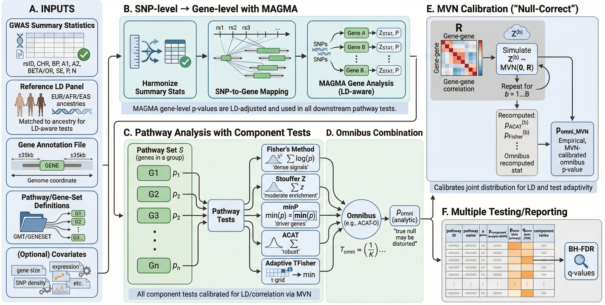

### Why multiple tests are needed

Pathways can be significant for statistically different reasons:

- one driver gene dominates,
- many genes show coordinated moderate enrichment,
- diffuse polygenic shift, and
- hybrids of these patterns.

No single gene-set statistic is uniformly most powerful across these various possibilities. Instead of relying on a single test, CATFISH runs several complementary pathway tests and combines them into one pathway-level omnibus $p$-value. We define these patterns using a set of **pathway signal archetypes** (sparse driver, coordinated moderate enrichment, diffuse polygenic shift, hybrid driver–support, single-gene proxy), which describe different ways a pathway can appear significant.

## Pathway signal archetypes

We divide the pathway signals into a set of archetypes that describe different ways a pathway can be enriched in a biological sense explained in detail below. We then use a combination of statistical tests chosen to be representative to each of these behaviors and a provide a biological example for each archetype.

### Archetype I — Sparse Driver Architecture (SDA)

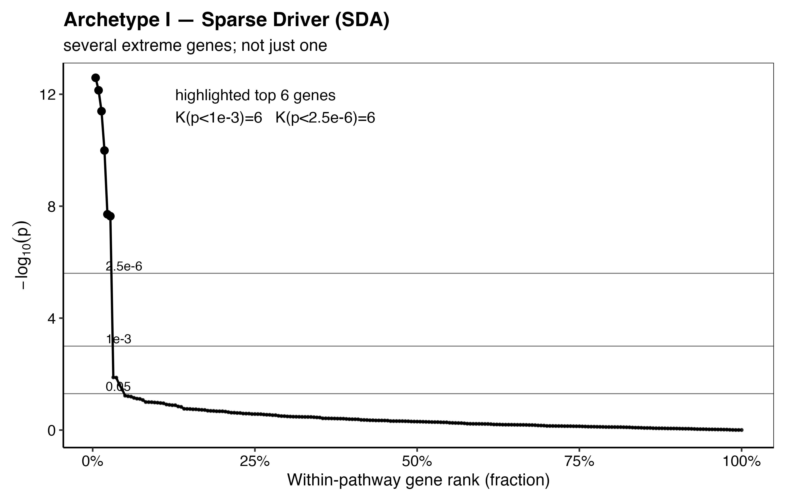
*Archetype I: Sparse Driver Architecture (SDA).*

**Signature:** A small number of genes are extremely significant; most genes look null.

**Gene-level $p$-value pattern:**

- There exists a small $K \ll G$ such that the top $K$ gene $p$-values are extremely small, $p_{(1)}, \dots, p_{(K)} \ll \alpha$ (e.g. $p_{(1)} \sim 10^{-7}$ or smaller),
- The remaining genes are approximately null, $p_{(K+1)}, \dots, p_{(G)} \sim \mathrm{Uniform}(0,1)$.
- This produces a sharp “elbow” in the ranked $p$-values (a few tiny hits followed by a long flat tail).

**Interpretation:**  
An SDA pathway is significant because **a small set of driver genes dominates the signal**, rather than broad involvement of most pathway members. This can occur when the trait-relevant biology passes through a **bottleneck** (committed step, rate-limiting enzyme, key regulator, or essential transporter) so that genetic variation concentrates its effect at a few control points. In contrast, pathway annotations typically include many additional enzymes, modifiers, and general “support” genes that may be necessary for pathway operation but do not carry strong association for the trait. Under SDA, association is therefore concentrated in the top $K$ genes, yielding very small ordered $p$-values $p_{(1)}, \ldots, p_{(K)}$ followed by a long tail $p_{(K+1)}, \ldots, p_{(G)}$ that is close to uniform.

**Biological example:**  
**Aspartokinase in the aspartate-derived amino acid pathway**

The aspartate-derived amino-acid biosynthesis pathway converts **aspartate** into essential amino acids, such as **lysine**, **threonine**, **methionine**, and **isoleucine**. In plants and bacteria, the first step is catalyzed by **aspartokinase (AK)**, which phosphorylates aspartate to **aspartyl-phosphate** that feeds multiple branched network to produces several end-products. Due to its position at the starting point of the pathway, AK acts as a **flux-controlling bottleneck**. Variations in AK activity alter carbon and nitrogen flow through the whole network. Downstream enzymes, including tailoring steps, dehydrogenases, and transaminases, typically exhibit dispersed or buffered roles. Thus, the gene-level pattern aligns with SDA. A single AK gene or a few genes downstream may exhibit very low $p$ values (e.g. $10^{-8}\text{-}10^{-10}$), while the majority are dispersed across the interval $(0,1)$.

**Best detectors in CATFISH:**
- **ACAT** — sensitive to a few extremely small $p$-values (RECOMMENDED).  
- **minP / Tippett** — targets the minimum $p$-value; optimal when one gene dominates.


---

### Archetype II — Coordinated Moderate Enrichment (CME)

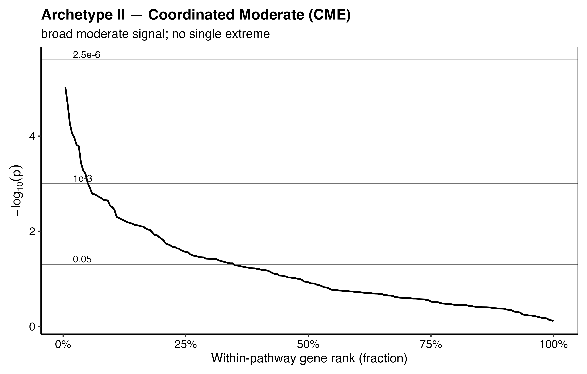
*Archetype II — Coordinated Moderate Enrichment (CME)*


**Signature:** many genes show moderate association; no single gene is extremely low.

**Gene-level $p$-value pattern:**
- A non-trivial fraction of genes have moderately small $p$-values, e.g.
  $$p_i \in [10^{-3}\,0.05]\quad\text{for many} i.$$
- The top signal is not orders-of-magnitude beyond the rest (no single-gene spike), e.g.
  $$p_{(1)} \not\ll p_{(k)}\quad\text{for small }k\ (\text{e.g., }k=5,10,20).$$
- The ranked $p$-values show a **broad shoulder** (many good genes) but not a sharp elbow.

**Interpretation:**  
CME signifies **collective functional engagement**. The pathway behaves like a coordinated module wherein numerous components exert small-to-moderate effects. This is expected when phenotypes emerge from distributed regulation, redundancy, and buffering/feedback as dramatic single-gene effects are rare. Statistically, enrichment arises from numerous mildly informative genes rather than single driver.

**Biological example:**  
**Cytokine / immune signaling cascades**

In numerous immunological pathways, the output is regulated not by a singular "master gene," but through distributed modulation across various tiers of a signaling circuit. A clear example is TNFα / IL-1β → NF-κB, where the activation of upstream receptors ultimately activates IKK complexes, which phosphorylate IκB inhibitors, facilitating the nuclear translocation of NF-κB family members. The temporal dynamics of NF-κB activation (rapid/transient versus slower/sustained) are significantly influenced by the stimulus class and receptor context  (Zhao et al., 2018). The significance of these dynamics lies in the variability of transcriptional outputs influenced by stimulus, NF-κB family composition, and cell type. Core feedback and marker targets encompass genes such as **NFKBIA (IκBα)** and **TNFAIP3 (A20)**, underscoring the notion that pathway behavior is governed by numerous regulatory nodes rather than a singular switch (Zhao et al., 2018).

This “many-knobs” architecture is also apparent one layer upstream in TNFRSF signaling. TNFRSF receptors bind trimeric TNFSF ligands, however, increasing evidence suggests that a single trimeric ligand–receptor complex fails to elicit complete signaling output. Rather, for certain TNFRSF pathways (notably the classical NF-κB pathway), successful activation may necessitate secondary interactions or clustering of multiple trimeric receptor complexes (Medler et al., 2019). Mechanistically, this indicates that pathway output relies on the coordinated effects of receptor assembly/avidity, adaptor recruitment, kinase activation thresholds, and the strength of negative feedback, precisely the type of system where typical genetic variation is anticipated to produce numerous modest perturbations rather than a singularly significant driver.

In CATFISH terminology, this yields a CME pattern. Within a cytokine/immune circuit, gene-level $p$-values may exhibit a surplus of moderate signals (e.g., numerous genes around 10⁻³–10⁻²) without a singular extreme outliers. The ordered gene-level $p$-values ($$p_{(1)}, p_{(2)}, \ldots$$) contains many values in the range of $$10^{-3} to 10^{-2},$$ without an extreme such as 10^{-12}. Consequently, CME pathways are optimally represented by evidence-accumulating tests (e.g., Fisher, Stouffer/mean-Z, and mild-truncation/soft-TFisher), whose efficacy is enhanced when numerous route members exhibit moderate associations, rather than depending on a singular peak.

**Best detectors in CATFISH:**
- **Fisher’s method** (aggregates evidence across many moderately small $p$-values) (RECOMMENDED).
- **Stouffer / mean-Z** (gains power when many genes shift together).
- Optionally **wFisher / weighted Z** if you later add biologically informed weights.


---

### Archetype III — Diffuse Polygenic Shift (DPS)

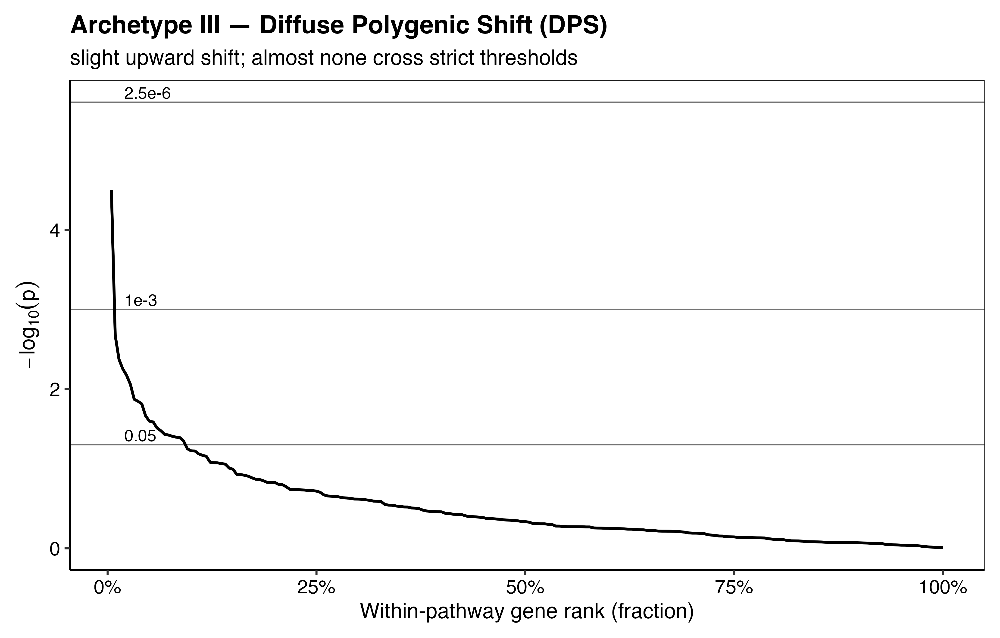
*Archetype III — Diffuse Polygenic Shift (DPS)*


**Signature:** the pathway’s genes are, on average, slightly more associated than the genome-wide background, but almost none cross a conventional significance threshold.

**Gene-level $p$-value / Z pattern:**
- Most gene $p$-values satisfy:
  $$p_i > 0.05\quad\text{for most } i.$$
Yet the pathway shows a small but consistent shift in adjusted gene-level Z-scores:

$$
\overline{Z}_{S,\mathrm{adj}} \;=\; \frac{1}{G}\sum_{i\in S} Z_{i,\mathrm{adj}} \;\neq\; 0,
$$

often with a coherent sign (bias in one direction).
- $$\{p_i: i\in S\}\ \text{is subtly enriched toward smaller values relative to Uniform}(0,1),$$
  but without extreme outliers.
- No sharp elbow, instead, the ranked $p$-values show a gentle, global downward bend relative to null.

**Interpretation:**  
DPS indicates a global pathway bias aligned with polygenicity. Numerous genes individually exert minimal impacts in a uniform direction, resulting in pathway enrichment due to the collective subtle shift of the entire module rather than the influence of a singular "star" gene. This is the regime characterized by numerous little issues and the absence of significant challenges. Spike-hunting tests, such as minP/Tippett or highly aggressive truncation, are generally underpowered in this context due to the absence of a singular extreme $p$-value to leverage. Conversely, mean-/distribution-sensitive tests (Stouffer/mean-Z, Fisher, and competitive regression) are specifically formulated to identify this subtle, pervasive divergence from the null hypothesis.

**Biological example:**  

**Human height as a diffuse polygenic shift**

The height of adult humans exemplifies a highly polygenic characteristic. Initial GIANT meta-analyses involving over 180,000 individuals identified 180 loci and "hundreds of variants" associated with height. Nevertheless, they accounted for merely 10% of the phenotypic variance, despite height exhibiting approximately 80% heritability. Subsequent meta-analyses involving about 700,000 Europeans identified thousands of linked SNPs and hundreds of locations, validating the perspective that height is regulated by several common variants of minimal effect rather than a limited number of high-impact genes. A recent investigation of a "saturated map" identified over 12,000 genome-wide significant SNPs across more than 7,000 genomic segments, encompassing around 21% of the genome, thereby reaffirming Fisher’s original polygenic hypothesis for height proposed in 1918.

These variants are classified into several growth-related processes, such as chondrocyte proliferation and hypertrophy in the growth plate, extracellular matrix and cartilage organization, growth hormone and IGF-1 signaling, and morphogen pathways including TGF-β and Hedgehog, as well as overarching developmental and endocrine regulators. Analyses of height GWAS loci through pathway and gene-set evaluations have demonstrated enrichment for signaling pathways such as TGF-β and Hedgehog, as well as for genes associated with skeletal growth, growth plate regulation, and pertinent Mendelian growth disorders. Lango Allen et al. (2010) discovered that genes adjacent to height-associated variants congregate in biologically coherent pathways, including TGF-β signaling, Hedgehog signaling, and histone and growth/development gene sets. Furthermore, several SNPs near these pathway genes "narrowly miss" genome-wide significance, suggesting numerous additional sub-threshold contributors within the same modules. Guo et al. (2018) demonstrate that genes adjacent to height GWAS loci are enriched in processes and tissues pertinent to growth, including growth plate cartilage.

When examined at the level of an individual pathway (e.g., TGF-β signaling, Hedgehog signaling, or growth-plate extracellular matrix genes), this structure inherently produces a DPS pattern. Throughout the gene set, numerous genes possess one or more prevalent variations that have minor impacts on height. Certain genes attain definitive genome-wide relevance, while many others exhibit relatively mild or nominal associations. The outcome indicates that, in contrast to random gene sets, the distribution of gene-level test statistics within these pathways exhibits a shift towards more robust evidence overall characterized by an increased number of genes with small or moderate $p$-values and a decreased number of genes appearing entirely null, despite the fact that most individual genes would not, on their own, substantiate a strong association claim. This scenario exemplifies the optimal application of CATFISH’s DPS-oriented detectors (Stouffer/mean-Z on adjusted gene-level Z-scores, and optionally MAGMA-style competitive regression tests). They assess whether the **average** association signal across a biologically coherent pathway is subtly yet consistently heightened in comparison to the genome-wide background.

**Best detectors in CATFISH:**
- **Stouffer / mean-Z on** `Z_adj` (unweighted; permutation-calibrated) (RECOMMENDED).
- Optionally **competitive regression-style gene-set models** (e.g., **MAGMA competitive**) if included as a component test (NOT INCLUDED IN CATFISH)


---

### Archetype IV — Hybrid Driver–Support (HDS)

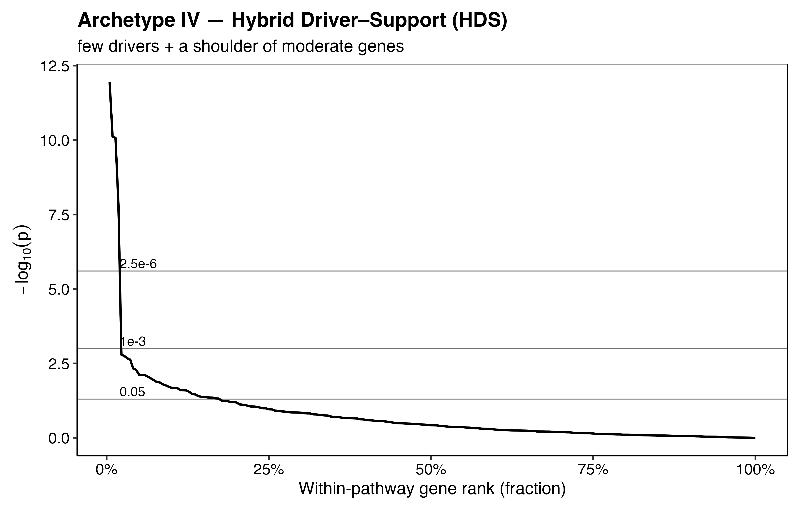
*Archetype IV — Hybrid Driver–Support (HDS)*


**Signature:** a few very strong genes plus a some moderately associated genes.

**Gene-level $p$-value pattern:**
- One or a few top genes are extremely significant, e.g.
  $$p_{(1)},\,p_{(2)} \ll 10^{-4}\quad(\text{often much smaller}).$$
- Beyond the top hits, several additional genes show moderate evidence:
  $$p_{(k)} \in [10^{-3},\,0.05]\quad\text{for multiple }k \text{ (support genes).}$$
- The remaining genes are near-null:
  $$p_{(j)} \sim \mathrm{Uniform}(0,1)\quad\text{for most other }j.$$
- A small “spike” at the top (drivers) plus a clear “shoulder” of moderately small $p$-values (support), then a flat tail.

**Interpretation:**  
Hybrid Driver–Support (HDS) exhibits a hierarchical pathway structure. A small number of “driver” genes exert the most significant effects, whilst a group of genes provides modest yet persistent associations. This is prevalent in pathways where flow or signal is regulated by a limited number of control points, whereas effective route output also relies on the synchronized activity of various downstream components. This architecture is statistically positioned between SDA and CME. A distinct driver signal exists, although the significance of the pathway is augmented by supplementary moderate signals.

**Biological example** – **LDL cholesterol as a hybrid driver–support pathway**

The regulation of LDL-cholesterol (LDL-C) exemplifies a scenario in which a limited number of genes serve as primary "drivers" within a more extensive polygenic framework. Extensive GWAS and sequencing investigations consistently identify *LDLR*, *APOB*, and *PCSK9* as fundamental genes associated with Mendelian hypercholesterolemia. Infrequent coding or splice-altering variants in these genes can alter LDL-C by approximately half a standard deviation or more and are responsible for classical familial hypercholesterolemia, significantly elevating the risk of coronary artery disease. Recent whole-genome sequencing investigations involving over 60,000 individuals reveal that even infrequent *non-coding* variations next to *LDLR* and *PCSK9* can exert effects comparable to clinically recognized exonic FH variants, hence supporting their significance as primary regulators of LDL-C homeostasis.

A supporting network of lipoprotein and cholesterol metabolism genes surrounds these drivers. GWAS of traditional lipids and nuclear magnetic resonance (NMR)-based lipoprotein characteristics have revealed numerous new loci affecting LDL particle size, concentration, and composition, including apolipoprotein clusters (*APOE/APOC*, *APOA1/A5*), hepatic lipase (*LIPC*), and transporters such as *ABCG5/ABCG8*. Individually, prevalent variants at these loci typically elucidate only a minor proportion of LDL-C variance, however, collectively, they constitute a significant segment of the genome-wide polygenic signal. Recent extensive multi-ancestry meta-analyses now identify hundreds of lipid-associated loci distributed throughout this extensive lipoprotein network.

Translating this biology into gene-level association statistics for an LDL-related trait reveals that the route is neither exclusively "sparse driver" nor entirely "coordinated moderate". Typically, one observes several robust gene-level signals at *LDLR*, *APOB*, *PCSK9*, and a few linked loci, supported by a wider array of modestly correlated genes implicated in lipoprotein assembly, remodeling, and cholesterol transport. The HDS pattern is characterized by a pathway whose enhancement is indicative of both a limited number of predominant, high-impact genes and a strong, albeit subtler, influence from the broader metabolic framework. In CATFISH terminology, this refers to the regime when **soft TFisher** (which prioritizes the lower tail while still considering moderate $p$-values), along with **Fisher** and the **omnibus combination**, aligns effectively with the underlying biology.

**Best detectors in CATFISH:**
- **Soft TFisher** (tail-focused; gains power from a few strong hits *plus* additional modest hits)
- **Fisher** (accumulates evidence across the moderate support set)
- **Omnibus combination** (e.g., ACAT across ACAT/Fisher/soft-TFisher/Stouffer; or permutation-calibrated minP across methods)

---

### Archetype V — Single-Gene Proxy Pathway (SGP)

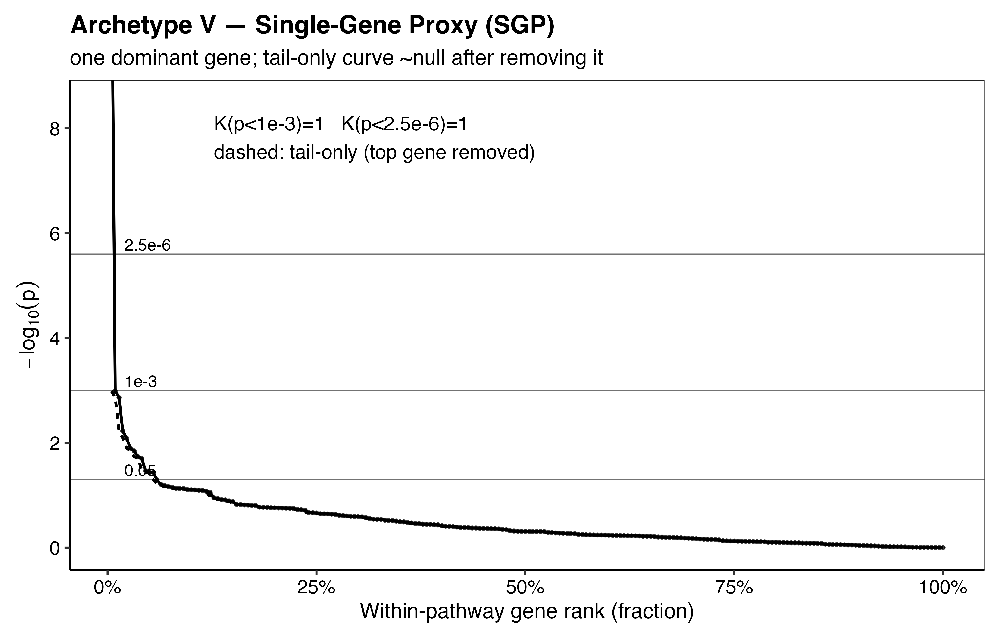
*Archetype V — Single-Gene Proxy Pathway (SGP)*


**Signature:** the pathway looks significant only because it contains one very strong gene; the remaining members look essentially null.

**Gene-level pattern:**
- The top gene has an extremely small $p$-value (e.g. $10^{-7}\text{--}10^{-12}$).
- The rest of the genes have $p$-values that look noisy / $\mathrm{Uniform}(0,1)$, with no clear excess of small p’s.
- If you ignore the top gene, there is no obvious enrichment left in the pathway.

**Interpretation:**  
The pathway effectively serves as a proxy for a singular gene-level relationship. This frequently occurs when:
- an annotation term is very small (one gene plus a couple of weakly related neighbors), or
- numerous pathway definitions redundantly incorporate the same driver gene, resulting in several "distinct" pathways activating while all reference the same underlying gene.

Biologically, the driver gene remains significant (and may also align with the SDA), although the pathway-level assertion provides no additional information beyond indicating that "this gene is strongly associated to the pathway." In CATFISH, we consequently designate SGP patterns with a cautionary note, "view these as gene-centric findings with associated pathway designations, rather than as proof that the entire pathway is collectively activated."

**Biological example:**  
**PAH in phenylalanine metabolism**

In humans, phenylalanine metabolism is primarily regulated by a singular bottleneck enzyme, phenylalanine hydroxylase (PAH), a hepatic monooxygenase that catalyzes the conversion of phenylalanine to tyrosine in a process dependent on tetrahydrobiopterin (BH₄) (Scriver, 2007; Elhawary et al., 2022). Classical phenylketonuria (PKU) and associated forms of hyperphenylalaninemia (HPA) occur when phenylalanine hydroxylase (PAH) activity is significantly diminished, resulting in elevated blood phenylalanine levels, relatively decreased tyrosine levels, and the accumulation of neurotoxic metabolites. This culminates in the distinctive untreated PKU phenotype characterized by extremely high phenylalanine, low tyrosine, and progressive neurological impairment (Elhawary et al., 2022). Extensive clinical and molecular studies indicate that the predominant cause of HPA/PKU cases is pathogenic variants in PAH, whereas a minority results from deficiencies in BH₄ synthesis, recycling, or the PAH co-chaperone DNAJC12 (Blau et al., 2014; Himmelreich et al., 2021; Elhawary et al., 2022). In summary, within the overarching phenylalanine metabolism pathway, PAH represents the pivotal flux-controlling step. Both common and rare variations at PAH significantly influence systemic phenylalanine levels, while the majority of other pathway components (transporters, minor side-enzymes, cofactor recycling genes) have considerably weaker or less frequent effects at the population level.

**Best detectors in CATFISH:**
- **minP / Tippett** 
- **ACAT** 

---

### Archetype VI — Competitive Enrichment Above Background (CEAB) (OPTIONAL - Not used for CATFISH, just a check)

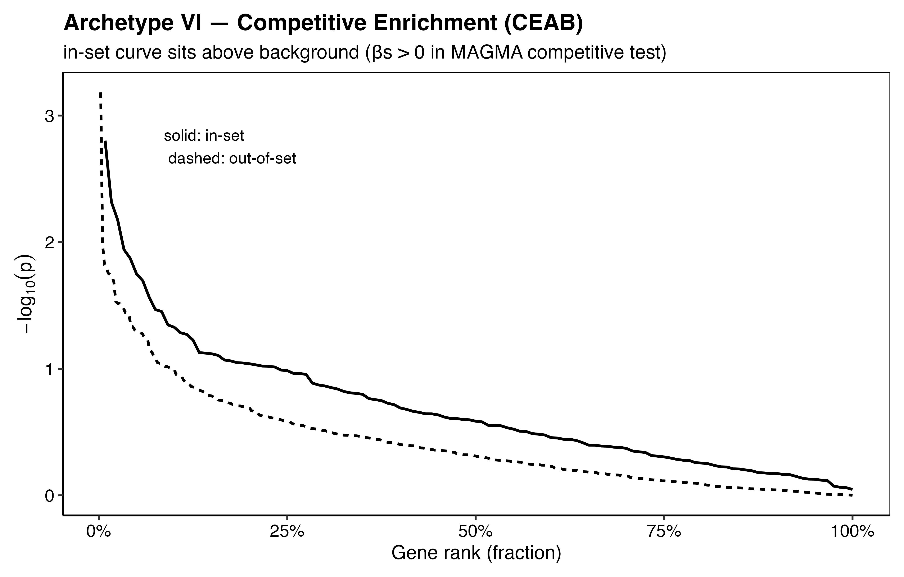
*Archetype VI — Competitive Enrichment Above Background (CEAB)*


**Signature:** the pathway is not merely “associated”, it is enriched above the genome-wide polygenic background. It passes a MAGMA competitive test ($\beta_s > 0$), indicating that genes inside the set exhibit, on average, greater associated than those outside the set.

**Gene-level pattern:**

Let $Z_g$ be the gene-level $Z$ used by MAGMA, derived from gene $p$-values via a probit transform (higher $Z$ = stronger association).  
In a CEAB pathway $s$:

- The distribution of $\{Z_g : g \in s\}$ is elevated in comparison to $\{Z_g : g \notin s\}$. Equivalently, $\mathrm{mean}(Z_{\mathrm{in\_set}}) > \mathrm{mean}(Z_{\mathrm{outside\_set}})$, rather than merely $\mathrm{mean}(Z_{\mathrm{in\_set}}) > 0$.
- The signal is generally not represented by a single-gene proxy, rather, one may see multiple modestly strong genes or a small top-tail alongside an elevated mean. The crucial aspect is that the *average* in-set relationship surpasses the background level
- The pathway retains its significance following MAGMA's default covariate adjustment for confounding gene characteristics (e.g., gene size and gene density, including log-transforms), indicating that it is not "large genes/dense genes" responsible for the observed effect.

**Interpretation:**  
CEAB signifies authentic enrichment rather than: (i) generic polygenicity (where multiple sets appear related under independent testing), (ii) artifacts from annotation overlap, or (iii) confounding effects due to gene size or density.  

Competitive tests possess a more generalized null hypothesis because they explicitly adjust for baseline associations inherent in polygenic characteristics. In MAGMA’s Crohn’s disease case study, numerous gene sets seemed related through self-contained testing. However, only one maintained significance under the competitive hypothesis demonstrating that CEAB identifies sets with associations that exceed expectations based on polygenicity.

**Biological example**
**From MAGMA’s Crohn’s Disease analysis**  

In the WTCCC Crohn’s disease dataset, MAGMA’s self-contained analysis identified 39 related gene sets. However the competitive analysis recognized only one of those 39 as enriched above background ("Regulation of AMPK activity via LKB1 (REACTOME))".

This exemplifies a standard CEAB pattern. The pathway meets the above-background enrichment criterion. Two supplementary sets (e.g., Cell adhesion molecules and ECM-receptor interaction) attained competitive significance solely when gene size/density correction was disabled, which MAGMA reads as (at least partially) confounding-induced inflating rather than genuine enrichment.

**Best detectors in CATFISH:**

- MAGMA competitive $p$-value (from `*.gsa.out`) as an external “above-background” anchor:  
  if $p_{\mathrm{comp}}$ is small and $\beta_s > 0$, interpret as CEAB-supported enrichment.

---

### Bias warning

Pathway-based analysis for assessing over-representation or enrichment is influenced by various biases, including gene size, pathway size, SNP coverage density, and linkage disequilibrium (LD) patterns, all of which must be addressed explicitly (White et al., 2020; PMC6391732). In CATFISH, we tackle these issues in three phases: (i) The SNP to gene analysis is conducted using MAGMA’s LD-aware multi-SNP model, ensuring that gene-level Z/P values account for local LD structure and SNP density; (ii) we subsequently regress MAGMA gene Z-scores against log(gene length) and log(number of SNPs), utilizing the residual-based $P_adj$ for all subsequent gene to pathway analyses, thereby eliminating any remaining dependence on gene size and SNP density; and (iii) at the pathway level, we avoid simplistic over-representation tests, opting instead to calibrate our omnibus statistics through gene-label LD-aware permutations that maintain each gene’s adjusted $p$-value and the observed distribution of pathway sizes, yielding enrichment $p$-values that are resilient to these established biases.

Link: https://pmc.ncbi.nlm.nih.gov/articles/PMC6391732/

---

## METHODS

### Notation

Let a pathway (gene set) be denoted by $S$, containing $G = |S|$ genes indexed by $g = 1,\dots,G$.

For each gene $g \in S$, let:
- $Z_g$ denote the raw gene-level $Z$-statistic, and
- $p_g$ denote the corresponding two-sided $p$-value.

We collect these into vectors:

$$
\mathbf{Z}_S = (Z_1, Z_2, \dots, Z_G),
\qquad
\mathbf{p}_S = (p_1, p_2, \dots, p_G).
$$

---

### 1) Gene-level association statistics (SNP → gene)

For each gene $g$, MAGMA generates a gene‑level association p‑value $p_g$ by aggregating SNP‑level signals within or within a window of the gene while accounting for local LD using a reference panel. We employed MAGMA’s `multi=snp-wise` model, which integrates a SNP-wise mean test (effective for numerous small effects) and a SNP-wise top test (effective for a single strong SNP) into a unified LD-aware omnibus statistic per gene, hence ensuring the robustness of gene $p$-values against varying within-gene causal structures.

The workflow emcompasses:

- SNPs are mapped to genes (gene boundaries with optional windows).
- A multi‑marker gene model accounts for LD among SNPs in the genic region.
- MAGMA generates gene statistics (e.g., $Z_g$ and $p_g$).

In CATFISH, the $p$-values (or Z statistics) of the MAGMA gene are utilized as inputs for all pathway analyses.

---

### 2) Gene-level adjustment for gene size and SNP density

Despite LD-aware gene testing, gene-level signals may still demonstrate residual dependency on gene size and SNP density. CATFISH executes a post-hoc correction at the gene level.

Let:

- $Z_g$ be the MAGMA gene Z‑statistic,
- $L_g$ be gene length (bp),
- $S_g$ be number of SNPs mapped to the gene.

We fit a regression line as:

$$
Z_g = \beta_0 + \beta_1 \log(L_g) + \beta_2 \log(S_g) + \varepsilon_g.
$$

We define adjusted residual Z as:

$$
Z^{\mathrm{adj}}_g = Z_g - \widehat{Z}_g,
\quad \widehat{Z}_g = \widehat{\beta}_0 + \widehat{\beta}_1 \log(L_g) + \widehat{\beta}_2 \log(S_g).
$$

The corresponding adjusted two-sided $p$-values are:

$$
p_{g,\mathrm{adj}} = 2\.\Phi\!\left(-\left|Z_{g,\mathrm{adj}}\right|\right),
$$

where $\Phi(\cdot)$ is the standard normal CDF.

We denote the adjusted vectors by:

$$
\mathbf{Z}_{S\mathrm{adj}} = (Z_{1\mathrm{adj}}, \dots, Z_{G\mathrm{adj}}),
\qquad
\mathbf{p}_{S\mathrm{adj}} = (p_{1\mathrm{adj}}, \dots, p_{G\mathrm{adj}}).
$$


---

### 3) Pathway-level test statistics (gene → pathway)

CATFISH computes multiple pathway statistics from either unadjusted gene-level $p_g$ and $Z_g$, or the adjusted counterparts $p_{g,\mathrm{adj}}$ and $Z_{g,\mathrm{adj}}$. For convenience, we present definitions using the unadjusted inputs.

We define multiple pathway-level statistics as functionals of a common set of within-pathway, gene-level evidences p<sub>g</sub> : g ∈ S (and, when available, Z<sub>g</sub> : g ∈ S).
The gene-level evidences for genes within the same pathway are typically dependent (e.g., due to linkage disequilibrium–induced correlation and shared genomic architecture). Consequently, the resulting pathway statistics are also mutually dependent, as they are derived from the same underlying inputs.


Therefore, closed-form reference calibrations that rely on independence of the gene-level tests (such as Fisher’s $\chi^2$ null or Tippett’s transformation for minP) are provided only as canonical or illustrative definitions. The final inferential $p$-values (both for each individual component statistic and for the omnibus statistic) are obtained via the unified null calibration procedure described in Section~4, which recomputes all statistics under a null-generating mechanism that preserves the dependence structure.


### 3.1 ACAT (Aggregated Cauchy Association Test)

The ACAT statistic transforms each gene $p$-value via:

$$
t_g = \tan\left(\pi\left(\tfrac{1}{2} - p_g\right)\right).
$$

Because the Cauchy distribution has heavy tails, ACAT is dominated by the smallest $p_g$, making it powerful for sparse signals.

We define non‑negative weights $w_g \ge 0$ with $\sum_{g \in S} w_g = 1$ (default $w_g = 1/G$).

The ACAT statistic is:

$$
T_{\mathrm{ACAT}}(S) = \sum_{g \in S} w_g\, t_g
= \sum_{g \in S} w_g \tan\left(\pi\left(\tfrac{1}{2} - p_g\right)\right).
$$

The combined $p$-value is:

$$
p_{\mathrm{ACAT}}(S) = \tfrac{1}{2} - \frac{1}{\pi}\arctan\left(T_{\mathrm{ACAT}}(S)\right).
$$

ACAT is asymptotically dominated by the smallest $p$-values, and is therefore sensitive to SDAs. In practice, ACAT’s Cauchy transform is undefined at exact boundary $p$-values (0 or 1) because $\tan\{\pi(1/2-p)\}$ diverges. Therefore, prior to computing $T_{\mathrm{ACAT}}(S)$ we clip gene $p$-values to a safe open interval:

$$
p_g \leftarrow \min\{1-p_{\min}\,\max(p_g\,p_{\min})\},\qquad p_{\min}=10^{-15}.
$$

In addition, if a gene appears multiple times in the pathway input (e.g., duplicate mapping entries), we collapse duplicates so that each gene contributes **once**, using the smallest $p$-value observed for that gene:

$$
p_g \leftarrow \min\{p_{g,1},p_{g,2},\ldots\}.
$$

This ensures that ACAT is computed over the set of **unique genes** in $S$ and avoids inflating evidence by repeated gene entries.


---

### 3.2 Fisher’s method

The define the Fisher’s statistic as:

$$
T_{\mathrm{Fisher}}(S) = -2\sum_{g \in S} \log(p_g).
$$

Under independence,

$$
T_{\mathrm{Fisher}}(S) \sim \chi^2_{2G},
\quad
p_{\mathrm{Fisher}}(S) = 1 - F_{\chi^2_{2G}}\left(T_{\mathrm{Fisher}}(S)\right),
$$

where $F_{\chi^2_{2G}}(\cdot)$ is the $\chi^2$ CDF with $2G$ degrees of freedom.

Fisher is sensitive to CMEs. To avoid undefined values in $\log(p_g)$ when $p$-values are extremely small or numerically zero, we apply the same clipping rule as above:

$$
p_g \leftarrow \min\{1-p_{\min}\,\max(p_g\,p_{\min})\},\qquad p_{\min}=10^{-15}.
$$

If a gene appears multiple times in the input for a pathway (duplicate gene entries), we retain one value per gene by collapsing duplicates using the minimum $p$-value for that gene before computing $T_{\mathrm{Fisher}}(S)$. Thus Fisher’s statistic is computed on the set of unique pathway genes.

---

### 3.3 Adaptive Soft TFisher

CATFISH includes **soft TFisher** to explicitly target *tail-driven* pathway architectures, where enrichment is carried by a subset of the most significant genes rather than a diffuse shift across many genes. TFisher is an adaptive, weighted Fisher-family test that up-weights the smallest gene-level p-values by applying a soft truncation controlled by a threshold parameter $$\tau$$. The optimal tail focus depends on the (unknown) genetic architecture of each pathway (e.g., sparse-driver vs. moderately diffuse enrichment), CATFISH uses an adaptive soft TFisher strategy. Here, we evaluate the soft TFisher statistic over a small, fixed grid of $$\tau$$ values and retain the smallest resulting $p$-value as the TFisher component signal for that pathway. 

#### Soft TFisher statistic (per $\tau$)

For a pathway $S$ with gene-level $p$-values $\{p_g\}_{g\in S}$ and a soft-threshold $\tau\in(0,1]$, the soft TFisher statistic is

$$
W^{\mathrm{soft}}(S;\tau)=\sum_{g\in S}\left[-2\log(p_g)+2\log(\tau)\right]_{+},
\qquad (x)_+=\max(x,0).
$$

This is a continuous (soft) down-weighting near the cutoff, in contrast to hard truncation.

#### Adaptive selection over a fixed $\tau$ grid

Let $\mathcal{T}=\{\tau_1,\dots,\tau_m\}$ be a fixed grid of candidate thresholds. In the CATFISH implementation, the default grid is:

$$
\mathcal{T}=\{0.20\;0.10\;0.05\;0.01}.
$$

For each $\tau\in\mathcal{T}$, we compute $W^{\mathrm{soft}}(S;\tau)$ and obtain a corresponding analytic null $p$-value $p_{\tau}(S)$ using the TFisher package’s calibration for the soft statistic.
We then define the adaptive soft TFisher component as:

$$
p_{\mathrm{aTF}}(S)=\min_{\tau\in\mathcal{T}} p_{\tau}(S).
$$

Because the values p<sub>τ</sub>(S)}<sub>τ∈𝒯</sub> are dependent (they reuse the same gene $p$-values), the TFisher package provides an analytic omnibus calibration for the minimum across τ. CATFISH uses this resulting p<sub>aTF</sub>(S) as the **component** TFisher $p$-value, and then accounts for LD-induced gene–gene correlation and cross-method dependence at the final omnibus calibration stage (Section 4). To avoid $\log(0)$ and other numerical issues, gene $p$-values are clipped to:

$$
p_g \leftarrow \min\{1-p_{\min}\,\max(p_g\,p_{\min})\},\qquad p_{\min}=10^{-15}.
$$

If a gene appears multiple times in the pathway input, duplicate entries are collapsed so that each gene contributes once, using the minimum $p$-value for that gene prior to computing $W^{\mathrm{soft}}(S;\tau)$.


---

### 3.4 Stouffer's method

Stouffer’s Z-score test (one-sided by default to detect positive enrichment) is most powerful for many small, concordant effects. In CATFISH, the gene-level $Z$ input is taken directly from MAGMA’s gene output (`ZSTAT`). Importantly, MAGMA’s $Z$ scale is an association-strength transform (monotone in the gene $p$-value), so larger positive values indicate stronger evidence of association, not the direction of effect (trait-increasing vs trait-decreasing) (ref). Consequently, the natural pathway-level Stouffer test in this context is one-sided (greater), assessing whether genes in the pathway show unusually large association-strength scores.

**Default (unweighted) Stouffer:**

For a pathway $S$ with $G=|S|$ genes,

$$
Z_{\mathrm{stouffer}}(S)=\frac{1}{\sqrt{G}} \sum_{g \in S} Z_g, \qquad p_{\mathrm{stouffer}}(S)= 1-\Phi\!\left(Z_{\mathrm{stouffer}}(S)\right),
$$

where $\Phi(\cdot)$ is the standard normal CDF.

**Optional (weighted) Stouffer:**

CATFISH optionally supports nonnegative per-gene weights $w_g$ (e.g., based on SNP count or other gene-level quantities). In that case,

$$
Z_{\mathrm{stouffer}}^{(w)}(S) = \frac{\sum_{g\in S} w_g\, Z_g}{\sqrt{\sum_{g\in S} w_g^2}}, \qquad p_{\mathrm{stouffer}}^{(w)}(S) = 1-\Phi\!\left(Z_{\mathrm{stouffer}}^{(w)}(S)\right).
$$

(Weights are assumed nonnegative so that “large positive” still corresponds to stronger aggregated evidence.)

A two-sided option can be reported for completeness when a genuinely *signed* gene-level $Z$ is available:

$$
p_{\mathrm{stouffer}}^{(2\text{-sided})}(S) = 2\,\Phi\!\left(-\left|Z_{\mathrm{stouffer}}(S)\right|\right).
$$

This is not the default for MAGMA-style association-strength $Z$ scores.

In the CATFISH implementation, Stouffer’s test defaults to a **one-sided** alternative, `alternative = "greater"`, i.e. we test whether the pathway’s aggregated MAGMA association-strength scores are unusually large:

$$
H_0:\; Z_{\mathrm{stouffer}}(S)\sim \mathcal{N}(0,1) \qquad \text{vs}\qquad H_1:\; Z_{\mathrm{stouffer}}(S) > 0.
$$

This default is appropriate for MAGMA’s gene-level $Z$ statistics (e.g. `ZSTAT`), which represent **strength of association** (higher = stronger evidence) rather than a signed direction of effect.

If the user provides genuinely **signed** gene-level $Z$-scores (e.g., from an effect-direction-aware gene model), CATFISH can optionally report a **two-sided** Stouffer $p$-value:

$$
p_{\mathrm{stouffer}}^{(2\text{-sided})}(S) = 2\,\Phi\!\left(-\left|Z_{\mathrm{stouffer}}(S)\right|\right).
$$

Finally, the analytic Stouffer $p$-values above rely on the standard normal reference calibration, which implicitly assumes independent gene-level statistics (or, more generally, that $Z_{\mathrm{stouffer}}$ has been variance-standardized under the null). In practice, genes within a pathway can be correlated (LD / local genomic structure), so CATFISH treats the analytic Stouffer $p$-value as a component summary and addresses dependence at the final omnibus calibration stage (Section 4; MVN/global resampling).

---

### 3.5 minP (Tippett / Šidák)

For each pathway $S$ with $G=|S|$ genes and gene-level $p$-values $\{p_g\}_{g\in S}$, the minP statistic is the smallest gene $p$-value:

$$
T_{\min}(S)=p_{\min}(S)=\min_{g\in S} p_g.
$$

Under independence, the canonical calibration for the minimum $p$-value is the Tippett/Šidák transform:

$$
p_{\mathrm{tippett}}(S) = \Pr\!\left(\min_{g\in S} P_g \le p_{\min}(S)\right) = 1-\big(1-p_{\min}(S)\big)^{G}.
$$

(Here $G$ is the number of *unique* genes in the pathway after collapsing duplicates; see below.)

CATFISH computes and reports the above Tippett/Šidák mapping as the analytic component minP $p$-value. This is used as a standardized “component $p$-value” for downstream combination across methods. However, CATFISH does not treat this analytic mapping as the final inferential calibration because gene-level statistics within pathways are typically correlated (LD / local genomic structure).

Instead, when dependence-aware calibration is requested (Section 4; MVN and/or global resampling), CATFISH recomputes the minP statistic under each null draw using the same definition, take the minimum gene $p$-value in the null draw for the pathway and apply the same Tippett/Šidák transform with $G$ fixed for that pathway. The resulting empirical null distribution is then used in the unified calibration that produces the final omnibus $p$-values. minP is emphasized not because it is robust to dependence (it is not; like all component tests it is affected by gene–gene correlation), but because it targets a qualitatively distinct evidence mode: a pathway can rank highly due to one extremely significant gene even when the remaining genes show little signal. Thus minP is primarily a detector of sparse, single-gene–driven signals (SDA/SGP-type patterns), complementing aggregate procedures (Fisher, Stouffer, softTFisher, ACAT) that are designed to capture more diffuse enrichment.

To prevent duplicated gene entries from inflating evidence, CATFISH collapses pathway inputs to **unique genes** prior to computing $p_{min}(S)$ (and hence $p_{tippett}(S)$ ). If a gene appears multiple times in a pathway definition, only one value is retained for that gene (using the minimum $p$-value for that gene), so $G$ denotes the number of unique genes in $S$.


---

### 4) Dependence structure and unified null calibration

For a pathway $S$ with genes $g \in S$, CATFISH computes multiple component pathway tests from the same gene-level evidence (gene $p$-values $p_g$ and, when used, gene Z-scores $Z_g$). Two sources of
dependence arise:

1. **Deterministic coupling across component tests:** each component is a deterministic function of the same multiset ($p_g$) (and possibly $Z_g$), so component $p$-values are correlated even if genes were
   independent.

2. **Additional dependence across genes:** gene-level inputs within $S$ can be correlated due to LD/shared genomic structure and related effects, inducing correlation among $p_g$ and $Z_g$.

To obtain valid inference without assuming independence at either level, CATFISH calibrates the omnibus under a single dependence-preserving null generator that recomputes all components (and the omnibus) from the **same** null draw.

---

### 4.1 Deterministic coupling under the null (same $p_g$ reused)

Even under a pure null scenario where genes are independent, the component statistics are not jointly independent because they are all functions of the same gene-level $p$-values (equivalently the same order statistics $P_{(k)}$. Definitely, we have:

- Fisher and soft TFisher are monotone in $log(p_g)$. Soft TFisher can be viewed as a truncated/reweighted Fisher that concentrates weight on $p_g \le \tau$. Thus, when many $p_g$ are moderately small (or the lower tail is long), both Fisher and TFisher tend to become extreme in the same direction.

- Stouffer aggregates gene Z-scores, which in typical gene-set settings are monotone transformations of gene $p$-values (or are supplied directly as gene-level association Z-scores). Therefore pathways exhibiting diffuse, coordinated enrichment of small $p_g$ often also yield extreme Stouffer values.

- ACAT and minP are both tail-driven tests. ACAT uses the heavy-tailed Cauchy transform $\tan\{\pi(1/2 - p_g)\}$, and minP is exactly $P_{(1)}=\min_{g\in S} p_g$. Hence, if a pathway contains one (or a few) extremely small $p$-values, both ACAT and minP tend to be extreme. Soft TFisher with very small $\tau$ can behave similarly by up-weighting the most extreme $p$-values.

- Post hoc selection across methods (e.g., min across methods, or adaptive $\tau$ selection within TFisher) increases dependence among the reported statistics and can yield overly optimistic significance unless the null distribution is calibrated for the entire selection step.

---

### 4.2 Extra dependence from LD and shared gene-level correlation

In real data, gene-level inputs are not independent. The sets $\{p_g\}$ and $\{Z_g\}$ can be correlated across genes due to (i) adjacent genes sharing SNPs or LD structure, (ii) coupling of SNP-level evidence across genes via
local LD, and (iii) genome-wide polygenic background effects that can induce weak correlation among gene-level association metrics. This dependence compounds the deterministic coupling in Section 4.1.

---

### 4.3 Dependence-aware null calibration in CATFISH

CATFISH addresses the problems in 4.1 and 4.2 in two complementary ways:

1. Upstream LD-aware SNP \(\rightarrow\) gene aggregation (MAGMA):
Gene-level $p_g$ and $Z_g$ are derived from MAGMA’s LD-aware SNP-to-gene model, which adjusts gene evidence for correlated SNP structure within and near genes.

2. Downstream dependence-preserving null calibration:
   Rather than assuming independence among the component $p$-values $\{p_j(S)\}$, CATFISH calibrates by resampling in a way that recomputes all component tests on the same null draw:
   - Global gene-set resampling: sample genes from a genome-wide pool and recompute all component tests on the same resampled gene sets, preserving cross-method coupling induced by shared inputs (but LD-agnostic within a pathway).
   - LD-aware MVN calibration (recommended): simulate correlated gene Z-scores $Z \sim \mathcal{N}(0, R_S)$ using a pathway-specific correlation matrix $R_S$ (from MAGMA gene–gene correlations), and derive p-based components from the same draw via a Gaussian-copula mapping. This preserves both within-pathway gene dependence and cross-method coupling by construction.

---

### 4.3.1 Unified null calibration via an LD-aware MVN generator

Under the LD-aware MVN null, we generate null replicates for each pathway \(S\):

$$
Z^{(b)} \sim \mathcal{N}(0, R_S), \qquad b = 1,\dots,B,
$$

where $R_S$ is the pathway-specific gene–gene correlation matrix. For p-based components, we apply a Gaussian-copula mapping from the same $Z^{(b)}$. With two-sided gene $p$-values (default),

$$
U_g^{(b)}=\Phi\!\left(Z_g^{(b)}\right), \qquad
p_g^{(b)} = 2\min\{U_g^{(b)}, 1-U_g^{(b)}\}.
$$

(If a one-sided convention is adopted for gene $p$-values, the mapping can be replaced by $p_g^{(b)} = 1-\Phi(Z_g^{(b)})$ with the appropriate direction.)

For each replicate $b$, we recompute all component pathway $p$-values from the same null draw $\{p_g^{(b)}\}$ (and $\{Z_g^{(b)}\}$ for Stouffer), yielding the replicate component vector

$$
\mathbf{p}^{(b)}(S)=\big(p_{\mathrm{ACAT}}^{(b)}(S)\;p_{\mathrm{Fisher}}^{(b)}(S)\;p_{\mathrm{TF}}^{(b)}(S)\;
p_{\mathrm{Stouffer}}^{(b)}(S)\;p_{\mathrm{minP}}^{(b)}(S)\big),
$$

with the observed vector $\mathbf{p}^{\mathrm{obs}}(S)$ computed analogously from the real data.

Given a prespecified omnibus operator $\mathcal{O}(\cdot)$ (e.g., ACAT across methods or Sidák-min across methods), we compute

$$
p_{\mathrm{omni}}^{(b)}(S)=\mathcal{O}\!\left(\mathbf{p}^{(b)}(S)\right),\qquad
p_{\mathrm{omni}}^{\mathrm{obs}}(S)=\mathcal{O}\!\left(\mathbf{p}^{\mathrm{obs}}(S)\right).
$$

The MVN-calibrated omnibus $p$-value is estimated by the standard resampling tail probability (small = more extreme):

$$
\hat p_{\mathrm{omni}}(S)=\frac{1+\sum_{b=1}^{B}\mathbf{1}\!\left(p_{\mathrm{omni}}^{(b)}(S)\le p_{\mathrm{omni}}^{\mathrm{obs}}(S)\right)}{B+1}.
$$

---

### 4.3.2 MVN calibration of component $p$-values

CATFISH can compute MVN-calibrated component $p$-values primarily for diagnostic purposes. These values quantify how each component statistic behaves after accounting for within-pathway gene–gene correlation (via MVN draws) and are useful for detecting component-specific sensitivity to LD structure. Importantly, even after MVN calibration, the component outputs remain dependent across methods because they are computed from the same latent MVN realizations and are different transforms of the same underlying evidence. Consequently, MVN-calibrated components should not be treated as independent inputs for downstream recombination unless the entire recombination procedure is itself calibrated. For primary inference, CATFISH therefore recommends relying on the omnibus MVN calibration (Section 5), and treating component-MVN $p$-values as descriptive diagnostics.

For a component method $$j$$, we define its MVN-calibrated $p$-value as the empirical tail probability of the observed component statistic relative to the MVN-generated null distribution:

$$
\hat p_{j}(S)=\frac{1+\sum_{b=1}^{B}\mathbf{1}\!\left(p_{j}^{(b)}(S)\le p_{j}^{\mathrm{obs}}(S)\right)}{B+1}.
$$

CATFISH supports two related strategies for using MVN draws when forming the omnibus, controlled by `mvn_calibrate_components` in the CATFISH pacakge:

**(i) `mvn_calibrate_components = FALSE` (direct omnibus calibration; default).**  
CATFISH constructs the omnibus directly from the raw component $p$-values computed on each MVN draw. Specifically, for each replicate $(b)$ we compute component null $p$-values $$p_j^{(b)}(S)$$ and form an omnibus null statistic


$$
p_{\mathrm{omni}}^{(b)}(S)=\mathcal{O}\!\left(\{p_j^{(b)}(S)\}\right).
$$

The observed omnibus $$p_{\mathrm{omni}}^{\mathrm{obs}}(S)$$ is then calibrated against \[p<sub>omni</sub><sup>(b)</sup>(S)]<sub>b=1..B</sub> using the same tail-probability mapping, yielding p̂<sub>omni</sub>(S). In this mode, component MVN $p$-values p̂<sub>j</sub>(S) may still be reported for diagnostics, but they are **not** used to construct the final omnibus (explained in more detail in section 5).

**(ii) `mvn_calibrate_components = TRUE` (component-calibrated omnibus with joint MVN calibration).**
CATFISH first converts each component to the MVN-calibrated scale $$\hat p_j(S)$$ via the equation above, and forms a component-calibrated observed omnibus

$$
p_{\mathrm{omni}}^{\mathrm{obs,\,compcal}}(S)=\mathcal{O}\!\left(\{\hat p_j(S)\}\right).
$$

However, because $$(\hat p_{\mathrm{ACAT}},\hat p_{\mathrm{Fisher}},\hat p_{\mathrm{TF}},\hat p_{\mathrm{Stouffer}},\hat p_{\mathrm{minP}})$$ remain dependent, CATFISH still calibrates this omnibus using the same MVN replicates. Concretely, within each replicate $$b$$, we map each component’s null draws to the uniform scale via its empirical CDF (equivalently, a rank-based “uniformization”) to obtain $$\hat p_j^{(b)}(S)$$, then form

$$
p_{\mathrm{omni}}^{(b)}(S)=\mathcal{O}\!\left(\{\hat p_j^{(b)}(S)\}\right),
$$

and finally compute $$\hat p_{\mathrm{omni}}(S)$$ as the empirical tail probability of $$p_{\mathrm{omni}}^{\mathrm{obs,\,compcal}}(S)$$ relative to $$\{p_{\mathrm{omni}}^{(b)}(S)\}_{b=1}^B$$. This ensures the omnibus $p$-value is calibrated for the full pipeline (component calibration + omnibus combination) rather than treating calibrated components as independent.

In both modes, the key principle is the same in that MVN draws are used to preserve within-pathway LD-induced dependence, and the final omnibus $p$-value is calibrated against an omnibus null generated by recomputing the full set of component statistics on the same MVN realizations.

---


### 4.4 Implications for inference

Because the component tests are strongly dependent—both because they are computed from the same gene-level inputs and because gene-level statistics are correlated within pathways (Sections 4.1–4.2)—naïve across-method combination rules that assume independence (e.g., analytic Šidák corrections applied across method $p$-values) can be miscalibrated and may be anti-conservative. Accordingly, CATFISH treats the analytic across-method omnibus (e.g., ACAT-O or minP-O computed directly from component $p$-values) as a descriptive summary of cross-test agreement, but uses the resampling/MVN-calibrated omnibus $p$-value as the primary inferential quantity. This unified calibration targets the null distribution of the entire procedure—recomputing each component test and the omnibus operator under dependence-preserving null draws—thereby controlling type-I error under both intra-pathway gene dependence and cross-method coupling.


---

### 5) Omnibus pathway $p$-value across methods (omnibus operator + unified null calibration)

The component tests in CATFISH are intentionally heterogeneous: each is optimal for a different pathway signal archetype, so no single statistic dominates across settings. Consequently, a pathway may be strongly supported by one component yet only weakly supported by others. To produce a single ranking while preserving this complementarity, CATFISH applies an omnibus operator that aggregates the component $p$-values into a pathway-level summary, and then calibrates this summary using the same dependence-preserving null resampling used for the component diagnostics (Section 4.4). Each pathway in CATFISH is evaluated using a panel of complementary gene-to-pathway tests (ACAT, Fisher, adaptive soft TFisher, Stouffer, and a minP statistic). All component tests are deterministic functions of the same gene-level inputs $\{p_g\}$ (and optionally $\{Z_g\}$), hence, the resulting component $p$-values are correlated. Accordingly, CATFISH makes two choices: (i) how to summarize the vector of method $p$-values into a single omnibus statistic (ACAT-O or minP-O), and (ii) how to calibrate that omnibus statistic under the null (analytic for ranking and resampling/MVN for valid inference).

Let the component method $p$-values for pathway $S$ be

$$
\mathcal{P}(S)= \{p_{\mathrm{ACAT}}(S)\,p_{\mathrm{Fisher}}(S)\,p_{\mathrm{TFisher}}(S)\,p_{\mathrm{minP}}(S)\,p_{\mathrm{Stouffer}}(S)\}
$$


where the Stouffer term is included only when gene $Z$-scores are available; thus $K=|\mathcal{P}(S)|\le 5$.

CATFISH reports two omnibus summaries:
(i) \emph{ACAT-O} (Cauchy combination across the $K$ method $p$-values), and
(ii) \emph{minP-O} (Sidak-adjusted minimum across the $K$ method $p$-values),

$$
p_{\mathrm{minP}\text{-}\mathrm{O}}(S) = 1-\big(1-\min_{j\in\{1,\dots,K\}} p_j(S)\big)^K.
$$

Analytic omnibus values are useful for descriptive ranking, while primary inference uses dependence-aware calibration (global resampling and/or LD-aware MVN simulation) in which all component tests and the omnibus operator are recomputed within each null replicate.

---

### 5.1 LD-aware SNP $\rightarrow$ gene inputs via MAGMA (upstream)

GWAS summary statistics were aggregated to gene-level association evidence using MAGMA’s LD-aware SNP-wise gene model (multi-model), with an external reference panel to represent local LD. SNPs were assigned to genes using a symmetric $\pm 25$ kb window around gene boundaries, yielding per-gene association outputs such as a gene $p$-value $p_g$ and an association-strength Z statistic $Z_g$.

To reduce confounding by gene length and SNP density, we optionally compute covariate-adjusted gene evidence by regressing the gene-level Z statistics on $\log(L_g)$ and $\log(S_g)$, where $L_g$ is gene length and $S_g$ is the number of assigned SNPs. Residual Z-scores are then converted to adjusted gene $p$-values and used as inputs for p-based pathway tests when available, otherwise, raw MAGMA gene $p$-values are used (Explained in detail in Methods Section 2).

---

### 5.2 Component pathway tests (gene $\rightarrow$ pathway)

For each pathway $S$ with member genes $g\in S$, we compute:

1. ACAT (p-based)
2. Fisher (p-based)
3. Adaptive soft TFisher (p-based; via a fixed $\tau$ grid)
4. minP:  $p_{minGene}(S) = \min_{g\in S} p_g$; this serves as a sparse-signal detector; no analytic independence correction
5. Stouffer Z (using gene $Z_g$ when available)

All $p$-values are clipped to $[p_{\min}\,1-p_{\min}]$ (e.g., $p_{\min}=10^{-15}$) before applying $\log(\cdot)$ or $\tan(\cdot)$ transformations for numerical stability.

---

### 5.3 Omnibus ACAT across methods (ACAT-O)

Let $p_1,\dots,p_K$ denote the available component $p$-values for pathway $S$ and let weights $v_j\ge 0$ satisfy $\sum_{j=1}^K v_j=1$ (default $v_j=1/K$). Define

$$
T_{\mathrm{omni,ACAT}}(S)=\sum_{j=1}^{K} v_j \tan\!\bigl(\pi(0.5 - p_j)\bigr),\qquad p_{\mathrm{omni,ACAT}}(S) = 0.5 - \frac{1}{\pi} \arctan\!\bigl(T_{\mathrm{omni,ACAT}}(S)\bigr)
$$

We recommend using ACAT-O to combine component tests because it provides a stable evidence-integration rule under correlated inputs, allowing multiple modest signals to jointly support significance, whereas a minP-based combination (explained below) is effectively determined by the single smallest component p-value and is therefore more sensitive to noise or miscalibration in any one component.

---

### 5.4 Omnibus via minP across methods (minP-O; "best-of-test")

Define the across-method minimum

$$
T_{\mathrm{omni,min}}(S) = \min_{p \in \mathcal{P}(S)}p
$$

An independence-based analytic conversion is

$$
p_{\mathrm{omni,min}}(S) = 1 - \bigl(1 - T_{\mathrm{omni,min}}(S)\bigr)^K 
$$

Since, the component tests are correlated, inference is based on unified resampling calibration (Section 5.5).

---

### 5.5 Unified null calibration of the omnibus (global gene-set resampling and LD-aware MVN simulation)

Since, all component pathway tests are computed from the same within-pathway gene evidence $\{p_g\}$ (and optionally $\{Z_g\}$), their component $p$-values are correlated under the null. Rather than assuming independence, CATFISH calibrates the chosen omnibus operator by generating null replicates in which all component tests are recomputed from the same dependence-preserving draw.

For a chosen omnibus operator $f_{\mathrm{omni}}$ (ACAT-O or minP-O), and null replicates $b=1,\dots,B$, we compute component method $p$-values $\{p_j^{(b)}(S)\}$ and form

$$
p_{\mathrm{omni}}^{(b)}(S) = f_{\mathrm{omni}}\!\left(\{p_j^{(b)}(S)\}\right).
$$


The calibrated omnibus $p$-value is then

$$
\hat p_{\mathrm{omni}}(S) = \frac{ 1+\sum_{b=1}^{B} \mathbf{1}\!\left( p_{\mathrm{omni}}^{(b)}(S) \le p_{\mathrm{omni}}^{\mathrm{obs}}(S) \right)}{B+1}
$$

where $p_{\mathrm{omni}}^{\mathrm{obs}}(S)$ is the omnibus value computed on the observed pathway inputs.

We implement two complementary null generators.


---

#### 5.5.1 Global gene-set resampling (`perm_mode="global"`)

For a pathway $S$ of size $d$, each null replicate samples $d$ genes from a genome-wide pool $\mathcal{G}$ of genes with valid MAGMA outputs. Each sampled gene contributes its paired evidence $(p_g, Z_g)$ (when $Z_g$ is available), ensuring that p- and Z-based components are computed from the same resampled genes in each replicate. All component pathway tests (ACAT, Fisher, adaptive soft TFisher, minGene, and Stouffer) are recomputed on the resampled set, and then combined using the same omnibus operator $f_{\mathrm{omni}}$ used for the observed pathway.

This approach preserves the empirical genome-wide marginal distribution of gene-level evidence and captures cross-method coupling (since all components are recomputed from the same resampled gene set), but it is LD-agnostic (it does not preserve within-pathway gene–gene correlation).

**Concept.**  
The global resampling approach generates the null distribution of the omnibus by re-sampling genes instead of SNPs. It maintains the empirical distribution of gene-level $p$-values and Z-scores from MAGMA, while randomizing their allocation to pathways. This simulates a situation in which the genome-wide association landscape remains intact yet is not associated with any specific biological route designation.

**Step 1 – Define the global gene pool.**  
We define a gene pool $$\mathcal{G}$$ containing all genes with valid pathway inputs. Each gene contributes:
- its $p$-value $$p_g$$ from the  MAGMA $p$-value column (or adjusted $p$-value), and
- if Stouffer is used, its corresponding Z-score (or adjusted Z-score) in the same MAGMA results.

Both vectors $$\{p_g\}$$ and $$\{Z_g\}$$ are aligned so that each gene $$g$$ has a paired $$(p_g, Z_g)$$. This ensures that the $p$-value and Z-score for a given gene are always resampled together in every replicate.

**Step 2 – Sample null gene sets.**  
For each pathway $$S$$ of size $$|S| = d$$, and each permutation $$b = 1, \dots, B$$:

1. **Randomly draw gene indices**  
   Select $$d$$ unique gene indices $$I^{(b)} = (i_1, \dots, i_d)$$ uniformly from $$\{1, \dots, |\mathcal{G}|\}$$. Sampling is without replacement when $$d \leq |\mathcal{G}|$$.

2. **Construct paired null evidence**  
   The resampled gene-level evidence is  


$$
P^{(b)} = (P_{i_1}, \dots, P_{i_d}), \quad Z^{(b)} = (Z_{i_1}, \dots, Z_{i_d}).
$$

   This paired resampling ensures that each gene contributes its observed correlation between $$p_g$$ and $$Z_g$$ to the identical replicate, and that all component tests in replicate $$b$$ utilize the same foundational gene selection.
   
**Step 3 – Recompute all five component tests.**  
For every null draw $$(P^{(b)}, Z^{(b)})$$, CATFISH recomputes:
- $$p_{\mathrm{ACAT}}^{(b)}(S)$$ using the Cauchy combination on $$P^{(b)}$$;
- $$p_{\mathrm{Fisher}}^{(b)}(S)$$ via the sum–log–p statistic;
- $$p_{\mathrm{TFisher}}^{(b)}(S)$$ for each $$\tau$$ in the same grid as the observed test, recording the minimum;
- $$p_{\mathrm{minP}}^{(b)}(S)$$ from the smallest gene $p$-value;
- and $$p_{\mathrm{Stouffer}}^{(b)}(S)$$ using $$Z^{(b)}$$ under the same (one-sided) alternative.
  
The Stouffer null is typically regarded as unweighted for numerical stability. However, this does not influence dependence preservation, as the same genes are sampled collectively across all components.

**Step 4 – Combine resampled components into omnibus.**  
The set of replicate component $p$-values $$\{p_j^{(b)}(S)\}$$ are combined using the same omnibus rule (ACAT-O or minP-O) applied to the observed data:

$$p_{\mathrm{omni}}^{(b)}(S) = f_{\mathrm{omni}}\!\left(\{p_j^{(b)}(S)\}\right),$$

where $$f_{\mathrm{omni}}$$ denotes either the ACAT or minP operator.

**Step 5 – Empirical calibration.**  
The permutation-calibrated omnibus $p$-value is obtained as

$$\hat p_{\mathrm{omni,global}}(S) = \frac{1 + \left|\{b : p_{\mathrm{omni}}^{(b)}(S) \le p_{\mathrm{omni}}(S)\,\}\right|}{B + 1}$$

The "+1 correction" eliminates zero $p$-values and produces unbiased estimates, even with modest $$B$$ values.  
The cross-method correlation is inherently preserved because all five component statistics are recalculated on the identical resampled gene sets.

**Interpretation.**  
Global resampling offers a data-driven, LD-agnostic calibration of the omnibus, honoring the genome-wide distribution of gene-level evidence while randomizing route affiliation. It is computationally efficient and produces valid null hypotheses despite arbitrary reliance among component tests.

---

#### 5.5.2 LD-aware MVN calibration (`perm_mode="mvn"`)

To preserve within-pathway dependence, we construct a pathway-specific gene–gene correlation matrix $R_S$ from MAGMA gene-correlation outputs and simulate correlated null gene Z-scores

$$
Z^{(b)} \sim \mathcal{N}(0, R_S), \qquad b=1,\dots,B.
$$

Missing gene–gene pairs are set to 0 by default, correlations are clipped (e.g., $|r|\le 0.999$), and $R_S$ is enforced to be positive definite (e.g., via nearest-PD correction). For numerical robustness in rare edge cases, a small diagonal shrinkage/jitter may be applied after nearPD (this is a numerical stabilization step, not a change to the modeling assumptions).

**Concept.**  
Global resampling preserves the genome-wide marginal distribution of gene evidence but is LD-agnostic within a pathway. The LD-aware MVN calibration explicitly preserves within-pathway gene–gene dependence by simulating gene-level statistics with covariance $R_S$ and recomputing all component tests from the same simulated draw, thereby retaining both intra-pathway dependence and cross-method coupling.

**Step 1 – Build the correlation matrix $R_S$.**  
For each pathway $S=\{g_1,\dots,g_d\}$, we extract pairwise gene correlations $r_{ij}$ from a MAGMA gene-correlation file (three columns: `gene1`, `gene2`, `r`) and construct a symmetric $d\times d$ matrix $R_S$ with:
- $R_{ii}=1$ (diagonal),
- $R_{ij}=r_{ij}$ when available,
- missing pairs defaulted to 0,
- correlations clipped to $|r_{ij}|\le 0.999$,
- and positive-definiteness enforced (e.g., via nearPD), optionally followed by a tiny diagonal jitter.

**Step 2 – Simulate correlated null Z-scores.**  
For each replicate $b=1,\dots,B$:

$$
Z^{(b)} \sim \mathcal{N}(0, R_S),
$$

so that null gene Z-scores share the same correlation structure as implied by $R_S$.

**Step 3 – Derive null $p$-values from the same simulated $Z^{(b)}$ (Gaussian copula).**  
To ensure that Stouffer and the p-based tests are coherent, all components are derived from the *same* draw $Z^{(b)}$. For p-based components (ACAT, Fisher, TFisher, minP), CATFISH maps $Z^{(b)}$ to null gene $p$-values using a Gaussian copula:

- Uniform marginals (default):

$$
U_g^{(b)}=\Phi\!\left(Z_g^{(b)}\right), \qquad
p_g^{(b)} = 2\min\{U_g^{(b)}\,1-U_g^{(b)}\}.
$$

  This yields marginally Uniform $(0,1)$ $p$-values while preserving dependence via $R_S$.

- Empirical marginals (optional):
  
  Alternatively, the same copula uniforms $$U_g^{(b)}$$ can be mapped through an empirical null quantile function estimated from the genome-wide distribution of gene $p$-values. To avoid leakage, the empirical pool excludes genes in the tested pathway $S$ (unless an external pool is explicitly provided).

(If one-sided gene $p$-values are desired for the p-based components, the mapping can be replaced with $p_g^{(b)}=1-\Phi(Z_g^{(b)})$ in the appropriate direction; however, the default above uses two-sided $p$-values.)

**Step 4 – Recompute component tests under the MVN null (and optional component calibration).**  

Using the simulated $p$-values $\{p_g^{(b)}\}$ and the same Z-scores $\{Z_g^{(b)}\}$, CATFISH recomputes:
- ACAT, Fisher, TFisher (using the identical $\tau$ grid), and minP from $\{p_g^{(b)}\}$;
- Stouffer from $\{Z_g^{(b)}\}$ using the specified alternative (e.g., one-sided “greater” default), optionally weighted.

Optionally, component $p$-values can themselves be MVN-calibrated using the same draws (i.e., each component’s observed $p$-value is evaluated against its MVN null replicate distribution but is recommended to be used for omnibus.

**Step 5 – Form the omnibus and empirically calibrate.**  
Within each replicate $b$, we combine the replicate component results using the prespecified omnibus operator (ACAT across methods or Sidák-min across methods) to obtain $p_{\mathrm{omni}}^{(b)}(S)$, and compare to the observed
omnibus value $p_{\mathrm{omni}}^{\mathrm{obs}}(S)$. The MVN-calibrated omnibus $p$-value is:

$$
\hat p_{\mathrm{omni,mvn}}(S) = \frac{1+\sum_{b=1}^{B}\mathbf{1}\!\left(p_{\mathrm{omni}}^{(b)}(S)\le p_{\mathrm{omni}}^{\mathrm{obs}}(S)\right)}{B+1}.
$$

**Interpretation.**  
This MVN procedure preserves (i) within-pathway gene dependence encoded by $R_S$ and (ii) cross-method coupling because every component is recomputed from the same correlated draw. As a result, it provides LD-aware calibration of the omnibus without assuming independence among genes or among component tests.

---

### 5.6 Choice of final omnibus $p$-value

Depending on the resampling mode used:

- $$p_{\mathrm{omni,analytic}}(S)$$: Analytic omnibus (ACAT-O or minP-O).  
- $$\hat p_{\mathrm{omni,global}}(S)$$: Global gene-set resampling calibrated omnibus.  
- $$\hat p_{\mathrm{omni,mvn}}(S)$$: LD-aware MVN calibrated omnibus.

The **final omnibus $p$-value** is chosen as:

$$
p_{\mathrm{omni,final}}(S) =
\begin{cases}
\hat p_{\mathrm{omni,mvn}}(S), & \text{if MVN calibration was performed (recommended);}\\
\hat p_{\mathrm{omni,global}}(S), & \text{else if global calibration was performed;}\\
p_{\mathrm{omni,analytic}}(S), & \text{otherwise.}
\end{cases}
$$

This final omnibus is then adjusted across pathways using Benjamini–Hochberg FDR (Section 6) to obtain
$$q_{\mathrm{omni,final}}(S)$$, reported as `omni_p_final_BH` in CATFISH.

---

### 5.7 Reporting guidelines

For each pathway, we report:

- **Primary:** the calibrated omnibus p-value (`p_omni_hat(S)`) and its BH-FDR q-value.
- **Supplementary:** all five analytic component p-values (ACAT, Fisher, adaptive soft TFisher, Stouffer, minP).
- **Optional:** a calibration ratio to summarize how much calibration changes the raw omnibus signal:  
  `p_omni_hat(S) / p_omni_analytic(S)`
- **For interpretation:** the pathway’s gene list with per-gene p-values (and Z-scores if available), to check whether signal is sparse, diffuse, or hybrid.

**Interpretation examples:**

- If the **calibrated omnibus** is significant and multiple component tests agree → **robust enrichment**.
- If **only minP** is extreme → **sparse / single-gene–dominated** signal (check for SGP/SDA; consider leave-one-gene-out).
- If **Fisher/ACAT/TFisher** drive the signal while minP is not extreme → **diffuse or moderate multi-gene enrichment**.
- If `p_omni_hat / p_omni_analytic >> 1` → strong evidence that **LD/dependence inflation** was present and calibration materially increased the p-value (interpret raw/analytic results cautiously).

---

### 5.8 Power considerations under different enrichment patterns

The CATFISH omnibus is designed to maintain sensitivity across heterogeneous pathway signal architectures by combining component tests with complementary operating characteristics:

- **Sparse signals** (1–2 highly significant genes): **minP** and **TFisher** with small τ tend to be most sensitive (tail-driven / driver-like patterns).
- **Diffuse signals** (many moderately associated genes): **Fisher**, **ACAT**, and **Stouffer** tend to be most sensitive (evidence accumulation across many genes).
- **Mixed patterns** (driver + support): **ACAT-O** provides a robust across-method integrator when multiple components contribute partially overlapping evidence.
- **Adaptive selection:** because CATFISH effectively selects/aggregates across correlated component tests, the **omnibus calibration** (global or MVN) is critical to account for post hoc selection and dependence.

In simulations (`RESULTS`), this specialization is evident: **Fisher** tends to lose power under extremely sparse architectures, while **minP** tends to lose power under diffuse polygenic architectures. The omnibus mitigates these trade-offs by aggregating across complementary component tests and calibrating the full procedure under a dependence-preserving null.


---

### 5.9 Treatment of MAGMA competitive in the omnibus (optional)

We also calculate and present the MAGMA competitive gene-set $p$-value (`magma_pvalue`) as an independent summary.
By default, it is **excluded** from the resampling-calibrated omnibus (`include_magma_in_perm=FALSE`) because the aforementioned resampling strategies provide null realizations just for **within-pathway** gene evidence ($$p_g$$ and $$Z_g$$ for genes $$g\in S$$). A principled null for the MAGMA competitive statistic necessitates rerunning a competitive regression (or MAGMA itself) for each duplicate on a suitable genome-wide null, which is not executed in this context. Thus, the resampling-calibrated omnibus is calculated exclusively for the five gene-derived component tests, and MAGMA competitive is analyzed in conjunction with the omnibus rather than being integrated into it.

---


### 6) Multiple testing correction

Across all pathways, the final omnibus $p$-values $$\{p_{\mathrm{omni,final}}(S)\}$$ are adjusted using the Benjamini–Hochberg FDR procedure:

$$
q_{\mathrm{BH}}(S)=\mathrm{BH}\big(p_{\mathrm{omni,final}}(S)\big)
$$

Since each pathway produces a single final omnibus $p$-value, no supplementary penalty is necessary for the quantity of component tests. The post hoc "best-of-tests" selection is inherently addressed by the resampling calibration when activated.

---

### 7) Candidate-gene prioritization by multi-layer evidence (GWAS + MAGMA + Pathways)

To prioritize candidate genes beyond “top SNPs only”, we integrate evidence across three complementary layers: (i) **GWAS locus evidence** (variant/locus-level signal mapped to genes), (ii) **MAGMA gene-level association** (LD-aware aggregation of SNP effects into a gene $p$-value), and (iii) **pathway-level enrichment** (set-level signal capturing coordinated/polygenic effects across biologically related genes). Each layer detects partially distinct signal patterns, so genes supported by multiple layers are treated as higher-confidence candidates than genes supported by only one layer.

We summarize multi-layer support using an interpretable **support-count + strength score**. For each gene \(g\), we add one point for each analytical layer that passes a predefined significance threshold (GWAS locus support, MAGMA gene-level significance, and pathway membership), and then incorporate modest contributions from the continuous strength of evidence within each layer using $(-\log_{10}(p)$) terms:

```math
\mathrm{score}(g)
=
\mathbf{1}\{\mathrm{GWAS}\}
+
\mathbf{1}\{\mathrm{MAGMA}\}
+
\mathbf{1}\{\mathrm{PATH}\}
+
0.2\cdot\left[-\log_{10}\!\left(p_{\mathrm{MAGMA}}\right)\right]
+
0.1\cdot\left[-\log_{10}\!\left(p_{\mathrm{GWAS}}\right)\right]
+
0.1\cdot\left[-\log_{10}\!\left(p_{\mathrm{PATH}}\right)\right].
```


This formulation is intentionally conservative: the **discrete support terms dominate** so that agreement across independent layers matters more than any single extremely small $p$-value, while the weighted $(-\log_{10}(p)$) components preserve **within-layer ranking** (distinguishing marginal from strong signals). In practice, we prioritize genes with **≥2 layers** of support and rank them by the composite score to produce a focused, biologically grounded candidate list.

---

### 8) Addressing common questions

**Q: Why not just use the best component test?** <br>
A: Unknown a priori which pattern exists. Omnibus adapts without multiple testing penalty.


**Q: Why not use component-calibrated $p$-values for inference?** <br>
A: They remain correlated. Omnibus calibration directly targets the composite decision rule.


**Q: Isn't double calibration (component then omnibus) over-conservative?** <br>
A: Yes, which is why it's optional for diagnostics only. Primary inference uses single omnibus calibration, either at the component level or at the OMNIBUS level.


**Q: How many permutations B are needed?** <br>
A: For $α=0.05$, $B≥1000$ gives stable estimates. For FDR control, $B≥10,000$ recommended.

---

## USAGE

### CATFISH (R package wrapper)

**CATFISH** is the R interface implementation used to run CATFISH‑style workflows on top of MAGMA, and to compute ACAT/Fisher/TFisher + omnibus pathway statistics.

---

### Installation

### 1) Install MAGMA (external dependency)

Download MAGMA from the official site and make the `magma` executable available on your `PATH`:

- https://ctg.cncr.nl/software/magma

### 2) Install CATFISH in R

```r
# install.packages("devtools")  # if needed
devtools::install_github("nirwan1265/CATFISH")
library(CATFISH)
```

### 3) Optional: set MAGMA path

```r
CATFISH::magma_set_path("/full/path/to/magma")
```

---

### Conceptual workflow (end-to-end)

1. **SNP → gene (MAGMA)**
   - Prepare SNP locations (`*.snp.loc`) and gene locations (`*.genes.loc`).
   - Run MAGMA annotation and gene analysis to get gene Z and p.

2. **Gene-level adjustment (optional)**
   - Regress $Z_g$ on `log(gene_length)` and `log(NSNPS)`; derive $p^{adj}_g$.

3. **Gene → pathway tests**
   - Compute pathway $p$-values from adjusted gene $p$-values using:
     - ACAT,
     - Fisher,
     - soft TFisher (tail-focused),
     - Stouffer's test,
     - minP.

4. **Omnibus**
   - Combine pathway $p$-values using minP or ACAT to produce $p_{\mathrm{omni}}$.

5. **Multiple testing**
   - BH FDR (and optional Storey q-values).
  
6. Permutation
   - Use either random sampling or MVN (RECOMMENDED).

---

### MAGMA commands (typical)

```bash
# 1) Annotate SNPs to genes
magma \
  --annotate \
  --snp-loc  <snp.loc> \
  --gene-loc <genes.loc> \
  --out      <prefix>

# 2) Gene analysis (LD-aware)
magma \
  --bfile      <LD_reference_panel_prefix> \
  --pval       <gwas.pval.txt> N=<N> \
  --gene-annot <prefix>.genes.annot \
  --gene-model multi=snp-wise \
  --out        <prefix>
```

---

### Quick R example (CATFISH)

> **Note:** This is the exact end-to-end pipeline used (MAGMA → gene adjustment → pathway tests → omnibus). Paths, filenames, and column mappings should be edited to match your local files.

```r


############################################################
## Omnibus combining methods (ACAT or minP)
############################################################

## All tests use gene_results + species/pathways to:
##  - find genes per pathway,
##  - take their $p$-values (raw P or adjusted P_adj),
##  - compute a pathway-level p per method.

omni_minp <- omni_pathways(
  gene_results      = genes_adj,
  species           = "maize",
  gene_col          = "GENE",
  p_col             = "P_adj",
  effect_col        = "Z_adj",
  is_onetail        = FALSE,
  ptrunc            = 0.05,
  min_p             = 1e-15,
  do_fix            = TRUE,
  omnibus           = "ACAT",      # minP or "ACAT"
  B_perm            = 10000L,
  seed              = 123,
  perm_mode    = "mvn",       # mvn or 
  magma_genes_out = "/Users/nirwantandukar/Documents/Research/results/MAGMA/CATFISH/magma_multi_snp_wise_genes_by_chr_N_maize/magma_N_maize.txt",
  remove_singletons = TRUE,
  output            = TRUE,
  out_dir           = "catfish_omni_full"
)

## In a single call omni_pathways gives you:
##   - acat_p       : ACAT pvalue per pathway
##   - fisher_p    : Fisher pvalue per pathway
##   - tpm_p        : truncated Fisher (soft) pvalue per pathway
##   - stouffer_p   : Stouffer pvalue per pathway
##   - minp_gene_p  : minP pvalue per pathway
##   - omni_p       : combination of these methods (ACAT or minP) pvalue per pathway
##   - omni_perm_p  : permutation-calibrated omnibus pvalues
##   - BH FDR for omni_p and each component
##   - omni_perm_BH  : permutation-calibrated BH pvalues using perm pvalues


```

---

## RESULTS

### Simulation-Based Validation of CATFISH Pathway Tests

To assess the calibration and statistical power of the CATFISH framework, we generated gene-level Z-scores from a multivariate normal distribution under three LD regimes (LD_independent, rho = 0; LD_moderate, rho = 0.7; LD_strong, rho = 0.3) and three pathway sizes (m = 5, 25, 50). For each simulated pathway, we computed five component test statistics (ACAT, Fisher’s method, adaptive soft TFisher, minP, and Stouffer’s method), as well as an omnibus p-value obtained by aggregating the constituent p-values using ACAT. Calibration under the null hypothesis was evaluated using genomic control inflation (λ; reference line at λ = 1) and empirical type I error at α = 0.05 (reference line at 0.05). We compared p-values derived from naïve (LD-ignorant) p-value computations (red) with those obtained via multivariate-normal (MVN) calibration (blue) (Fig 2). Here, “analytic” denotes a naïve independence-based calculation of each component p-value (i.e., ignoring within-pathway LD), whereas MVN calibration explicitly resamples null Z-scores from the specified pathway correlation matrix.

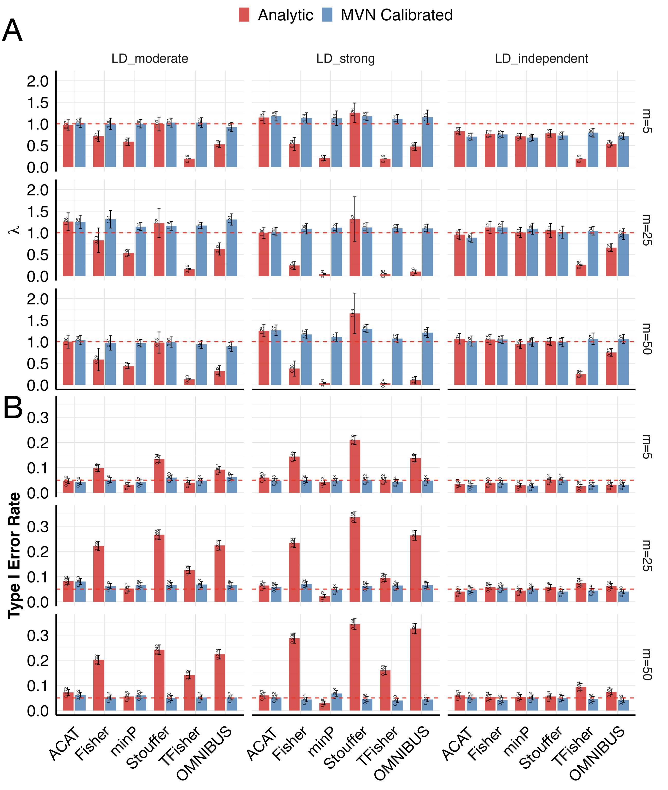
*Figure 2 | Null Calibration and Genomic Control Across LD Regimes. Pathway-level p-values were generated under the global null using simulated gene Z-scores with three within-pathway LD regimes (LD_moderate, LD_strong, LD_independent) and pathway sizes (m = 5, 25, 50).  
A. Genomic Control Under the Null: Bars show genomic control inflation factor (λ) for each component test (ACAT, Fisher, minP, Stouffer, TFisher) and the omnibus combination, computed either analytically under an independence approximation (red) or using MVN calibration that resamples null gene Z-scores from the pathway correlation matrix (blue). The dashed line indicates the nominal expectation (λ = 1). Notably, under nontrivial LD the independence-based analytic approximation can yield either conservative behavior (λ < 1; deflation) or anti-conservative behavior (λ > 1), depending on the component test; MVN calibration enforces λ ≈ 1 by construction. Across LD_moderate and LD_strong settings, analytic p-values exhibit substantial miscalibration for multiple components and consequently for the omnibus, whereas MVN calibration stabilizes λ near 1 across methods and pathway sizes; under LD_independent, analytic and MVN-calibrated results are broadly concordant, consistent with the independence assumption being approximately valid.  
B. Type I Error Under the Null: Using the same simulations as Fig. 2A, bars report empirical type I error at α = 0.05 (dashed line). Analytic (independence-based) p-values show inflated false-positive rates in LD_moderate/LD_strong settings for several component tests and the omnibus, while MVN calibration restores near-nominal error control across pathway sizes and LD regimes. Error bars indicate sampling variability across null replicates.*


Across pathway sizes, analytical p-values exhibited expected behavior under the LD_independent condition, in which the independence assumptions underlying the component tests are approximately satisfied and the analytic and MVN-calibrated results were largely in agreement. In contrast, under LD_moderate and particularly under LD_strong, several analytic component tests displayed clear miscalibration, characterized by either inflation (λ > 1) or deflation (λ < 1; conservative behavior) depending on the method, and in several cases elevated type I error rates. This pattern is consistent with the well-documented sensitivity of many p-value combination procedures to within-set dependence when their null distributions are derived under assumptions of independence (ref). Importantly, because λ summarizes the median tail behavior, λ < 1 does not indicate inflation, but rather that the independence-based approximation can become overly conservative under LD for some components (e.g., ACAT or Stouffer in certain regimes). MVN calibration largely mitigated these discrepancies as MVN-calibrated component p-values, as well as the resulting MVN-calibrated omnibus test, remained close to the expected null behavior (λ≈1 and type I error near 0.05) across all LD regimes and pathway sizes (Fig 2 A and B). Although ACAT showed comparatively stable performance among the analytic approaches, in line with its known robustness to dependence (ACAT ref), MVN calibration yielded uniformly well-controlled behavior across all component tests and for the omnibus statistic.


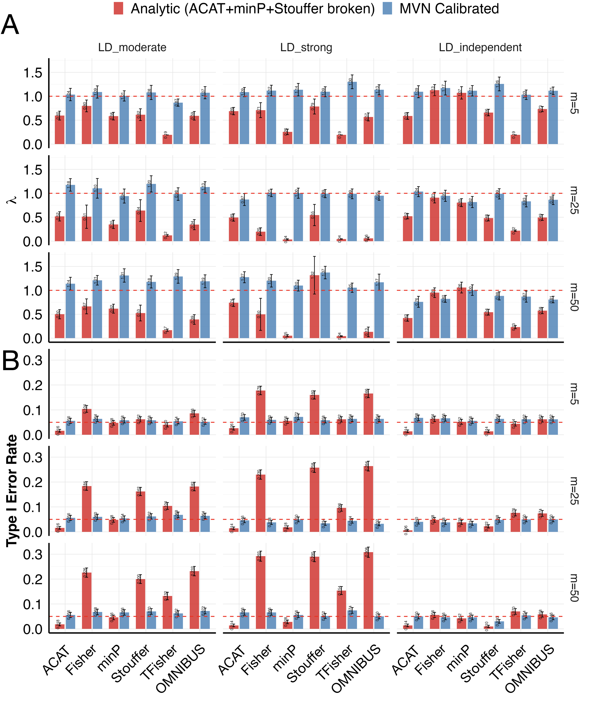
*Supplementary Figure 1 | Stress test for null calibration and genomic control. 
A. To stress-test robustness to component miscalibration, we repeated null simulations across LD regimes and pathway sizes but intentionally computed a subset of component p-values using an analytic procedure that ignores LD (red; “broken”), while the MVN-calibrated pipeline uses the correct LD-aware null (blue). Broken-Component Stress Test—Genomic Control: The resulting λ values illustrate that LD-ignorant component calculations can induce substantial miscalibration that propagates into the omnibus, whereas MVN calibration keeps λ near 1 across conditions, demonstrating that the omnibus behaves appropriately when its component p-values are correctly calibrated under the null.  
B. Broken-Component Stress Test—Type I Error: Empirical type I error rates at α = 0.05 are shown for the same stress-test conditions as Supplementary Fig. 1A. LD-ignorant (“broken”) analytic components lead to marked inflation in false positives in LD_moderate/LD_strong settings, while MVN calibration maintains approximately nominal type I error across pathway sizes and LD regimes. Error bars indicate sampling variability across null replicates.*


To replicate realistic data settings in which one or more component tests exhibit anti-conservative behavior (e.g., due to unmodeled LD or method-specific misspecification of the null distribution), we conducted a stress test in which the analytic layer was supplied with deliberately miscalibrated component p-values and examined the resulting impact on the omnibus statistic. When multiple components are liberal, the analytic genomic inflation factor (λ) and the type I error rate both tend to increase in value. As such, the analytic omnibus directly reflects the properties of its component inputs. In contrast, the MVN-calibrated pipeline remains substantially more robust across a range of LD structures and pathway sizes, producing omnibus p-values that are close to nominal calibration even when individual analytic components are misspecified (Supp Fig 1 A and B). In the few scenarios where deviations persist, they are typically conservative (λ slightly below 1 and type I error below 0.05), consistent with the protective effect of calibrating against an LD-aware null distribution.

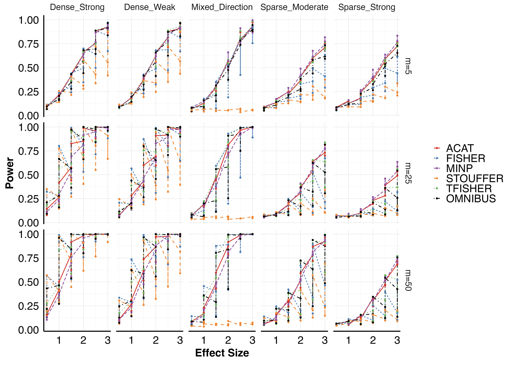
*Supplementary Figure 2 | Power Under Alternatives and MVN Calibration.  
Power was evaluated across five signal archetypes (Dense_Strong, Dense_Weak, Mixed_Direction, Sparse_Moderate, Sparse_Strong), increasing effect sizes, and pathway sizes (m = 5, 25, 50), using MVN-calibrated p-values to ensure valid null control under LD. Curves compare individual component tests to the omnibus. Across signal shapes, no single component test uniformly dominates; rather, the best-performing component varies with sparsity, effect strength, and directionality. In contrast, the omnibus consistently tracks the upper envelope of component performance, providing robust power across heterogeneous alternatives while retaining valid calibration under the null.*

Furthermore, we assessed statistical power under a range of alternative signal architectures characterized by varying degrees of signal density (dense versus sparse) and directional coherence (concordant versus mixed). In our power simulations, we varied the signal architecture within a pathway by modulating (i) signal density, defined as the proportion of genes in the pathway that are truly associated (i.e., “causal”), and (ii) directional coherence, defined by whether causal effects are aligned in the same direction or comprise a mixture of positive and negative effects. We characterize scenarios as sparse when only a small proportion of pathway genes are causal (e.g., approximately 5–10\% of genes), and as dense when a large proportion of pathway genes are causal (e.g., approximately 30–50\%). Independent of signal density, we controlled the per-gene effect size by applying a mean shift δ to the Z-scores of causal genes, with larger δ corresponding to stronger underlying effects. Statistical power is thus evaluated over a grid of δ values (e.g., 1–3). In the mixed-direction configuration, we assign positive and negative shifts to disjoint subsets of causal genes (approximately half positive and half negative), thereby modeling scenarios in which pathway-level effects lack directional consistency and in which one-sided aggregation procedures may suffer from partial cancelation of opposing signals. The signals can be specified as: Dense-Strong, Dense-Weak, Mixed-Direction, Sparse-Moderate, and Sparse-Strong (Table 1). Concordant effects may be all positive or all negative, thus we report results for the all-positive convention without loss of generality.

### Table 1: Signal Architecture Definitions Used in Power Simulations

| Scenario label     | Signal density (fraction causal) | Directional coherence     | Per-gene effect magnitude |
|-------------------|----------------------------------:|---------------------------|---------------------------|
| Dense_Strong      | ~0.50                             | Concordant (all +)        | Swept over δ grid         |
| Dense_Weak        | ~0.30                             | Concordant (all +)        | Swept over δ grid         |
| Mixed_Direction   | ~0.30                             | Mixed (+ and −)           | Swept over δ grid         |
| Sparse_Moderate   | ~0.10                             | Concordant (all +)        | Swept over δ grid         |
| Sparse_Strong     | ~0.05                             | Concordant (all +)        | Swept over δ grid         |


No single constituent test showed uniformly superior performance across all conditions. Methods optimized for dense, directionally concordant enrichment (with Stouffer/Fisher-like behavior) often lost power under sparse alternatives, whereas procedures designed to prioritize sparse signals (with minP/TFisher-like behavior) were frequently suboptimal when the true architecture involved dense but weak enrichment or mixed effect directions. Stouffer’s method behaves as a directional Z-score combination, making it most powerful when many genes carry weak-to-moderate effects that are coherent in sign. Consequently, Stouffer appears underpowered when the architecture is sparse (only a few causal genes), weak (small per-gene effects), or mixed-direction (positive and negative effects partially cancel), which is reflected by the Stouffer's curves lagging behind other methods in several panels (Supp Fig 2). In contrast, the omnibus procedure was consistently competitive across these heterogeneous regimes, generally approximating the upper range of the power curves of the component methods as effect sizes increased (Supp Fig 2). Thus by aggregating complementary tests, CATFISH omnibus reduces dependence on the (unknown) underlying signal architecture and delivers stable power gains without relying on the optimality of any single component test.


---

### Robustness to Incomplete LD Information and Adaptive Component Filtering

To more accurately reflect the practical setting in which within-pathway gene–gene correlations are only partially available from LD-based estimation (for example, because MAGMA reports correlations for only a subset of gene pairs), we investigated omnibus calibration when the pathway correlation matrix is partially observed (Fig 3). Starting from a “true” within-pathway correlation structure, we progressively removed a random fraction of off-diagonal entries and compared three strategies for generating omnibus null p-values: (i) an analytic fallback that treats all gene pairs as independent (i.e., ignores the correlation matrix entirely) (red), (ii) multivariate normal (MVN) calibration based on the true correlation matrix (green), and (iii) MVN calibration based on an imputed correlation matrix in which missing gene–gene correlations are set to zero (blue) (Fig 3A). This imputed-zero approach reflects our practical implementation when constructing pathway correlation matrices from MAGMA pairwise outputs, where unobserved gene pairs are assumed independent while preserving the observed correlations. Across pathway sizes (m = 5, 25, 50) and missingness levels, the analytic fallback exhibited substantial miscalibration, with genomic control values deviating markedly from the nominal expectation (λ = 1), demonstrating that independence-based analytic approximations do not provide adequate null control in the presence of LD. By contrast, MVN calibration stabilized the omnibus test, and the imputed-zero MVN strategy consistently yielded genomic control values closest to λ ≈ 1 over a wide range of missingness fractions (Fig. 3A), thereby empirically supporting the use of missingness-as-zero correlation completion when complete pairwise correlation information is unavailable. The apparent advantage of the imputed-zero strategy over MVN calibration using the fully observed correlation matrix can arise in finite simulations because the positive-definite projection step effectively shrinks and regularizes the estimated correlation structure, improving numerical conditioning and reducing Monte Carlo variability in the resampled null. Moreover, λ is a median-based summary and can therefore appear well-behaved even when calibration differences are driven by tail behavior, motivating complementary evaluation using empirical type I error rates (Supplementary Fig. 2A).

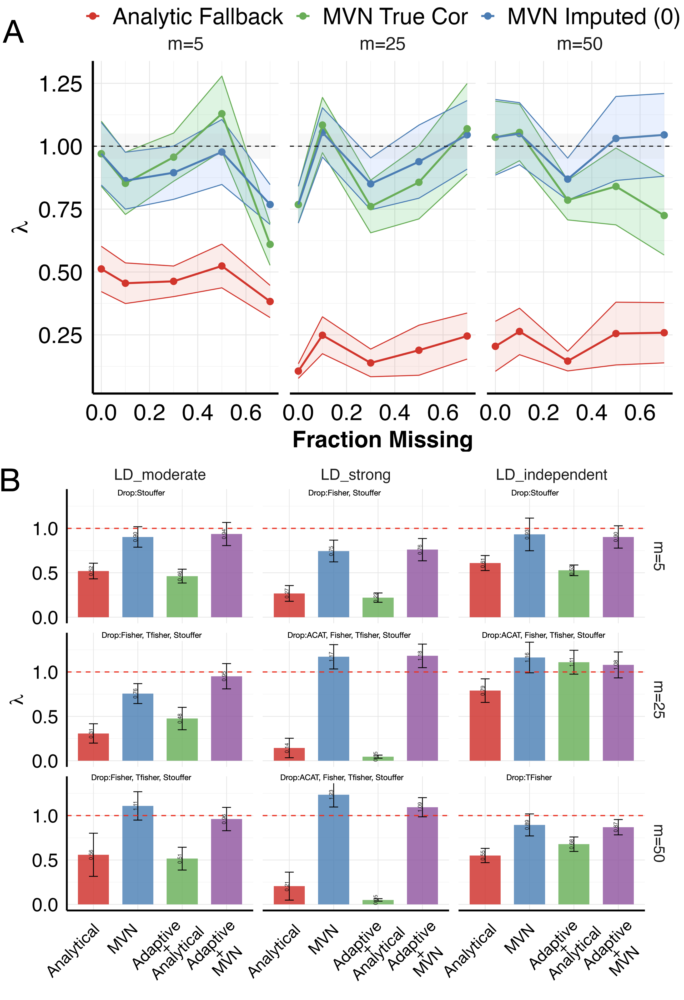
*Figure 3 | Omnibus Genomic Control vs Missing Correlations.
A. We evaluated robustness of MVN-based omnibus calibration when the within-pathway gene–gene correlation matrix is only partially observed. Gene Z-scores were simulated under the null from a “true” correlation structure, and then a fraction of off-diagonal correlation entries was randomly removed to mimic incomplete MAGMA pairwise outputs. The omnibus genomic control factor (λ; dashed line indicates λ = 1) is shown as a function of the fraction missing for three strategies: an “Analytical” omnibus that combines component tests without LD-aware calibration, (ii) an LD-aware “MVN” omnibus calibrated using MVN resampling, (iii) an “Adaptive (analytic)” omnibus that screens and drops components using training null simulations but evaluates the reduced omnibus without MVN calibration, and (iv) an “Adaptive (MVN)” omnibus that applies MVN calibration to the reduced (post-filtering) omnibus statistic. Across pathway sizes (m = 5, 25, 50), the analytic fallback is substantially miscalibrated under LD, whereas MVN calibration stabilizes λ near 1; the imputed-zero MVN strategy is consistently closest to nominal across a wide range of missingness fractions, supporting the practical “missing-as-independence” completion used when correlation information is incomplete. Findings for empirical type I error at α = 0.05 were consistent with the λ diagnostics (Supplementary Fig. 2A), with the analytic fallback showing poor error control under LD and MVN-based approaches remaining close to nominal. 
B. Adaptive Omnibus Genomic Control: We compared four omnibus variants under the null across LD regimes (LD_moderate, LD_strong, LD_independent) and pathway sizes (m = 5, 25, 50): (i) an “Analytical” omnibus that combines component tests without LD-aware calibration, (ii) an LD-aware “MVN” omnibus calibrated using MVN resampling, and (iii) an “Adaptive” omnibus that first screens component tests on training null simulations and drops components exhibiting evidence of miscalibration (e.g., inflated λ or excess type I error), then combines only the retained components. Bars show genomic control (λ; dashed line at 1). MVN calibration provides the most stable control across LD conditions, whereas the adaptive strategy can become overly conservative or unstable under stronger LD due to variable component removal, indicating that component-dropping is not a reliable substitute for LD-aware MVN calibration.*

In agreement with the λ-based calibration diagnostics, the empirical type I error rate at α = 0.05 (Supp Fig. 2A) was inadequately controlled under the analytic fallback procedure, whereas the MVN-calibrated approaches remained much closer to the nominal level. Importantly, despite the substantial loss of correlation information at higher levels of missingness, the imputed MVN-based procedure maintained approximately nominal type I error across a broad range of pathway sizes. These results suggest that LD-aware resampling, when combined with a conservative zero-imputation scheme, can achieve robust calibration even under substantially incomplete correlation structure.

Finally, we evaluated whether a data-driven “adaptive” omnibus strategy—using training null simulations to identify and exclude apparently miscalibrated component tests—could improve or replace explicit LD-aware calibration (Fig. 3B; Supplementary Fig. 2B). We compared four variants: (i) an Analytical omnibus computed directly from analytically derived component p-values; (ii) an MVN omnibus obtained by calibrating the omnibus statistic under an MVN null; (iii) an Adaptive+Analytical omnibus, in which components are filtered based on training-set calibration metrics (labels indicate dropped components) but the resulting reduced omnibus is still evaluated analytically; and (iv) an Adaptive+MVN omnibus, which applies MVN calibration to the reduced (post-filtering) omnibus statistic (Fig 3B and Supp Fig 2B). Under LD_moderate and LD_strong, both Analytical and Adaptive+Analytical exhibit substantial miscalibration, with markedly inflated type I error despite often conservative median λ values (Fig 3B and Supp Fig 2B), underscoring that λ is a coarse, median-based diagnostic and does not guarantee tail control. MVN calibration yields the most consistent control of type I error across pathway sizes and LD regimes. Although Adaptive+MVN sometimes produces λ values numerically closer to 1 than MVN (Fig. 3B), this does not translate into uniformly better type I error control (Supplementary Fig. 2B), and in some settings Adaptive+MVN deviates from nominal more than MVN. Collectively, these results indicate that explicit MVN calibration is the essential for rigorous null control under LD, while adaptive component filtering adds complexity without a clear, consistent advantage over the standard MVN-calibrated omnibus.


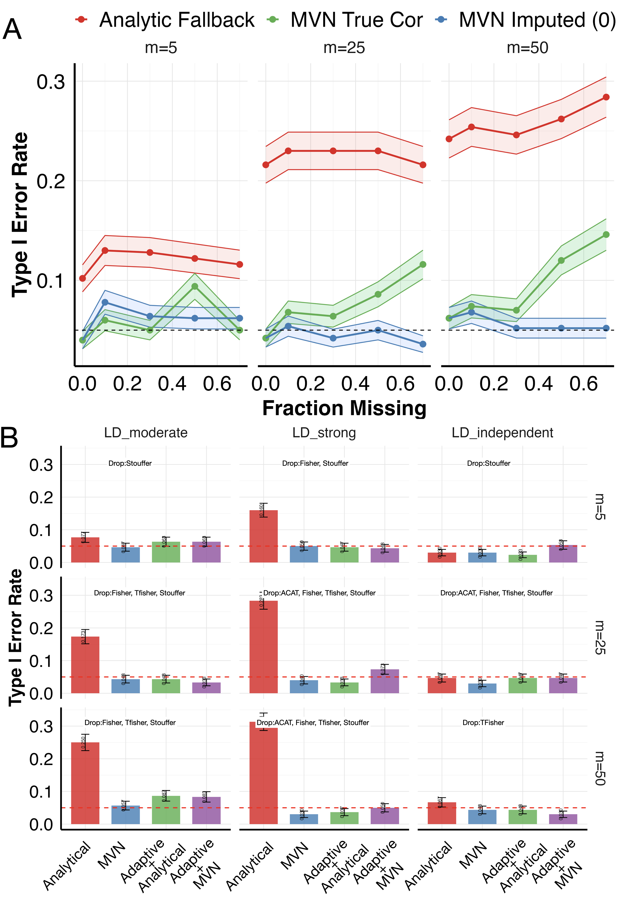
*Supplementary Figure 3 | Type I Error Diagnostics Under Missing Correlations and Adaptive Omnibus Variants: For the four omnibus variants in Fig. 3B…: Power was evaluated across five signal archetypes (Dense_Strong, Dense_Weak, Mixed_Direction, Sparse_Moderate, Sparse_Strong), increasing effect sizes, and pathway sizes (m = 5, 25, 50), using MVN-calibrated p-values to ensure valid null control under 
A. Omnibus Type I Error vs Missing Correlations" Using the same missing-correlation framework as Fig. 3A, we report empirical type I error of the omnibus test at α = 0.05 (dashed line) across fractions missing and pathway sizes. The analytic fallback shows elevated false-positive rates in the presence of LD, while MVN-based approaches substantially improve error control. Consistent with Fig. 3A, the imputed-zero MVN strategy maintains type I error closer to nominal across missingness levels, supporting its use when complete pairwise correlation information is unavailable.  
B. Adaptive Omnibus Type I Error: For the four omnibus variants in Fig. 3B, we report empirical type I error at α = 0.05 (dashed line). The LD-aware MVN omnibus maintains near-nominal error control across LD regimes and pathway sizes, whereas the analytical approach exhibits inflation under LD. The adaptive omnibus shows condition-dependent departures (often conservative and sometimes unstable under stronger LD), reflecting sensitivity to which components are dropped during training and reinforcing that explicit MVN calibration is the most reliable approach for controlling false positives under LD.*


---

### From SNP associations to pathway-level aggregation

We performed genome-wide association studies (GWAS) to characterize the genetic architecture of two important traits in plants and animals. In *Arabidopsis thaliana*, we examined BIO6, defined as the minimum temperature of the coldest month, using accessions from the 1001 Genomes Project to capture variation in long-term winter severity across the species’ range (Fig A). Our GWAS revealed polygenic signals across all five chromosomes, indicating a complex trait influenced by numerous genes associated with metabolism and cold acclimatization. In *Drosophila melanogaster*, we investigated starvation resistance as survival under food deprivation, and conducted sex-stratified GWAS that replicated previously reported associations (Fig B). Similar to BIO6 in *A. thaliana*, starvation resistance in *D. melanogaster* displayed a polygenic architecture, with multiple loci of modest effect contributing to moderate but robust genome-wide association signals. The polygenic association patterns observed for both BIO6 and starvation resistance are consistent with complex trait architectures in which many variants contribute small effects. Under such architectures, biological interpretation is often better achieved by shifting from individual loci to higher-order functional units such as pathway enrichments. We therefore performed LD-aware gene-level aggregation using MAGMA and summarized pathway-level evidence using CATFISH.

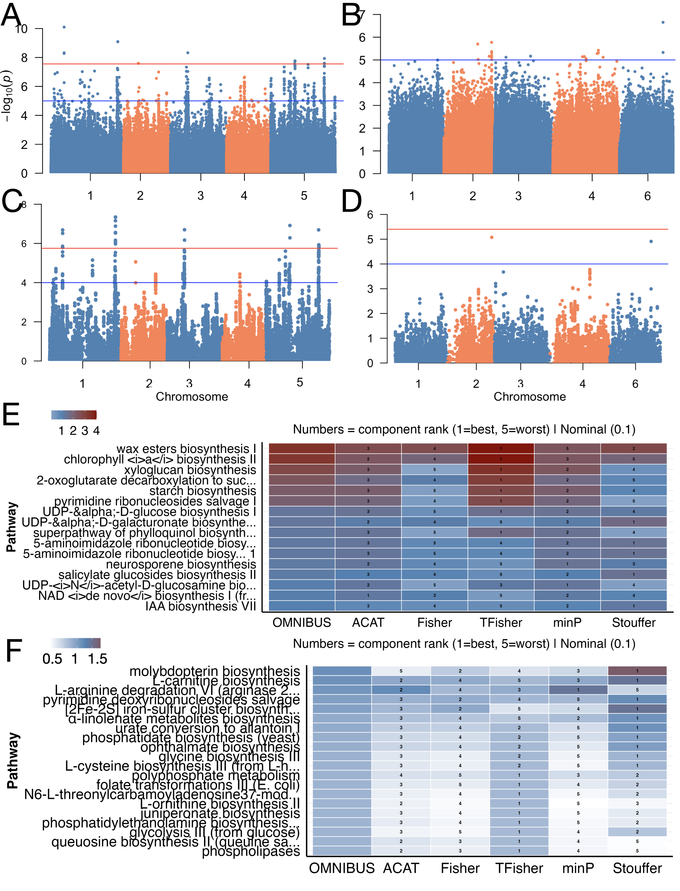
*Figure 4 | From SNP-level association to gene- and pathway-level inference in Arabidopsis and Drosophila.  
(A,B) GWAS Manhattan plots showing SNP-level association signals:  (A) Arabidopsis thaliana BIO6 (minimum temperature of the coldest month) across five chromosomes and (B) Drosophila melanogaster starvation resistance across six chromosomes. Points show −log10(P) for each variant (alternating colors indicate chromosomes). Horizontal lines indicate conventional significance thresholds used for visualization.  
(C,D) MAGMA gene-level association results for the corresponding GWAS: (C) Arabidopsis BIO6 and (D) Drosophila starvation resistance. Each point represents a gene-level test statistic (−log10(P)) positioned by genomic location, highlighting loci where aggregated SNP evidence yields stronger gene-level support.  
(E,F) CATFISH pathway enrichment summaries for (E) Arabidopsis BIO6 and (F) Drosophila starvation resistance. Heatmaps show calibrated −log10(P) for the CATFISH omnibus and each component test (ACAT, Fisher, TFisher, minP, Stouffer) for the top pathways, with rows ordered by omnibus significance. The final column indicates the leading component test for each pathway (the component yielding the smallest permutation-calibrated P).*


To translate SNP-level associations into gene-level evidence while accounting for LD, we applied MAGMA to the GWAS datasets. MAGMA aggregates SNP-level association statistics within predefined gene boundaries using a multiple regression framework that incorporates the LD structure among variants, thereby generating gene-level $p$-values that represent the cumulative genetic signal attributable to each gene (ref).  In Arabidopsis, MAGMA analysis maintained the overall signal while reducing noise from isolated SNPs, leading to significant gene-level associations across all chromosomes. This gene-based analysis enhanced the visibility of moderately associated genes that were less apparent at the SNP level, highlighting the advantages of LD-aware aggregation approaches. In Drosophila, MAGMA-based analysis produced a set of gene-level associations indicative of a broadly distributed genetic architecture. These outputs serve as a shared gene-level input for downstream CATFISH pathway enrichment analyses.

We next applied CATFISH to translate gene-level MAGMA association statistics into pathway-level inference using five complementary component tests: ACAT, Fisher’s method, TFisher, the minimum (p)-value (minP) test, and Stouffer’s Z-score method. These statistics are sensitive to distinct genetic signal archetypes (explained in detail in Methods). In the Arabidopsis BIO6 analysis, CATFISH highlighted pathways enriched for cold-associated genetic signal, including processes linked to wax ester biosynthesis and starch metabolism (ref). In Drosophila, CATFISH applied to starvation resistance similarly revealed enrichment of pathways related to amino acid and lipid metabolism, with Stouffer often providing the strongest support among the component tests and TFisher sometimes leading (replace ref). Pathways are ranked by the omnibus (p)-value, and the final column reports the leading component test, i.e., the statistic yielding the smallest calibrated (p)-value for that pathway. In both datasets, the smallest calibrated component (p)-value varies across pathways, reflecting the dominant signal architecture rather than any systematic bias. For example, TFisher often yields the lowest (p) in Arabidopsis, whereas Stouffer often does in the fly (Fig. 4E–F). Importantly, multiple pathways show different best tests (ACAT/minP or Fisher), illustrating that CATFISH adapts to pathway-specific signal structure rather than recapitulating a single statistic.

### Component gene-set tests capture distinct pathway signals across traits and species.

To evaluate whether CATFISH’s component pathway tests provide non-redundant information, rather than repeatedly detecting the same pathways, we compared the five component statistics (ACAT, Fisher, TFisher, minP, and Stouffer) using Arabidopsis BIO6 and Drosophila starvation resistance as contrasting case studies. While multiple tests are expected to exhibit overlapping sensitivity to related signal patterns, each method implicitly specifies a distinct enrichment model and may consequently prioritize different classes of pathways.

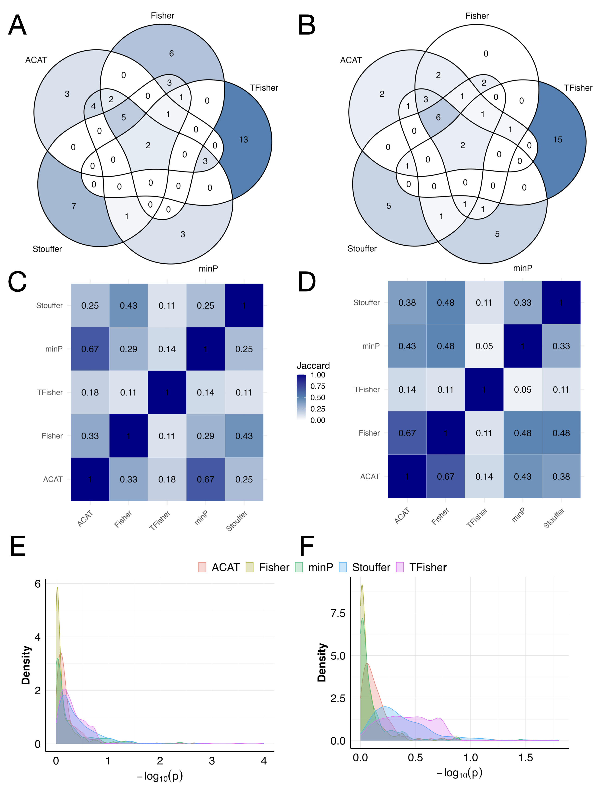
*Fig. 5 | Component pathway tests capture unique pathway classes despite shared gene-level inputs.  
(A,B) Overlap among significant pathways detected by ACAT, Fisher, adaptive TFisher, minP, and Stouffer in Arabidopsis (A) and Drosophila (B). TFisher yields the largest number of hits, consistent with adaptive tail selection over a 
τ-grid.  
(C,D) Pairwise Jaccard similarity of discovered pathway sets. ACAT and minP cluster strongly in both datasets; in fly, Fisher shows increased similarity to ACAT/minP, and Fisher–Stouffer similarity indicates agreement under coordinated multi-gene enrichment.  
(E,F) Distributions of pathway-level −log10 (p). Fisher shows the strongest mass near null-like values, whereas Stouffer and TFisher show heavier right tails (more significant pathways), motivating explicit null calibration checks to rule out inflation.
All component $p$-values are calibrated under the same dependence-preserving multivariate normal (MVN) null generator.*

Across both datasets, the overlap analyses revealed a substantial number of discoveries that were specific to individual methods. Fig. 2 (A–B) and Supp. Fig. 1 (A–B) indicates that a considerable proportion of statistically significant pathways are unique to particular component tests, rather than being shared across all approaches. In particular, TFisher contributed the largest set of method-specific pathways in both the Arabidopsis and Drosophila dataset. This observation is consistent with the adaptive “soft-thresholding” principle underlying TFisher that is by assessing pathway enrichment over a grid of truncation/threshold parameters (τ values) and selecting the most informative configuration, TFisher is able to detect pathway-level signals that are moderately dense or that are concentrated within specific gene subsets, without relying on a single, fixed cutoff. Overall, TFisher effectively interpolates between sparse and diffuse signal regimes, which broadens the range of pathways it can identify relative to single-parameter procedures. 

Despite these method-specific distinctions, the component tests are not statistically independent, and their pairwise overlap exhibits a systematic and interpretable structure. Jaccard similarity matrices (Fig. 2 C–D) demonstrate that ACAT shows the highest similarity to minP, particularly in Drosophila, consistent with both procedures being highly responsive to sparse-driver architectures. By contrast, Fisher’s and Stouffer’s methods exhibit greater similarity to each other than to any other method, reflecting their shared propensity to aggregate weak-to-moderate evidence across many genes. These qualitative relationships are reproduced when using correlation-based measures (Supp. Fig. 1 C–D) as well. Overall, these results indicate that the observed similarity structure is robust to the choice of overlap metric, and the methods form partially overlapping sets, however, no method is redundant with or collapses onto another.

Differences in the behavior of the component tests are also evident in the global $p$-value distributions. Fig. 2 (E–F) (and Supp Fig 2 (E and F)) indicates that the distribution for Fisher’s method is strongly concentrated near zero. This suggests that under these data and calibration settings, Fisher yields fewer pathways with highly significant $p$-values compared to TFisher and Stouffer. In contrast, TFisher and Stouffer exhibit heavier right tails (larger −log10(p)), consistent with these procedures identifying a greater number of strongly enriched pathways in scenarios characterized by many modest gene-level effects. 

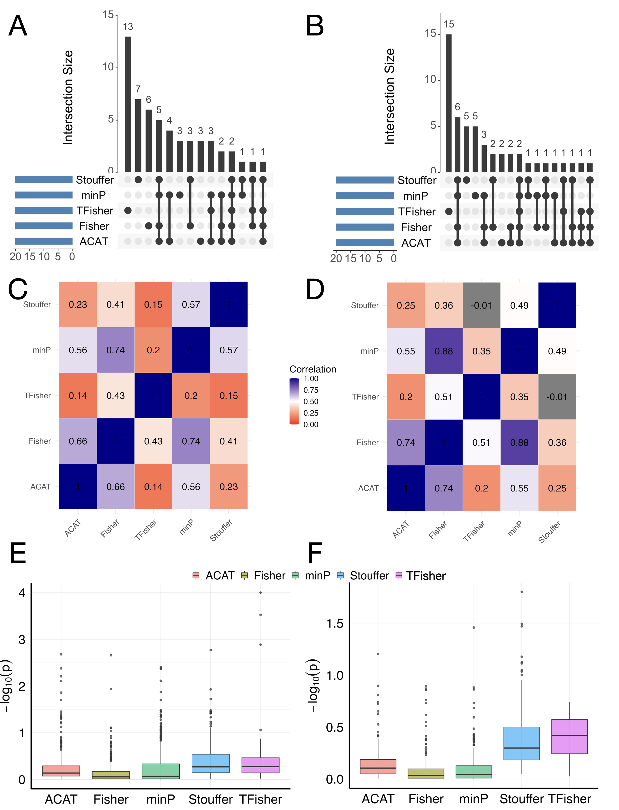
*Supplementary Fig. 4 | Extended comparison of component pathway tests.
(A,B) UpSet plots summarize the intersection structure among significant pathway sets, confirming that each test contributes unique discoveries in both Arabidopsis and fly.  
(C,D) Pairwise association patterns recapitulate the main figure: ACAT and minP are most similar, Fisher aligns more strongly in fly, and Fisher–Stouffer agreement is consistent with diffuse/coordinate pathway signals.  
(E,F) $p$-value distributions show heavier tails for Stouffer and TFisher; calibration under the dependence-preserving null is therefore required to ensure these are not false-positive artifacts.*

These analyses show that although component tests exhibit structured correlation—most notably ACAT with minP and Fisher with Stouffer, they nonetheless recover partially distinct sets of pathways, with TFisher contributing substantial additional discoveries in both Arabidopsis and Drosophila. This pattern supports the design of CATFISH that is combining complementary statistics to improve coverage across heterogeneous pathway-level signal architectures, which can differ across traits, species, and overall GWAS signal scale.


---

### The omnibus aggregates component test rather than recapitulating a single test

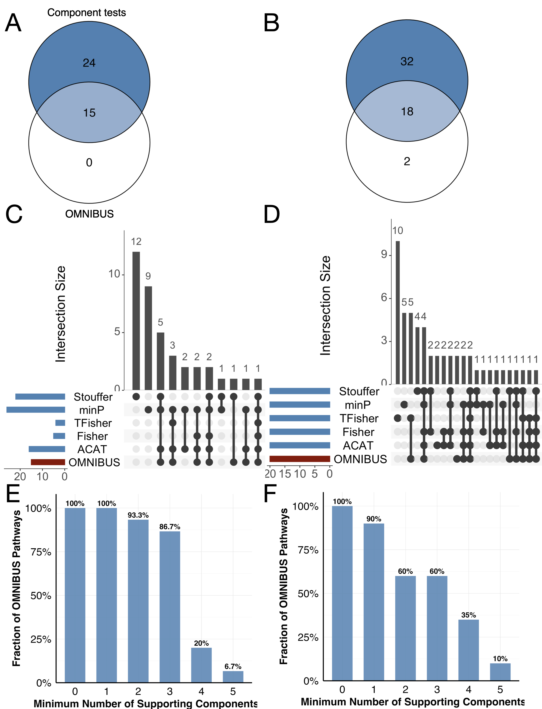
*Fig. 6 | Omnibus behaves as a broad union, not a narrow intersection.  
Panels A–B compare the omnibus significant set to the union of component significant sets for Arabidopsis (A) and fly (B), demonstrating union-consistency in Arabidopsis and a small number of omnibus-only calls in fly consistent with aggregation of sub-threshold component evidence.  
Panels C–D summarize higher-order intersection structure (UpSet), showing omnibus discoveries concentrate in multi-method overlaps while still permitting a limited number of architecture-specific calls.  
Panels E–F quantify multi-component corroboration by plotting the fraction of omnibus pathways supported by at least k component tests, indicating stronger multi-test support in Arabidopsis and greater heterogeneity in fly.*

We next investigated whether the MVN-calibrated omnibus operates as a true integrator or collapses to an effective surrogate for a single component test. Fig. 6 A and B indicate that, in Arabidopsis, the discovery set identified by the omnibus procedure is fully contained within the union of discoveries from the individual component tests under the same significance threshold (Methods). This demonstrates that the omnibus is not producing any unique signals that are decoupled from its constituent evidence layers. However, in Drosophila, the omnibus procedure recovers the majority of pathways supported by at least one component test but additionally identifies a small subset of pathways that are not detected by any single component (Fig. 6B). This behavior demonstrates the strength of the omnibus model, as it can also yield statistical significance when multiple component $p$-values are each suggestive but individually do not cross the specified threshold. Importantly, unique hits should not be treated as *prima facie* evidence of artifact; rather, they may reflect genuine synergy across component tests that must then be validated through rigorous null calibration (as explained below). In brief, in Arabidopsis the omnibus discoveries form a subset of the union of component discoveries (with no omnibus-only calls), whereas in Drosophila the omnibus recovers most component-supported pathways plus a small number of additional pathways consistent with evidence aggregation (Fig. 6A–B).

Fig. 6 C and D demonstrate that omnibus significant pathways are not predominantly driven by calls unique to any single method; instead, they are disproportionately enriched in multi-test intersection patterns. This indicates that the omnibus framework preferentially retains pathways that are repeatedly identified across distinct enrichment tests (Fig. 6E–F). In Arabidopsis, a substantial proportion of omnibus-significant pathways remains significant even under increasingly stringent multi-test support criteria (e.g., the majority remain significant when requiring ≥2 or ≥3 supporting component methods). By contrast, in the Drosophila dataset, multi-test support is generally weaker, with a larger fraction of pathways supported by only one or a small number of component methods. This suggests that the Arabidopsis BIO6 signal is more consistently detectable across multiple signal archetypes, whereas the Drosophila dataset appears to contain a higher proportion of architecture-specific signals that are detectable only by certain classes of enrichment tests.

Supplementary Figure 5 characterizes the relationship between individual components and the omnibus. In Arabidopsis (Supplementary Figure 5A), certain components (such as Fisher and TFisher) behave as strict subsets of the omnibus. All pathways identified by these components are also detected by the omnibus, whereas the omnibus additionally recovers pathways that are not captured by those components. In contrast, other methods (notably minP and Stouffer) exhibit substantial bidirectional non-overlap, indicating that they both contribute unique pathway calls and fail to recover a portion of the pathways identified by the omnibus. In the Drosophila dataset (Supplementary Figure 2B), the overlaps are more evenly distributed across components.

The similarity metrics (Supp. Fig. 5E–F) clarify an important subtlety: the “overlap proportion” and the Jaccard index answer different questions. The overlap proportion is asymmetric (it reflects how much of a component’s discovery set is recovered by the omnibus), whereas the Jaccard index is symmetric (intersection normalized by union) and penalizes methods that call many extra pathways beyond the shared set. Consequently, in Arabidopsis, we observe cases where overlap is high but Jaccard is modest, indicating that the component’s calls are largely contained within the omnibus; yet the total union is large because one of the sets contains many additional pathways. In the fly dataset, overlap and Jaccard are more similar in magnitude, implying that component and omnibus discovery set sizes are closer and the union is less dominated by one method’s extra calls. Collectively, Fig. 6 and Supp. Fig. 5 support the conclusion that the omnibus is broad in the signal types it can detect, yet selective in what it ultimately reports—behaving as an evidence integrator rather than a permissive union rule or a disguised single-component test.

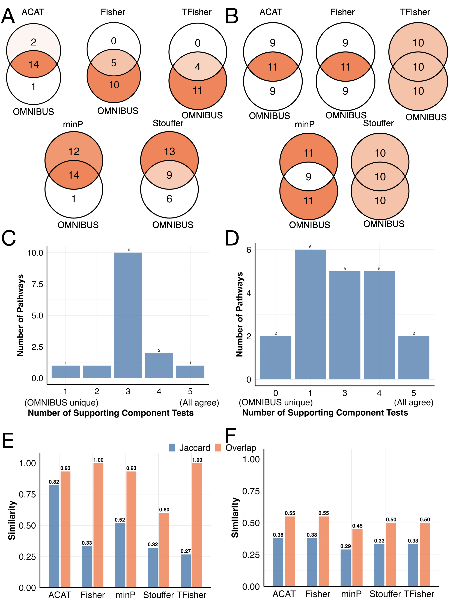
*Supp. Fig. 5 | Component-by-component decomposition of omnibus overlap.  
Panels A–B show pairwise overlaps between the omnibus and each component test in Arabidopsis (A) and fly (B).  
Panels C–D summarize how omnibus-significant pathways distribute across the number of supporting component tests, reinforcing that omnibus calls are enriched for multi-test support but are not identical to any single component.*

The overlap proportion is an asymmetric metric that quantifies, for each component test, the fraction of its discovered pathways that are also recovered by the omnibus procedure (Supp. Fig. 2E–F). By contrast, the Jaccard index is symmetric (the size of the intersection normalized by the size of the union) and penalizes methods that identify many additional pathways beyond those shared. Accordingly, in Arabidopsis, we observe instances in which the overlap proportion is high while the Jaccard index remains moderate. This pattern indicates that the component’s discoveries are largely subsumed by the omnibus set; yet, the overall union is inflated because one of the sets includes numerous additional pathways. In the Drosophila dataset, the overlap proportion and Jaccard index are more similar in magnitude, suggesting that the sizes of the component and omnibus discovery sets are more comparable and that the union is less dominated by method-specific additional calls. Taken together, Fig. 3 and Supp. Fig. 2 support the conclusion that the omnibus procedure is broad in the classes of signals it can detect while remaining selective in what it ultimately reports. Functionally, it behaves as an evidence-integrating mechanism rather than a permissive union operator or a reparameterized single-component test.

---

### MVN global-null diagnostics support overall calibration

To verify that differences in discovery patterns reflect power differences rather than miscalibration, we assessed all component tests and the omnibus procedure under a dependence-preserving global null using multivariate normal (MVN) resampling (Supp. Fig. 3). The Q–Q plots compare the empirical $p$-value distributions to the theoretical uniform distribution implied by the null hypothesis, and the genomic control factor λ provides a scalar summary of global inflation or deflation (with λ≈1 indicating appropriate calibration). Operationally, λ captures whether the bulk of null test statistics is globally over- or under-dispersed relative to expectation (λ>1 inflation; λ<1 conservativeness), whereas empirical Type I error directly evaluates threshold-level calibration via the observed rejection rate Pr(p<α) at a chosen α. In both datasets, ACAT, Fisher’s method, minP, and Stouffer’s method yield λ values close to 1, consistent with well-controlled null behavior under the MVN-based calibration scheme. The omnibus test is likewise close to null in both datasets (slightly conservative in Arabidopsis with λ<1, and near 1 in Drosophila), a desirable property for a combined procedure designed to maintain stable Type I error control across heterogeneous pathway architectures.

The main calibration exception is TFisher in the female fly null diagnostics, which shows a markedly elevated λ (Supp. Fig. 3; TFisher λ≫1), indicating a strong departure from the expected null. The empirical Type I error at α=0.05 remains at or below nominal, indicating that TFisher’s deviation is not simply “more false positives at 0.05.” Instead, it is consistent with a null distribution shape or scale mismatch, implying miscalibration across the $p$-value spectrum that may not manifest as excess rejections at any single operating threshold. Importantly, the omnibus does not inherit this instability, as both its λ and Type I error remain close to nominal, consistent with the omnibus functioning as a stabilizing integrator that limits dependence on the idiosyncratic behavior of any single component test.  These diagnostics support the conclusion that the CATFISH MVN framework is approximately nominally calibrated for most individual component tests and for the omnibus statistic, even though a subset of components may still exhibit residual miscalibration.


*Supp. Fig. 6 | MVN null diagnostics support calibrated inference.  
Panel A shows QQ plots compare observed vs expected $p$-values under dependence-preserving MVN resampling for each component and the omnibus in Arabidopsis and fly.  
Panel B shows genomic control (λ) that summarizes calibration, showing elevated λ for TFisher in fly while the omnibus remains near 1.  
Panel C depics Type I error at α = 0.05 confirms near-nominal rejection rates overall, supporting interpretation of component differences as sensitivity to distinct signal architectures rather than systematic false positives.*


---

### Candidate-gene prioritization integrates GWAS, MAGMA, and pathway

In Fig 7 A and B, we quantify the number of genes supported at each layer under the specified thresholds. For the Drosophila analysis, the GWAS evidence layer is deliberately defined using a more permissive significance threshold, reflecting the observation that very few genes satisfy the Bonferroni cutoff. The median number of genes per pathway is lower in Drosophila than in Arabidopsis. Consequently, pathway membership alone constitutes a weaker filtering criterion in the fly analysis. 

In Arabidopsis (Fig 7 C), a visible subset of genes shows concordant evidence across layers (including “all three”), consistent with a mixture of strong locus-driven genes. In fly females (Fig 7D), many top-ranked genes are supported by GWAS + MAGMA but lack pathway/top-pathway support at the chosen pathway threshold, which is consistent with (i) a smaller/shallower pathway mapping or (ii) pathway-level signals being distributed across many modest genes rather than concentrating on the same top loci that drive GWAS/MAGMA.

Furthermore, genes in the top pathways are enriched for stronger MAGMA signals (Fig. 7E–F), with a clear shift in Arabidopsis (Wilcoxon (p) significant) but a weaker or nonsignificant shift in fly, indicating that the pathway layer preferentially captures elevated gene-level association in Arabidopsis, whereas in fly the enrichment signal is more diffuse.

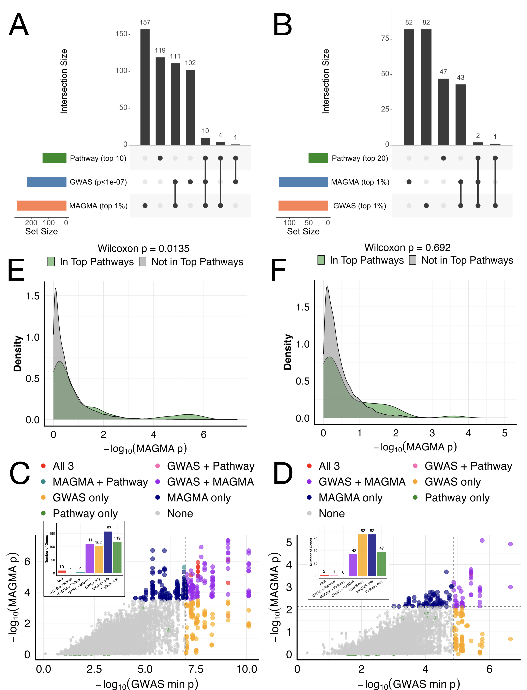
*Fig. 7 | Multi-layer candidate-gene prioritization integrates GWAS locus evidence, MAGMA gene-level association, and pathway enrichment. Panels **A/C/E** show Arabidopsis (BIO6) and panels **B/D/F** show female Drosophila starvation resistance.  
**(A–B)** UpSet plots summarize overlap among genes supported by each layer at the thresholds used in the main analysis (GWAS-mapped gene support, MAGMA gene-level support, and membership in top enriched pathways; top 10 pathways in Arabidopsis and top 20 in fly).  
**(C–D)** Gene-level concordance between GWAS and MAGMA: each point is a gene, with x-axis showing GWAS locus evidence mapped to the gene (−log10 of the minimum GWAS $p$-value among mapped variants) and y-axis showing MAGMA evidence (−log10 MAGMA $p$-value). Points are colored by which evidence layers support the gene (GWAS only, MAGMA only, pathway only, pairwise overlaps, or all three), and inset bar charts report the corresponding counts. Dashed lines indicate the significance cutoffs used to define GWAS- and MAGMA-supported genes (GWAS: log10(p) > 7, MAGMA: top 1%).  
**(E–F)** Distribution of MAGMA evidence for genes inside versus outside top enriched pathways; green curves denote genes in top pathways and gray curves denote genes not in top pathways, with Wilcoxon $p$-values testing for a shift toward stronger MAGMA association among pathway genes.* 


For each gene, “best_pathway_p” denotes the smallest calibrated pathway (p)-value among the top enriched pathways that contain the gene (top 10 in Arabidopsis; top 20 in fly), and the corresponding pathway identifier is reported as the gene’s best-supporting pathway. We also score the candidate genes using a count system with continuous evidence strength. Specifically, each gene receives a score increment of +1 for each evidence layer in which it is supported (GWAS, MAGMA, pathway analysis). In addition, small weighted contributions derived from continuous test statistics are added using −log10(p) terms, with the MAGMA-derived component assigned a slightly higher weight than the GWAS- and pathway-derived components. This scoring scheme is intentionally constructed such that the overall ranking is primarily driven by the number of independent evidence layers supporting a gene, while the continuous −log10(p)-based contributions serve only to distinguish genes that are weakly versus strongly supported within the same discrete support tier.

In Arabidopsis, the top-ranked genes are almost entirely 3-layer candidates with strong MAGMA $p$-values and extremely small mapped GWAS $p$-values, and they frequently point to a specific, best-supporting pathway (e.g., PWY-5884, a BioCyc pathway identifier corresponding to wax biosynthesis). In female flies, the highest-scoring genes include a small set of 3-layer candidates with explicit pathway assignments.


### Table 2. Top multi-layer candidate genes (Arabidopsis)

| GENE | magma_p | magma_fdr | gwas_min_p | gwas_n_snps | n_top_pathways | best_pathway_p | pathways | hit_gwas | hit_magma | hit_pathway | support_layers | score |
|---|---:|---:|---:|---:|---:|---:|---|---|---|---|---:|---:|
| AT1G74420 | 8.48E-07 | 0.001594258 | 8.13E-10 | 431 | 1 | 0.00169983 | PWY-5936 | TRUE | TRUE | TRUE | 3 | 5.400250361 |
| AT5G55380 | 1.18E-06 | 0.001954438 | 2.51E-08 | 605 | 1 | 0.00039996 | PWY-5884 | TRUE | TRUE | TRUE | 3 | 5.285590282 |
| AT5G55340 | 2.18E-06 | 0.002723199 | 2.51E-08 | 470 | 1 | 0.00039996 | PWY-5884 | TRUE | TRUE | TRUE | 3 | 5.232168885 |
| AT5G55350 | 2.58E-06 | 0.002757275 | 2.51E-08 | 514 | 1 | 0.00039996 | PWY-5884 | TRUE | TRUE | TRUE | 3 | 5.217663656 |
| AT5G55360 | 4.58E-06 | 0.003162742 | 2.51E-08 | 545 | 1 | 0.00039996 | PWY-5884 | TRUE | TRUE | TRUE | 3 | 5.167728631 |
| AT5G55330 | 4.61E-06 | 0.003162742 | 2.51E-08 | 470 | 1 | 0.00039996 | PWY-5884 | TRUE | TRUE | TRUE | 3 | 5.167117898 |
| AT1G74470 | 2.46E-05 | 0.008899952 | 8.13E-10 | 388 | 2 | 0.00049995 | PWY-5064; PWY-5863 | TRUE | TRUE | TRUE | 3 | 5.160831762 |
| AT5G55370 | 8.62E-06 | 0.004858669 | 2.51E-08 | 581 | 1 | 0.00039996 | PWY-5884 | TRUE | TRUE | TRUE | 3 | 5.112786997 |
| AT5G55320 | 9.21E-06 | 0.004992384 | 2.51E-08 | 466 | 1 | 0.00039996 | PWY-5884 | TRUE | TRUE | TRUE | 3 | 5.107022194 |
| AT1G73980 | 7.90E-06 | 0.004546725 | 5.58E-08 | 411 | 1 | 0.00809919 | PWY-7193 | TRUE | TRUE | TRUE | 3 | 4.954955162 |

---

### Table 3. Top multi-layer candidate genes (Fly female)

| GENE | magma_p | magma_fdr | gwas_min_p | gwas_n_snps | n_top_pathways | best_pathway_p | pathways | hit_gwas | hit_magma | hit_pathway | support_layers | score |
|---|---:|---:|---:|---:|---:|---:|---|---|---|---|---:|---:|
| FBgn0015781 | 0.0002558 | 0.403172775 | 3.78E-06 | 1118 | 1 | 0.081991801 | FLYCYC:ARG-PRO-PWY | TRUE | TRUE | TRUE | 3 | 4.369339771 |
| FBgn0036622 | 0.0074475 | 0.701182988 | 1.10E-05 | 649 | 1 | 0.104689531 | FLYCYC:PWY-7250 | TRUE | TRUE | TRUE | 3 | 4.019647612 |
| FBgn0030904 | 1.23E-05 | 0.077242734 | 2.22E-07 | 802 | NA | NA | NA | TRUE | TRUE | FALSE | 2 | 3.647713454 |
| FBgn0034479 | 8.41E-06 | 0.077242734 | 1.68E-06 | 836 | NA | NA | NA | TRUE | TRUE | FALSE | 2 | 3.592379942 |
| FBgn0038673 | 0.00016703 | 0.403172775 | 3.78E-06 | 1095 | NA | NA | NA | TRUE | TRUE | FALSE | 2 | 3.297738025 |
| FBgn0038672 | 0.00020019 | 0.403172775 | 3.78E-06 | 1093 | NA | NA | NA | TRUE | TRUE | FALSE | 2 | 3.282008445 |
| FBgn0027785 | 0.00021915 | 0.403172775 | 3.78E-06 | 1096 | NA | NA | NA | TRUE | TRUE | FALSE | 2 | 3.274148626 |
| FBgn0038674 | 0.00023806 | 0.403172775 | 3.78E-06 | 1121 | NA | NA | NA | TRUE | TRUE | FALSE | 2 | 3.266959635 |
| FBgn0053639 | 0.0010174 | 0.701182988 | 2.22E-07 | 792 | NA | NA | NA | TRUE | TRUE | FALSE | 2 | 3.263856505 |
| FBgn0260779 | 0.00034224 | 0.47947824 | 3.78E-06 | 1154 | NA | NA | NA | TRUE | TRUE | FALSE | 2 | 3.235430768 |


## DISCUSSION

### Cell wall remodeling and UDP-sugar precursor flux (freeze–dehydration mechanics)

The enriched pathway containing cell wall cluster, comprising xyloglucan biosynthesis (PWY-5936) together with UDP-sugar precursor pathways for pectin and side-chain assembly (UDP-galacturonate biosynthesis, PWY-4; UDP-β-L-arabinose biosynthesis, PWY-82), is consistent with a well-established mechanism of cold survival. Freezing promotes extracellular ice formation, which in turn drives cellular dehydration and tissue deformation during repeated freeze–thaw cycles, thereby rendering the apoplast/cell wall a primary determinant of freezing tolerance (Takahashi et al., 2021). In Arabidopsis, both cold acclimation and subsequent sub-zero acclimation elicit extensive and quantifiable remodeling of cell wall composition and wall-associated extracellular proteins, indicating that cell wall modification represents a central, actively regulated component of the acclimation program rather than a passive consequence of reduced growth (Takahashi et al., 2019).  

XTH19—an xyloglucan endotransglucosylase/hydrolase that modifies xyloglucan crosslinks, specifically, modulates freezing tolerance following cold and sub-zero acclimation (Takahashi et al., 2021), and an independent manipulation of an XTH gene in sweetpotato (IbXTH16) enhances cold tolerance in transgenic lines, reinforcing the notion that xyloglucan remodeling constitutes a generalizable regulatory lever in the cold-response network (Yu et al., 2025).  

Convergent evidence implicates pectins as a second mechanistic axis. In winter oilseed rape, cold acclimation and subsequent deacclimation are associated with changes in pectin content and methyl-esterification status that co-vary with cell wall mechanical properties and freezing resistance (Solecka et al., 2008). Complementary studies in Arabidopsis demonstrate that cold acclimation elevates levels of pectic β-1,4-galactan, and that genetic or biochemical reduction of galactan content diminishes freezing tolerance, consistent with a role for pectic side-chain fine structure in modulating wall mechanics under low-temperature conditions (Takahashi et al., 2024). These polymer-scale alterations naturally implicate the supply of activated nucleotide sugars. Enrichment of the UDP-galacturonate pathway is aligned with increased flux into uronic-acid/pectin precursors and is supported by the observation that overexpression of UDP-glucose dehydrogenase—responsible for generating UDP-glucuronate, a major upstream donor for wall uronic acids—enhances cold tolerance in Arabidopsis (Li et al., 2017). Similarly, enrichment of UDP-β-L-arabinose biosynthesis is congruent with cold-induced remodeling of rhamnogalacturonan I (RG-I) side chains, including α-1,5-arabinan and arabinogalactan-type motifs, as inferred from temporal cell wall compositional profiling during acclimation and deacclimation (Kutsuno et al., 2023).  

Natural variation along BIO6 climatic gradients likely targets an integrated cell wall mechanics with donor-sugar flux, in which xyloglucan remodeling (mediated by XTHs) and pectin/side-chain composition (uronic acids, arabinan/galactan moieties) act to fine-tune tolerance to freeze-induced dehydration.

### Surface wax-ester flux as a cold-environment signal along BIO6

In our BIO6 environment-GWAS, PWY-5884 (wax esters biosynthesis I) is most parsimoniously interpreted as tagging standing variation in *cuticular wax lipid flux*—i.e., the epidermal “outer lipid barrier” built largely from very-long-chain fatty acids (VLCFAs) and derivatives including **alkanes, ketones, esters, alcohols, and aldehydes**. :conten
tReference[oaicite:0]{index=0} This matters for cold habitats because winter minimum temperature (BIO6) often covaries with **freeze-desiccation regimes** (dry air, wind, and restricted water uptake), where the cuticle can influence both non-stomatal water loss and the physical conditions that govern *when* freezing initiates. Direct Arabidopsis experiments support this mechanism: the wax-deficient **cer3-6** line shows the strongest dehydration sensitivity, whereas the wax overproducer **dewax** shows increased resistance to dehydration and a freezing-avoidance phenotype consistent with later ice nucleation (i.e., freezing exotherms at colder temperatures), implicating hydrophobic long-chain wax fractions (notably C29–C33 alkanes) as functionally important for water-loss control and freeze avoidance rather than “intrinsic survival after freezing.” :contentReference[oaicite:1]{index=1}:contentReference[oaicite:2]{index=2} At the same time, wax composition is itself plastic under cold: in that study, plants were cold-acclimated and leaf-wax changes were explicitly profiled (GC–MS/ATR-FTIR), reinforcing that wax is also a cold-responsive trait. :contentReference[oaicite:3]{index=3} This “wax ↔ cold” link generalizes beyond Arabidopsis: tea accessions show cultivar-structured wax composition and **cold-stress–inducible wax-gene expression** associated with cold tolerance,:contentReference[oaicite:4]{index=4} and rice reproductive-stage cold tolerance requires lipid metabolism that supports surface barriers, with **wax esters identified as cold-responsive lipids** and disruption of wax-ester biosynthesis genes (OsCER1, WSL2) reducing cold tolerance. :contentReference[oaicite:5]{index=5} Consistent with this, cold-stored pear fruits show substantial remodeling of surface wax composition (including alkanes and esters) alongside coordinated changes in wax-related gene expression across cultivars. :contentReference[oaicite:6]{index=6} Taken together, PWY-5884 in the BIO6 GWAS is best viewed as a signal for *barrier-lipid biosynthesis* that can be (i) **selected** along cold gradients because it modulates dehydration and freeze-avoidance phenotypes, and (ii) **induced** by cold acclimation as part of stress-responsive remodeling.


---

## Papers behind the (Author, year) mentions

* Fürtauer et al., 2019 — cold acclimation drives broad metabolic rewiring including sugar/carbon partitioning. ([PubMed][1])
* Murata et al., 2007 — low temperature enhances photoinhibition largely by inhibiting PSII repair. ([ScienceDirect][2])
* Bascuñán-Godoy et al., 2012 — cold acclimation can improve resistance/recovery from low-temperature photoinhibition. 
([PMC][7])
* Demmig-Adams et al., 1996 — carotenoids/xanthophyll cycle as core photoprotection under environmental stress. ([PubMed][8])
* Gross et al., 2006 — phylloquinone biosynthesis mutants show reduced PSI activity. ([PubMed][9])
* Huner et al., 1998 — framework for energy balance/acclimation to light + cold (helps explain pigment/cofactor enrichment). ([ScienceDirect][5])
* Takahashi et al., 2019 — cold and sub-zero acclimation induce cell-wall remodeling linked to freezing tolerance. ([Nature][3])
* Kutsuno et al., 2022 — temporal cell-wall polymer changes track freezing tolerance during acclimation/deacclimation. ([PMC][10])
* Takahashi et al., 2024 — pectic polymer structural changes contribute to acquired freezing tolerance. ([PubMed][11])
* Rahman et al., 2021 — cuticular wax levels affect dehydration + low-temperature/freezing responses. ([PubMed][4])
* Hashida et al., 2009 — NAD biosynthesis/homeostasis in plant development and stress responses. ([PMC][12])
* Shibasaki et al., 2009 — cold inhibits auxin transport via effects on trafficking of auxin carriers. ([PMC][6])
* Scott et al., 2004 — SA accumulation inhibits growth at chilling temperature in *Arabidopsis*. ([PMC][13])

If you paste the **top genes driving** each pathway (or the leading-edge genes from your MAGMA/CATFISH outputs), I can help you separate “**likely cold-specific**” vs “**likely climate-correlated**” signals, especially for the small gene sets (n=2–3) where rankings can be high-variance.

[1]: https://pubmed.ncbi.nlm.nih.gov/31671650/ "Dynamics of Plant Metabolism during Cold Acclimation - PubMed"
[2]: https://www.sciencedirect.com/science/article/pii/S0005272806003665 "Photoinhibition of photosystem II under environmental stress - ScienceDirect"
[3]: https://www.nature.com/articles/s41598-019-38688-3?utm_source=chatgpt.com "Both cold and sub-zero acclimation induce cell wall ..."
[4]: https://pubmed.ncbi.nlm.nih.gov/33557073/ "Dissecting the Roles of Cuticular Wax in Plant Resistance to Shoot Dehydration and Low-Temperature Stress in Arabidopsis - PubMed"
[5]: https://www.sciencedirect.com/science/article/abs/pii/S1360138598012485 "Energy balance and acclimation to light and cold - ScienceDirect"
[6]: https://pmc.ncbi.nlm.nih.gov/articles/PMC2814496/ "
            Auxin Response in Arabidopsis under Cold Stress: Underlying Molecular Mechanisms - PMC
        "
[7]: https://pmc.ncbi.nlm.nih.gov/articles/PMC3490872/ "
            Cold-acclimation limits low temperature induced photoinhibition by promoting a higher photochemical quantum yield and a more effective PSII restoration in darkness in the Antarctic rather than the Andean ecotype of Colobanthus quitensis Kunt Bartl (Cariophyllaceae) - PMC
        "
[8]: https://pubmed.ncbi.nlm.nih.gov/8647339/ "Carotenoids 3: in vivo function of carotenoids in higher plants - PubMed"
[9]: https://pubmed.ncbi.nlm.nih.gov/16617180/ "A plant locus essential for phylloquinone (vitamin K1) biosynthesis originated from a fusion of four eubacterial genes - PubMed"
[10]: https://pmc.ncbi.nlm.nih.gov/articles/PMC10107845/?utm_source=chatgpt.com "Temporal cell wall changes during cold acclimation and ..."
[11]: https://pubmed.ncbi.nlm.nih.gov/38335960/?utm_source=chatgpt.com "Structural changes in cell wall pectic polymers contribute to ..."
[12]: https://pmc.ncbi.nlm.nih.gov/articles/PMC2707885/ "
            The role of NAD biosynthesis in plant development and stress responses - PMC
        "
[13]: https://pmc.ncbi.nlm.nih.gov/articles/PMC514138/ "
            Salicylate Accumulation Inhibits Growth at Chilling Temperature in Arabidopsis - PMC
        "


---

## References

- White MJ et al. *Strategies for Pathway Analysis using GWAS and WGS Data*. Current Protocols in Human Genetics (2020)
  https://pmc.ncbi.nlm.nih.gov/articles/PMC6391732/
- de Leeuw CA et al. *MAGMA: Generalized Gene‑Set Analysis of GWAS Data*. PLoS Comput Biol (2015).
  https://journals.plos.org/ploscompbiol/article?id=10.1371/journal.pcbi.1004219
- Liu Y et al. *ACAT: A Fast and Powerful p Value Combination Method for Rare-Variant Analysis in Sequencing Studies*.  The American Journal of Human Genetics (2019).
  https://pubmed.ncbi.nlm.nih.gov/30849328/
- Zhang H et al. *TFisher: A powerful truncation and weighting procedure for combining $p$-values*. Annals of Applied Statistics (2020)
https://projecteuclid.org/journals/annals-of-applied-statistics/volume-14/issue-1/TFisher--A-powerful-truncation-and-weighting-procedure-for-combining/10.1214/19-AOAS1302.full
- Yoon S et al. *Powerful $p$-value combination methods to detect incomplete association*. Nature (2021)
  https://www.nature.com/articles/s41598-021-86465-y
- Tippett, L. H. C. *The Methods of Statistics*. London:Williams & Norgate (1931)
- Westfall, P. H., & Young, S. S. *Resampling-Based Multiple Testing: Examples and Methods for $p$-value Adjustment*. New York: Wiley(1993)


## References (Glyconeogenesis)

- Karimi, R., Yanovich, A., Elbarbry, F., & Cleven, A. (2024). Adaptive Effects of Endocrine Hormones on Metabolism of Macronutrients during Fasting and Starvation: A Scoping Review. Metabolites.
- Landau, B. R., Wahren, J., Chandramouli, V., Schumann, W. C., Ekberg, K., & Kalhan, S. C. (1996). Contributions of gluconeogenesis to glucose production in the fasted state. Journal of Clinical Investigation.
- Naisbitt, C., & Davies, S. (2017). Starvation, exercise and the stress response. Anaesthesia and Intensive Care Medicine.
- Nogueira, C. L., Arcanjo, A. F., Lima, M. E., et al. (2025). Starvation Metabolism Adaptations in Tick Embryonic Cells BME26. International Journal of Molecular Sciences.
- Soeters, M. R., Soeters, P. B., Schooneman, M. G., Houten, S. M., & Romijn, J. A. (2012). Adaptive reciprocity of lipid and glucose metabolism in human short-term starvation. American Journal of Physiology – Endocrinology and Metabolism.
- Steinhauser, M. L., Olenchock, B. A., O’Keefe, J., et al. (2018). The circulating metabolome of human starvation. JCI Insight.

## References (NAD+)
- Cantó, C., Menzies, K.J., & Auwerx, J. (2015). NAD+ metabolism and the control of energy homeostasis: a balancing act between mitochondria and the nucleus. Cell Metabolism, 22, 31–53. https://doi.org/10.1016/j.cmet.2015.05.023
- Franczyk, M.P., Qi, N., Stromsdorfer, K.L., Yoshino, J., et al. (2021). Importance of Adipose Tissue NAD+ Biology in Regulating Metabolic Flexibility. Endocrinology, 162(3), bqab006.
- Fu, Z., Kim, H., Morse, P.T., Lu, M.-J., Hüttemann, M., Cambronne, X.A., Zhang, K., & Zhang, R. (2022). The mitochondrial NAD+ transporter SLC25A51 is a fasting-induced gene affecting SIRT3 functions. Metabolism, 135, 155275. https://doi.org/10.1016/j.metabol.2022.155275
- Girardi, E., Agrimi, G., Goldmann, U., et al. (2020). Epistasis-driven identification of SLC25A51 as a regulator of human mitochondrial NAD import. Nature Communications, 11, 6145. https://doi.org/10.1038/s41467-020-19871-x
- Hayashida, S., Arimoto, A., Kuramoto, Y., Kozako, T., Honda, S.-I., & Shimeno, H. (2010). Fasting promotes the expression of SIRT1, an NAD+-dependent protein deacetylase, via activation of PPARα in mice. Molecular and Cellular Biochemistry, 339, 285–292.
- Kory, N., uit de Bos, J., van der Rijt, S., et al. (2020). MCART1/SLC25A51 is required for mitochondrial NAD transport. Science Advances. (PubMed: 33087354)
- Luongo, T.S., Eller, J.M., Lu, M.J., et al. (2020). SLC25A51 is a mammalian mitochondrial NAD+ transporter. Nature, 588, 174–179. https://doi.org/10.1038/s41586-020-2741-7
- Ramsey, K.M., Yoshino, J., Brace, C.S., et al. (2009). Circadian clock feedback cycle through NAMPT-mediated NAD+ biosynthesis. Science, 324, 651–654. https://doi.org/10.1126/science.1171641
- Revollo, J.R., Grimm, A.A., & Imai, S. (2004). The NAD biosynthesis pathway mediated by nicotinamide phosphoribosyltransferase regulates Sir2 activity in mammalian cells. Journal of Biological Chemistry, 279, 50754–50763. https://doi.org/10.1074/jbc.M408388200
- Revollo, J.R., Körner, A., Mills, K.F., et al. (2007). Nampt/PBEF/Visfatin regulates insulin secretion in β cells as a systemic NAD biosynthetic enzyme. Cell Metabolism, 6, 363–375. https://doi.org/10.1016/j.cmet.2007.09.003
- Rongvaux, A., Shea, R.J., Mulks, M.H., et al. (2002). Pre-B-cell colony-enhancing factor… is a nicotinamide phosphoribosyltransferase, a cytosolic enzyme involved in NAD biosynthesis. European Journal of Immunology, 32, 3225–3234.
- Yoon, M.J., Yoshida, M., Johnson, S., et al. (2015). SIRT1-Mediated eNAMPT Secretion from Adipose Tissue Regulates Hypothalamic NAD+ and Function in Mice. Cell Metabolism, 21, 706–717. https://doi.org/10.1016/j.cmet.2015.04.002
- Xiao, W., Wang, R.-S., Handy, D.E., & Loscalzo, J. (2018). NAD(H) and NADP(H) Redox Couples and Cellular Energy Metabolism. Antioxidants & Redox Signaling, 28(3), 251–272. https://doi.org/10.1089/ars.2017.7216


## References (Wax-esters)
- Rahman, Yin, Kosma, et al. 2021. *Dissecting the Roles of Cuticular Wax in Plant Resistance to Shoot Dehydration and Low-Temperature Stress in Arabidopsis.* Int. J. Mol. Sci. :contentReference[oaicite:7]{index=7}
- Reyes-Díaz, Ulloa, Zúñiga-Feest, et al. 2006. *Arabidopsis thaliana avoids freezing by supercooling.* J. Exp. Bot. :contentReference[oaicite:8]{index=8}
- Hoermiller, Ruschhaupt & Heyer. 2018. *Mechanisms of frost resistance in Arabidopsis thaliana.* Planta. :contentReference[oaicite:9]{index=9}
- Hou, Han, Meng, et al. 2024. *Acyl carrier protein OsMTACP2 confers rice cold tolerance at the booting stage.* Plant Physiol. :contentReference[oaicite:10]{index=10}
- Shepherd & Wynne Griffiths. 2006. (cuticle/cuticular waxes as barrier relevant to cold stress; cited in Hou et al. 2024). :contentReference[oaicite:11]{index=11}
- Lewandowska, Keyl & Feussner. 2020. *Wax biosynthesis in response to danger: its regulation upon abiotic and biotic stress.* New Phytol. :contentReference[oaicite:12]{index=12}
- Amid, Lytovchenko, Fernie, et al. 2012. *The sensitive to freezing3 mutation… results in cold-induced cuticle deficiencies.* J. Exp. Bot. :contentReference[oaicite:13]{index=13}
- Zhu, Huang, Cheng, et al. 2022. *Characterization of Cuticular Wax in Tea Plant and Its Modification in Response to Low Temperature.* J. Agric. Food Chem. :contentReference[oaicite:14]{index=14}
- Li, Cheng, Shang & Guan. 2022. *Changing surface wax compositions and related gene expression in three cultivars of Chinese pear fruits during cold storage.* PeerJ. :contentReference[oaicite:15]{index=15}
- Li, Wu, Lam, et al. 2008. *Identification of the wax ester synthase… WSD1 required for stem wax ester biosynthesis in Arabidopsis.* Plant Physiol. :contentReference[oaicite:16]{index=16}

## References (Carbohydrate partitioning)
- Orzechowski, S., Sitnicka, D., Grabowska, A., Compart, J., Fettke, J., & Zdunek-Zastocka, E. (2021). Effect of Short-Term Cold Treatment on Carbohydrate Metabolism in Potato Leaves.
- Huang, X., Cao, L., Fan, J., Ma, G., & Chen, L. (2022). CdWRKY2-mediated sucrose biosynthesis and CBF-signalling pathways coordinately contribute to cold tolerance in bermudagrass.
- Strand, Å., et al. (2003). (As cited in Huang et al., 2022) SPS overexpression improves freezing tolerance after cold acclimation in Arabidopsis.
- Kitashova, A., Dalmannsdóttir, S., Dalman, K., Amini, F., & Ehlert, A. (2023). Limitation of sucrose biosynthesis shapes carbon partitioning during plant cold acclimation.
- Li, L., et al. (2024). (Tomato) Cold-induced SICINV4 inhibits SUS3 and modulates chilling tolerance.
- Adler, G., Mas, A., Sapir-Merzel, S., & Yaaran, A. (2025). Sucrose synthase gene SUS3 could enhance cold tolerance in tomato.


## References (Cell wall)
- Takahashi, D., Gorka, M., Erban, A., Graf, A., Kopka, J., Zuther, E., & Hincha, D.K. (2019). Both cold and sub-zero acclimation induce cell wall modification and changes in the extracellular proteome in Arabidopsis thaliana. Scientific Reports, 9:2289. https://doi.org/10.1038/s41598-019-38688-3
- Takahashi, D., Johnson, K.L., Hao, P., Tuong, T., Erban, A., Sampathkumar, A., Bacic, A., Livingston III, D.P., Kopka, J., Kuroha, T., Yokoyama, R., Nishitani, K., Zuther, E., & Hincha, D.K. (2021). Cell wall modification by the xyloglucan endotransglucosylase/hydrolase XTH19 influences freezing tolerance after cold and sub-zero acclimation. Plant, Cell & Environment, 44:915–930. https://doi.org/10.1111/pce.13953
- Yu, T., Pan, J., Liu, S., Yang, Z., & Liu, Z. (2025). A xyloglucan endotransglucosylase/hydrolase gene, IbXTH16, increases cold tolerance in transgenic sweetpotato. Frontiers in Genetics, 16:1629260. https://doi.org/10.3389/fgene.2025.1629260
- Solecka, D., Żebrowski, J., & Kacperska, A. (2008). Are pectins involved in cold acclimation and de-acclimation of winter oil-seed rape plants? Annals of Botany, 101:521–530. https://doi.org/10.1093/aob/mcm329
- Takahashi, D., Soga, K., Kikuchi, T., et al. (2024). Structural changes in cell wall pectic polymers contribute to freezing tolerance induced by cold acclimation in plants. Current Biology, 34:958–968. https://doi.org/10.1016/j.cub.2024.01.045
- Kutsuno, T., Chowhan, S., Kotake, T., & Takahashi, D. (2023). Temporal cell wall changes during cold acclimation and deacclimation and their potential involvement in freezing tolerance and growth. Physiologia Plantarum, 175:e13837. https://doi.org/10.1111/ppl.13837
- Li, N.N., Chen, L., Li, X.H., Li, Q., Zhang, W.B., Takechi, K., Takano, H., & Lin, X.F. (2017). Overexpression of UDP-glucose dehydrogenase from Larix gmelinii enhances growth and cold tolerance in transgenic Arabidopsis thaliana. Biologia Plantarum, 61:95–105. https://doi.org/10.1007/s10535-016-0657-8
- Rösti, J., Barton, C.J., Albrecht, S., Dupree, P., Pauly, M., Findlay, K., Roberts, K., & Seifert, G.J. (2007). UDP-Glucose 4-Epimerase Isoforms UGE2 and UGE4 Cooperate in Providing UDP-Galactose for Cell Wall Biosynthesis and Growth of Arabidopsis thaliana. The Plant Cell, 19:1565–1579.
